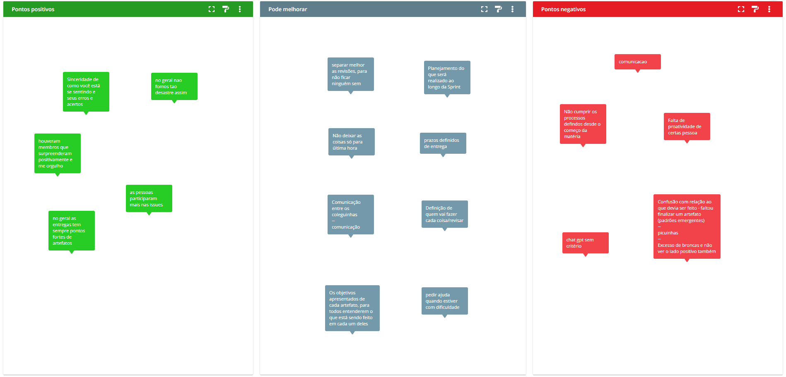

# Ata da reunião - 21/06/2023

## Introdução

O presente documento é um registro da reunião ocorrida no dia 21/06/2023, no qual constam os membros presentes,
representados na Tabela 1, objetivos da reunião e definição de tarefas.

## Dados da reunião

- Data: 21/06/2023
- Local: Online - Discord

| Membro                                    | Presente? |
|-------------------------------------------|-----------|
| Davi Lima da Silva                        | Sim |
| Davi Silva Matias                         | Sim |
| Guilherme Aguera de La Fuente Vilela      | Sim |
| João Pedro Alves Machado                  | Sim |
| Josue Teixeira Santana                    | Sim |
| Lucas Felipe Soares                       | Sim |
| Lucas Gabriel Sousa Camargo Paiva         | Sim |
| Lucas Gomes Caldas                        | Sim |
| Luiza Esteves dos Santos                  | Sim |
| Maria Eduarda dos Santos Abritta Ferreira | Sim |
| Nicolas Chagas Souza                      | Sim |

 Tabela 1: Membros presentes na reunião (Fonte: autor, 2023). 

## Objetivos da reunião

- Fazer uma distribuição mais detalhada das tarefas dentro dos dois módulos de entrega.
- Definir prazos de entrega para os artefatos.
- Definir metodologias para lidar com atrasos nas entregas dos artefatos.

## Pontos Abordados durante a reunião

1. Realizamos a retrospectiva com o objetivo de identificar os pontos forte, fracos e pontos a melhorar dentro do nosso trabalho e na equipe. Através dessa análise reflexiva, buscamos fortalecer o aprendizado contínuo e impulsionar o crescimento coletivo.

Os resultados dessa avaliação foram registrados na imagem abaixo, que ilustra as principais conclusões da retrospectiva:

Figura 1. Retrospectiva da sprint.

Durante a retrospectiva  os participantes tiveram a oportunidade de expressar suas opiniões e contribuir com ideias para o aprimoramento do trabalho em equipe. A intenção dessa discussão foi melhorar o trabalho em equipe e a organização dos integrantes dentro do projeto.

1. Um dos assuntos abordados na reunião foi esclarecer para todos os membros quais são as entregas e ideias que podem ser aplicadas para desenvolvimento dos artefatos. Para abordar essa questão, foram compartilhadas informações detalhadas sobre as entregas esperadas em cada etapa do projeto. Além disso, foram apresentadas ideias adicionais que podem ser exploradas para enriquecer e aprimorar os artefatos produzidos.
2. Também foi discutida a questão de como ficaria a distribuição das tarefas para cada membro e as atividades que serão realizadas por cada um. A equipe continuou dividida em duplas/trios, e foram definidas as atividades de cada membro. Além disso, foi decidido que o trio composto pelos integrantes João Pedro, Luiza e Lucas Gomes seria integrado no desenvolvimento dos padrões arquiteturais juntamente com as outras duas duplas.

### Distribuição das Tarefas - Módulo de Estilos e Padrões Arquiteturais

Essa entrega consiste na especificação de uma visão DAS, com o seguinte escopo:

- Lógico: Diagrama de Pacotes / Diagrama de Classes
  - Como os artefatos já estão prontos, basta ajustar os problemas apontados nas correções e adequá-los ao padrão do DAS.
- Processo: **Diagrama de Sequência** / **Diagrama de Atividades (com foco nos processos, _threads_)**
- Implementação: **Diagrama de Componentes**
- Implantação ou Dados:  
  - Implantação: **Diagrama de Implantação**
  - Dados: Modelagem de Dados, se for em base relacional **MER**, **DER** e **DLD**

> Os artefatos em negrito ainda **não foram feitos**.

### Distribuição das Tarefas - Módulo de Reutilização de Software

Essa entrega consiste em exemplo de reutilização, evidenciando parte conceitual e código. Algumas ideias:

- Definição de Frameworks (Como o [Spring Boot](https://docs.spring.io/spring-boot/docs/current/reference/htmlsingle/))
- Utilização de bibliotecas interessantes ao nosso contexto, como o Jackson ([Jackson Object Mapper](https://www.devmedia.com.br/introducao-ao-jackson-objectmapper/43174))
- Bibliotecas de conexão com o banco de dados, como o Hibernate ([Hibernate com Spring Boot](https://www.baeldung.com/spring-boot-hibernate))
- Versionador de Banco de Dados, com o Flyway (Flyway) ([Database Migrations with Flyway](https://www.baeldung.com/database-migrations-with-flyway))
- Biblioteca RXJS do JavaScript, com padrão [Observer](https://rxjs.dev/guide/observer) implementado (Front).
- Containers de ambiente e deploy com Docker e Docker Compose e orquestração de containers com Docker Swarm ([Docker docs](https://docs.docker.com/))
- Outras ideias?

## Atribuições

### Cronograma de Entregas e Responsáveis - Módulo de Estilos e Padrões Arquiteturais

Dependência entre os escopos:

**Lógico > Implementação > Implantação ou Dados**
**Lógico > Processo > Implantação ou Dados**

| Escopo               | Artefato                       | Responsáveis | Revisores | Data Limite de Entrega | Data Limite de Revisão |
| -------------------- | ------------------------------ | ------------ | --------- | ---------------------- | ---------------------- |
| Lógico               | Lucas Felipe e Josué           |              |           | 25/06/2023             | 26/06/2023             |
| Processo             | Luíza , Abritta  e Lucas Gomes |              |           | 28/06/2023             | 29/06/2023             |
| Implementação        | Josué e Abritta                |              |           | 28/06/2023             | 29/06/2023             |
| Implantação ou Dados | Nicolas e Lucas Felipe         |              |           | 01/07/2023             | 02/07/2023             |

### Cronograma de Entregas e Responsáveis - Módulo de Reutilização de Software

| Escopo                                               | Responsáveis               | Revisores | Data Limite de Entrega | Data Limite de Revisão |
| ---------------------------------------------------- | -------------------------- | --------- | ---------------------- | ---------------------- |
| Modelagem                                            | Davi Lima e Guilherme      |           | 25/06/2023             | 26/06/2023             |
| Interna(padrões de projeto, código, requisitos)      | Davi Lima e Guilherme      |           | 28/06/2023             | 29/06/2023             |
| Externa(Frameworks, bibliotecas e propostas extras ) | Lucas Gabriel e Davi Silva |           | 28/06/2023             | 29/06/2023             |
| Arquitetura                                          | Lucas Gabriel e Davi Silva |           | 01/07/2023             | 02/07/2023             |

## Histórico de Versão

| Versão |    Data    |                       Descrição                        |    Autor(es)    | Revisor(es) |
| :----: | :--------: | :----------------------------------------------------: | :-------------: | :---------: |
| `1.0`  | 21/06/2023 |                  Criação do Documento                  | Nicolas e Josué |    Josué    |
| `1.1`  | 21/06/2023 |        Adiciona os pontos abordados na reunião         |      Josué      |   Nicolas   |
| `1.2`  | 21/06/2023 | Adiciona escopos do módulo de reutilização de software |    Davi Lima    |   Nicolas   |
