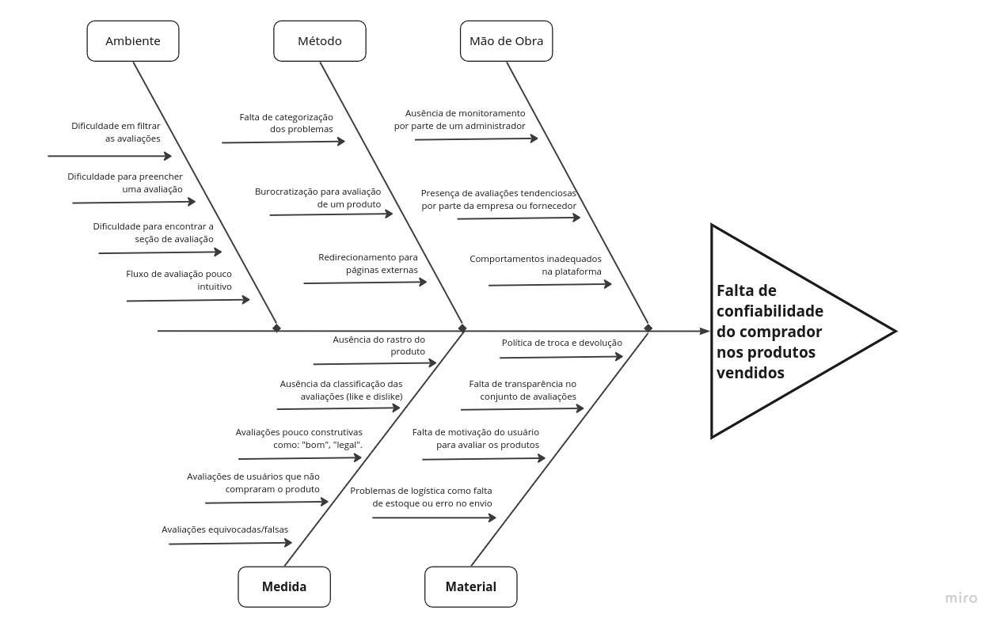

# 1.1.1. Diagrama de Causa-Efeito

## Introdução

O Diagrama de Ishikawa, também conhecido como Espinha de Peixe ou Diagrama de Causa e Efeito, é uma ferramenta
de análise de processos que permite identificar as causas raízes de um problema. Ele foi desenvolvido em meados da
década de 40 pelo engenheiro Kaoru Ishikawa e é amplamente utilizado em diversas indústrias. Pesquisas apontam que a
utilização dessa ferramenta pode aumentar a eficiência em torno de *30%* e a diminuição do tempo necessário para
resolução dos problemas em torno de *50%*, visto que esse diagrama fornece uma notação para representar causas que
podem gerar efeitos, tanto desejados quanto não desejados. Esse diagrama é composto pelos elementos (Figura 1): efeito,
categorias, causas e subcausas.

 

Figura 1. Notação do diagrama Causa-Efeito. Fonte: [3]

O efeito consiste em um problema principal posto para estudo durante a elaboração do diagrama. As causas podem surgir
como respostas da pergunta "por que o *efeito* ocorre?", e elas podem ser escritas em mais de uma categoria. Para cada
causa, podem existir subcausas, que também podem ser obtidas por meio da pergunta "por que a *causa* ocorre?".

O presente artefato visa documentar a metodologia adotada para criação do diagrama causa-efeito, apresentar o diagrama
criado e as conclusões obtidas a partir da elaboração.

## Metodologia

O diagrama de causa-efeito foi elaborado para auxiliar na análise de riscos envolvidos no processo de avaliação de
produtos no site da [Ri Happy](https://www.rihappy.com.br). A elaboração do diagrama foi realizada por três membros do
grupo de trabalho, a saber, Josué, Lucas Felipe e Nicolas. Inicialmente, cada membro fez um estudo individual sobre o
diagrama, complementando o conteúdo abordado sala durante as aulas da disciplina de Arquitetura e Desenho de
Software. Em seguida, cada membro, por meio das ferramentas fornecidas pela plataforma [Miro](https://www.miro.com/),
foi elaborado um diagrama inicial, e cada um dos autores do artefato elencou problemáticas proveninentes de uma má
implementação do fluxo de avaliação de produtos na plataforma, durante uma sessão de **brainstorming**, com o intuito de
que os três autores pudessem obter uma visão geral do problema para iniciar a confecção do diagrama.

A partir do estudo realizado, a equipe optou por utilizar uma adaptação da metodologia adotada em [2], e então a
elaboração do
diagrama foi dividida em três etapas principais, descritas nas seções a seguir.

### Definição do Efeito

A partir dos elementos elecados na plataforma Miro, chegou-se a um consenso sobre o efeito analisado.

<h4 style="text-align:center">
Efeito: Falta de confiabilidade do comprador nos produtos vendidos
</h4>

### Definição das Causas

Durante essa etapa, foi realizada uma releitura detalhada de cada problema elencado no Miro, durante a qual os problemas
semelhantes e complementares foram reescritos de formas mais claras e objetivas. Essa leitura também auxiliou na
definição das categorias de problemas, feita em seguida. As causas identificadas, após o processo de refinamento dos
problemas elencados anteriormente, foram:

- Ausência de monitoramento por parte de um administrador
- Falta de categorização dos problemas
- Dificuldade em filtrar as avaliações
- Dificuldade para preencher uma avaliação
- Burocratização para avaliação de um produto
- Presença de avaliações tendenciosas por parte da empresa ou fornecedor
- Dificuldade para encontrar a seção de avaliação
- Redirecionamento para páginas externas
- Comportamentos inadequados na plataforma
- Fluxo de avaliação pouco intuitivo
- Ausência do rastro do produto
- Política de troca e devolução
- Ausência da classificação das avaliações (like e dislike)
- Falta de transparência no conjunto de avaliações
- Avaliações pouco construtivas como: "bom", "legal".
- Falta de motivação do usuário para avaliar os produtos
- Avaliações de usuários que não compraram o produto
- Problemas de logística como falta de estoque ou erro no envio
- Avaliações equivocadas/falsas

## Definição das Categorias

O grupo de trabalho optou por categorizar as causas apenas após elencá-las, devido à dificuldade em categorizar os
problemas. Inicialmente, foram escolhidas categorias mais técnicas e relacionadas à área de Engenharia de Software, e
para cada categoria foi definida uma cor arbitrária para auxiliar na organização na plataforma Miro.

- Interação Humano Computador (IHC) — Laranja
- Fluxo de avaliação no sistema — Amarelo
- Monitoramento/administração — Azul
- Qualidade das avaliações — Verde-claro
- Motivação — Verde

Figura 2. Etapa de organização dos problemas nas categorias. Fonte: Elaborado pelos autores.

Após organização das causas nas categorias supracitadas, em conjunto com as orientações obtidas da docente, o grupo
optou por utilizar uma adaptação das categorias adotadas no padrão 6M (método, matéria prima, mão-de-obra, máquinas,
medição e meio ambiente), adotando-se as explicitadas abaixo.

- Ambiente: Unindo as categorias meio-ambiente e máquina, foram agregadas nessa categoria as causas relacionadas à
  interface (IHC).
- Método: Essa categoria agrega as causas envolvidas no método de avaliação, categoria anteriormente denominada
  fluxo.
- Mão-de-obra: Conjunto de causas relacionadas à ausência ou falta de qualificação dos recursos humanos envolvidos no
  fluxo de avaliação.
- Material: A principal matéria-prima no fluxo análisado é a avaliação realizada pelos compradores e usuários da
  plataforma, nessa categoria foram reunidas causas relativas à dificuldade de obter-se essa matéria.
- Medida: A categoria agrega as causas relacionadas à análise quantitativa e qualitativa das avaliações na plataforma,
  elecando causas relacionadas à dificuldade de medir a relevância dos comentários e informações sobre os produtos
  avaliados.

## Diagrama Causa-Efeito

 

Figura 3. Diagrama Causa-Efeito. Fonte: Elaborado pelos autores.

O grupo analisou o problema da empresa que estava afetando a qualidade da avaliação das avaliações dos produtos. Esse
problema está afetando a qualidade das avaliações dos produtos, causando uma desconfiança no consumidor. Decidiu-se
então utilizar uma ferramenta de análise de causa raiz para identificar as causas do problema e desenvolver soluções
eficazes.

Foi realizado um *brainstorming* para gerar uma lista de possíveis causas. Durante essa sessão, os membros contribuíram
com suas ideias e opiniões. Todas as ideias foram anotadas em post-its, sem avaliar ou criticar, para fosse possível ter
uma visão ampla do problema.

Com a lista de causas gerada, foi realizada a organização das ideias em categorias em um diagrama causa-efeito.
As categorias relevantes, como ambiente, método, mão de obra, medida e material, foram identificadas e as ideias geradas
durante o *brainstorming* foram alocadas em cada categoria com sua respectiva causa.

## Soluções

Os consumidores estão cada vez mais conscientes e exigentes em relação aos produtos que compram, e uma das formas que
eles têm de avaliar a qualidade e a eficácia de um produto é por meio das avaliações de outros consumidores. Quando um
produto tem poucas avaliações, pode causar falta de confiança nos consumidores, que podem questionar a qualidade e a
eficácia do produto. Isso pode afetar negativamente as vendas e a reputação da marca. Portanto, é importante para as
empresas encontrar soluções eficazes para aumentar o número de avaliações e promover a confiança do consumidor. Logo
abaixo foram listadas algumas possíveis soluções para esse problema

- Permitir a ordenação de avaliações: Permita que os usuários ordenem as avaliações existentes por diferentes critérios,
  como data, classificação, utilidade, foto e vídeo. Isso permitirá que os usuários vejam as avaliações mais relevantes
  primeiro e possam tomar uma decisão de compra mais informada.

- Incluir avaliações de especialistas: Além das avaliações de usuários, é possível incluir avaliações de especialistas
  em um produto. Isso pode incluir análises de produtos de sites de tecnologia ou análises de produtos em publicações
  especializadas em uma determinada área.

- Apresentar estatísticas: Se houver poucas avaliações, apresentar estatísticas pode ajudar a aumentar a confiança dos
  usuários. Por exemplo, é possível apresentar a média de classificação do produto ou o número de usuários que compraram
  o produto.

- Encorajar avaliações de usuários: Encorajar os usuários a deixarem avaliações pode ser uma maneira eficaz de aumentar
  o número de avaliações para um produto. Isso pode ser feito por meio de e-mails de acompanhamento ou com a oferta de
  incentivos para deixar avaliações.

## Conclusão

O diagrama de causa e efeito é uma ferramenta de análise poderosa que ajuda a identificar as causas raízes de um
problema específico. Ele fornece uma visão ampla do problema, permitindo que a equipe identifique as principais causas e
desenvolva soluções eficazes para resolvê-lo.

Além disso, a construção do diagrama de causa e efeito é uma atividade colaborativa que envolve a participação da
equipe. Isso incentiva a discussão aberta e honesta, o compartilhamento de ideias e a colaboração, o que pode levar a
soluções mais criativas e eficazes.

A criação do diagrama de causa e efeito também ajuda a entender a complexidade do problema e a relação entre as
diferentes causas. Isso pode levar a uma análise mais aprofundada e a uma solução mais holística e duradoura do
problema.

Em resumo, o diagrama de causa e efeito é uma ferramenta valiosa para qualquer equipe ou empresa que esteja enfrentando
um problema específico e queira identificar as causas raízes e desenvolver soluções eficazes. Ele incentiva a
colaboração, a discussão aberta e a análise aprofundada, permitindo que a equipe resolva problemas de forma mais eficaz
e sustentável.

## Bibliografia

> 1. FISHBONE DIAGRAM, artigo disponível no [link](https://asq.org/quality-resources/fishbone). Acesso em 15/04/2023.
> 2. APRENDENDO GESTÃO. Diagrama de Ishikawa (Ferramenta da Qualidade): Teoria + Exemplo. Youtube, 23 de setembro de
     2016. Acesso em 15/04/2023. Disponível no [link](https://www.youtube.com/watch?v=U-0qzmFqH-0)
> 3. SERRANO, Milene. Material da Aula "PROJETO E DESENHO DE SOFTWARE", disponível na plataforma Aprender3. Acesso em
     15/04/2023.
> 4. miro.com/
> 5. https://www.rihappy.com.br

## Histórico de Versão

| Versão | Data       | Descrição                                                       | Autor(es)      | Revisor(es)    |
|--------|------------|-----------------------------------------------------------------|----------------|----------------|
| `1.0`  | 15/04/2023 | Criação do documento com introdução.                            | Nicolas Souza  | Lucas Felipe   |
| `1.1`  | 17/04/2023 | Revisão da introdução e elaboração da metodologia               | Lucas Felipe   | Josué Teixeira |
| `1.2`  | 17/04/2023 | Correção de imagem, elaboração do texto do diagrama e conclusão | Josué Teixeira | Nicolas Souza  |