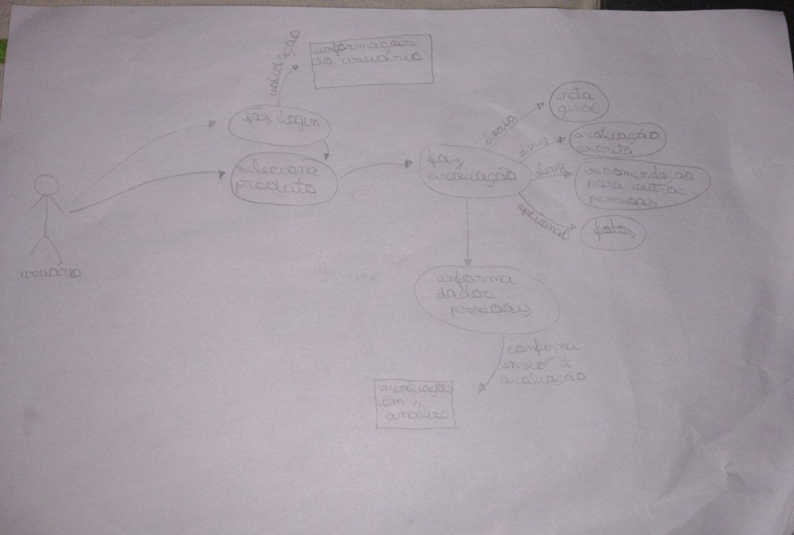
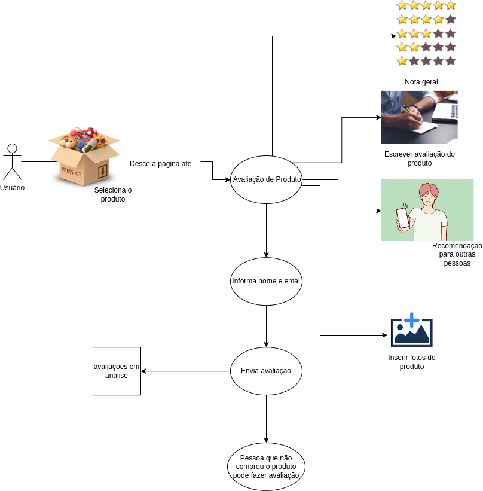
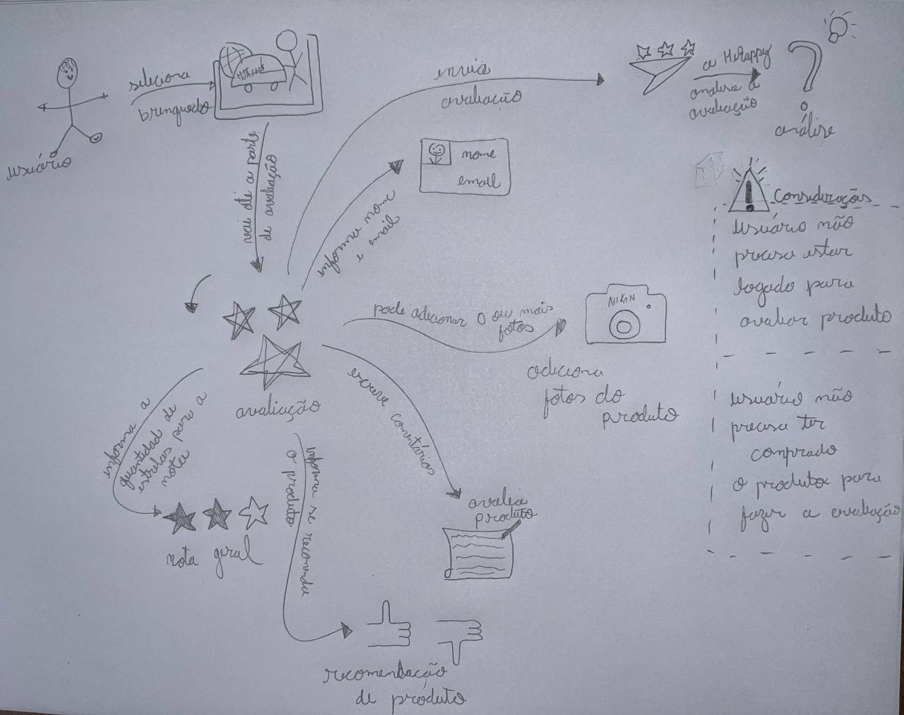

# 1.1.2 Rich Picture

## Introdução

O Rich Picture é uma forma de modelagem considerada informal, que possui uma notação que faz com que seja possível a
análise de problemas e desenvolver ideias. Suas principais vantagens são: identificação de processos de negócios, atores
e suas responsabilidades nesses processos.

## Objetivos e Metodologia

Com esse artefato, a equipe pretende facilitar a visualização de fluxos de avaliação dos produtos no site
da [Ri Happy](https://www.rihappy.com.br/), trazendo visões de diferentes membros da equipe para uma maior abrangência
de ideias. Feito isso, entraremos em consenso
com um modelo final elaborado a partir das produções iniciais. A elaboração do artefato partiu das etapas da *design
sprint*, que trazem um maior desempenho e agilidade em um curto período.

## Rich Pictures Desenvolvidos

### Versão Inicial

Inicialmente, construímos uma versão feita manualmente focando em rascunhar mais tecnicamente e identificar os fluxos
no processo de enviar um *feedback* no site, como pode ser observado na Figura 1.

    

Figura 1: RichPicture Inicial — Baixa Fidelidade — Avaliação de Produto na HiRappy. (Fonte: Elaborado pelos autores.)

 

Em seguida, nos reunimos para em conjunto criarmos uma versão do Rich Picture, já trazendo a parte mais visual para
dentro e pensando em melhorias no sistema, como pode ser observado na Figura 2.

    

Figura 2: RichPicture Inicial — Alta Fidelidade — Avaliação de Produto na HiRappy. (Fonte: Elaborado pelos autores.)

 

### Versão Final

Por fim, desenvolvemos a versão final do Rich Picture, evidenciando um problema identificado pela equipe no processo de
enviar comentários. Entendemos que no fluxo não ter uma verificação prévia de que o usuário realmente comprou o
brinquedo pode trazer opiniões inválidas para o propósito da ação. Além disso, melhoramos a questão estética,
para que ficasse de melhor entendimento para usuários e se diferenciasse de um fluxograma com teor mais técnico. Na
Figura 3 é
possível observar a versão final:

    

Figura 3: RichPicture Final — Baixa Fidelidade — Avaliação de Produto na HiRappy. (Fonte: Elaborado pelos autores.)

 

## Conclusão

Rich Pictures são úteis para identificar problemas de usabilidade em sites de compras, pois permitem que os usuários
expressem visualmente suas experiências e apontem áreas problemáticas. Ao incorporar o *feedback* dos usuários de Rich
Pictures em seus processos de *design*, as empresas podem melhorar a usabilidade do site, o que pode levar a um aumento
na
satisfação do cliente e nas conversões de vendas.

## Referências

[1] Introducing Rich Pictures, CTEC2402 - Software Development Project. Artigo disponível
no [link](https://kupdf.net/download/rich-picture-guidelines_5af33c6de2b6f5ed445220f1_pdf). Acesso em Acesso em
15/04/2023.

[2] SERRANO M., Material da aula: "PROJETO E DESENHO DE SOFTWARE", disponível na plataforma Aprender3. Acesso em
15/04/2023.

## Histórico de Versão

| Versão | Data       | Descrição                                                  | Autor(es)                       | Revisor(es) |
|--------|------------|------------------------------------------------------------|---------------------------------|-------------|
| `1.0`  | 15/04/2023 | Criação do documento com introdução e objetivos descritos. | Luíza Esteves                   | Nicolas     |
| `1.1`  | 15/04/2023 | Adição dos Rich Pictures.                                  | Luíza, Lucas Gomes e João Pedro | Nicolas     |
| `1.2`  | 15/04/2023 | Adição da conclusão                                        | João Pedro                      | Nicolas     |
| `1.3`  | 17/04/2023 | Adição da versão final do RichPicture                      | Lucas Gomes                     | Nicolas     |
| `1.4`  | 17/04/2023 | Adição dos textos explicativos dentro do  artefato         | Luíza Esteves                   | Nicolas     |
| `1.5`  | 19/04/2023 | Corrgindo imagens do RichPicture                           | Lucas Gomes                     | Nicolas     |