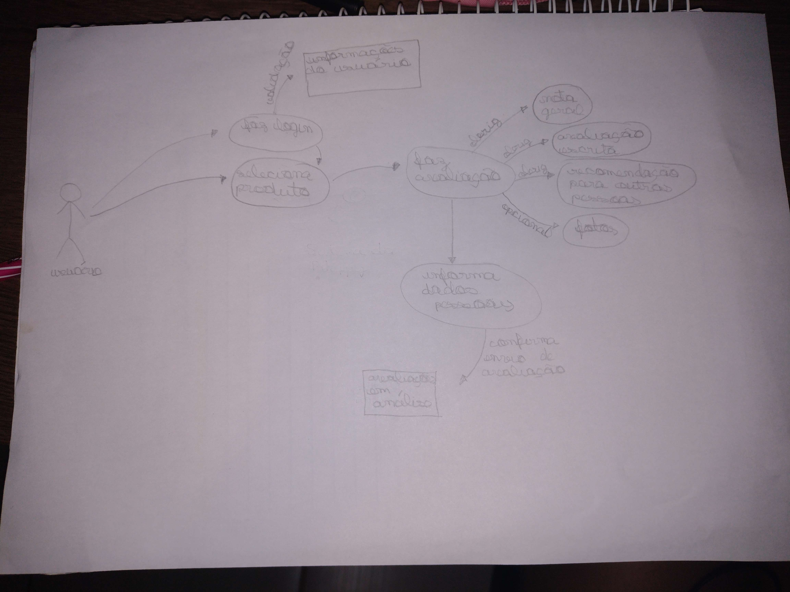

# 1.1.2 Rich Picture

## Introdução

O Rich Picture é uma forma de modelagem considerada informal, que possui uma notação que faz com que seja possível a análise de problemas e desenvolver ideias. Suas principais vantagens são: identificação de processos de negócios, atores e suas responsabilidades nesses processos.

## Objetivos

Com esse artefato, a equipe pretende facilitar a visualização de fluxos de avaliação dos produtos dentro do site da [Ri Happy](https://www.rihappy.com.br/?utm_source=google&utm_medium=cpc&utm_campaign=[INST]Ri_Happy&gclid=Cj0KCQjwlumhBhClARIsABO6p-yYsODK26HwM2vqG8xRfGJ64OwXwsqVUuU5fkqJUWCLrqWMlCypNp8aAgDOEALw_wcB), trazendo visões de diferentes membros da equipe para uma maior abrangência de ideias. Feito isso, entraremos em consenso com um modelo final elaborado a partir das produções iniciais.

## Rich Pictures Desenvolvidos

Figura 1: RichPicture Inicial - Avaliação de Produto na HiRappy. 

    

Fonte: Luíza.

 

Figura 2: RichPicture Final - Avaliação de Produto na HiRappy. 

    

Fonte: Luíza, Lucas Gomes e João Pedro.

 

## Conclusão

Rich Pictures são úteis para identificar problemas de usabilidade em sites de compras, pois permitem que os usuários expressem visualmente suas experiências e apontem áreas problemáticas. Ao incorporar o feedback dos usuários de Rich Pictures em seus processos de design, as empresas podem melhorar a usabilidade do site, o que pode levar a um aumento na satisfação do cliente e nas conversões de vendas.

## Referências

[1] Introducing Rich Pictures, CTEC2402 - Software Development Project. Artigo disponível no [link](https://kupdf.net/download/rich-picture-guidelines_5af33c6de2b6f5ed445220f1_pdf). Acesso em Acesso em 15/04/2023.

[2] SERRANO M., Material da aula: "PROJETO E DESENHO DE SOFTWARE", disponível na plataforma Aprender3. Acesso em 15/04/2023.

## Histórico de Versão

| Versão | Data       | Descrição                                                  | Autor(es)                       | Revisor(es) |
| ------ | ---------- | ---------------------------------------------------------- | ------------------------------- | ----------- |
| `1.0`  | 15/04/2023 | Criação do documento com introdução e objetivos descritos. | Luíza                           |             |
| `1.1`  | 15/04/2023 | Adição dos Rich Pictures.                                  | Luíza, Lucas Gomes e João Pedro |             |
| `1.2`  | 15/04/2023 | Adição da conclusão                                 |  João Pedro |             |

	
