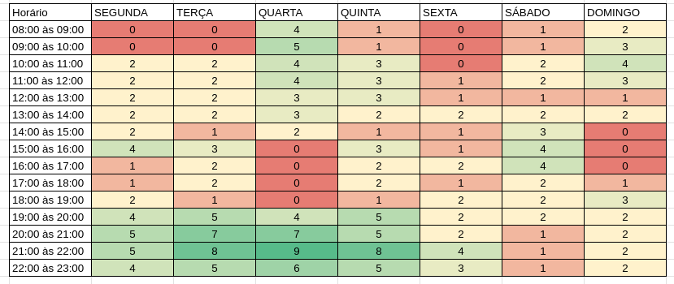
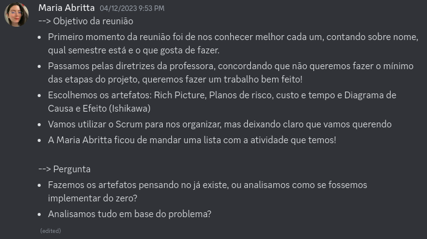
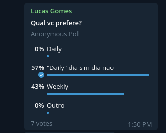
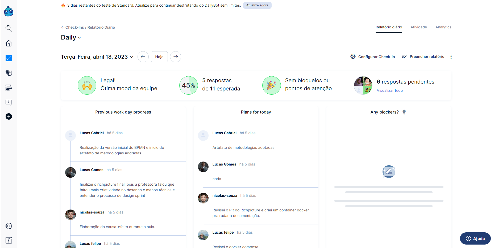
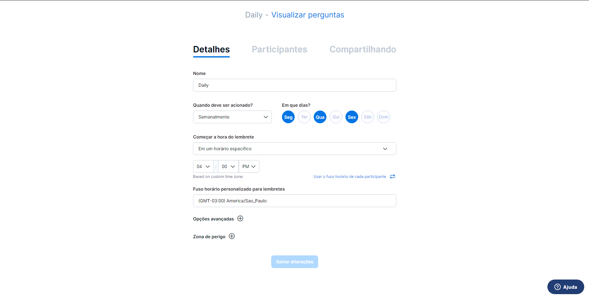

# Metodologia Adotada

## Introdução

Este documento tem como objetivo documentar e apresentar a metodologia escolhida pela
equipe para as atividades da disciplina de Arquitetura e Desenho de Software. Diante disso, foram consideradas e
estudadas pela equipe diversas abordagens, metodologias e processos, dentre elas estão o RUP, OpenUp, XP, Scrum, Lean e
Kanban, para assim estruturar a metodologia que será utilizada pelo grupo, após esse estudo as escolhidas foram o Scrum,
Kanban e o Lean.

## Métodologias

### Scrum

O Scrum é uma metodologia ágil muito usada na gestão e planejamento de softwares, a qual
valida-se de ciclos e papéis bem definidos para o desenvolvimento de software, com intuito de realizar as etapas do
processo de desenvolvimento de forma rápida para que logo se identifique os problemas e, assim, logo os solucione,
aumentando a velocidade de produção de um software e facilitando a adaptação a mudanças que podem ser necessárias
durante o projeto. O Scrum é dividido em etapas chamadas de Sprints nas quais um conjunto de tarefas devem ser
executadas, essas tarefas são retiradas do Product Backlog, o qual é composto por uma lista de requisitos necessários
para o desenvolvimento e entendimento do problema e é criada pelo Product Owner, que é o responsável pela visão do
produto como um todo. No início de cada Sprint, é realizado a Sprint Planning para definir as tarefas, essa é uma
reunião que ocorre entre o Time, o Product Owner e o Scrum Master, o qual é responsável por garantir que a equipe
realize o trabalho, assim, durante essa reunião eles definem qual será o Sprint Backlog que são as tarefas a serem
realizadas naquela Sprint. Diante disso, começam-se as Sprints, nas quais ocorrem diariamente a Daily Scrum, uma reunião
com intuito de informar o que foi realizado no dia anterior, o que será realizado no dia atual e se há algum impedimento
para realização das tarefas, caso, haja algum impedimento o Scrum Master intervém e busca solucionar o problema. Ao
final de cada Sprint ocorre a Sprint Review, na qual a equipe apresenta as funcionalidades implementadas e também a
Sprint Retrospective, na qual a equipe planeja a Sprint seguinte.

### Kanban

Kanban é uma forma de gestão de projetos que tem ênfase na visualização, fluxo e melhoria
contínua. Teve sua origem na indústria japonesa, mas logo se viu que sua aplicações poderiam ser adaptadas em uma
variedade de setores e contextos. Dentre todos, os principais princípios do Kanban incluem limitar o trabalho em
andamento, manter a visualização do fluxo do trabalho, gerenciar o fluxo, tornar as políticas de processo explícitas,
trabalhar com loops de feedback e a melhoria contínua do processo. O Kanban é comumente utilizado em conjunto com o
desenvolvimento ágil e outras metodologias, mas sua principal forma de aplicação se tem através de processos que possuam
fluxo de trabalho. Ao utilizar o Kanban é comum ocorrer um aumento da produtividade, redução dos desperdícios e uma
entrega de valor ao cliente de forma mais rápida e eficiente.

### Lean

O Lean é uma forma de pensar em geração de valor com poucos recursos evitando desperdícios,
para isso essa abordagem utiliza de constante experimentação. Além disso, o foco está no que o cliente valoriza e qual o
problema que precisa ser resolvido, assim, é necessário focar também na capacitação para resolução do problema e
gerenciamento do sistema de liderança. O Lean se inicia com o início do trabalho físico ou mental para a melhoria da
qualidade e do fluxo ao mesmo tempo que se diminui o desperdício e o custo para execução do projeto, validando-se de
processos puxados, nos quais as demandas são totalmente controladas e do "just in time" no qual o objetivo é realizar
uma tarefa na forma correta da primeira vez, no momento adequado, com a qualidade esperada dentro da expectativa do
cliente.

### Metologia desenvolvida para disciplina

Diante disso, foram selecionados o Scrum, devido ao ciclo bem definido o qual ajuda a
equipe a se organizar e incentiva a equipe a sempre procurar ativamente formas de solucionar problemas por meio das
Dailys, o Kanban, pois esse facilita a observação dos estados das tarefas que devem ser cumpridas durante as Sprints do
Scrum, assim como o estado das mesmas e o Lean com intuito de que a equipe foque na agregação de valor do produto
desenvolvido, com processos puxados, ou seja controlados pela demanda do cliente, além de que o processo siga o "just in
time" para que seja feito certo na primeira vez, no momento adequado e com a qualidade esperada.
Dessa forma, a metodologia desenvolvida foi uma mistura das abordagens e metodologias apresentadas e pode ser melhor
observada no artefato de [modelagem BPMN](../1.Base/1.2.2.ModelagemBPMN.md)

#### Elementos do Scrum

Conforme mencionado anteriormente, a equipe adotará alguns elementos do scrum durante o desenvolvimento do projeto, com
as seguintes configurações:

### Sprints

Cada sprint será composta pelas atividades de entrega da disciplina, com time boxes variados.

| Nome                                                           | Período                 |
|----------------------------------------------------------------|-------------------------|
| 1ª Sprint - Base                                               | 27/03/2023 a 24/04/2023 |
| 2ª Sprint - Modelagem                                          | 24/04/2023 a 15/05/2023 |
| 3ª Sprint - Padrões de Projeto                                 | 15/05/2023 a 09/06/2023 |
| 4ª Sprint - Arquitetura de Software & Reutilização de Software | 09/06/2023 a 03/07/2023 |

### Sprint review/planning

Embora a sprint seja mais longa do que uma semana, a cada semana a equipe se reunirá pela
plataforma Discord, nas quartas-feiras às 21 horas, para acompanhamento do andamento das tarefas. A decisão do horário
foi apoiada por um heatmap (Figura 1), preenchido por todos os membros da equipe.

 Figura 1. Heatmap indicando a quantidade de membros disponíveis nos horários. 
(Fonte: elaborado pelos autores) 

Cada reunião será composta por um momento de review, onde os membros apresentarão o que foi produzido durante a semana
anterior, e um momento de planning, onde as atividades serão distribuídas entre os membros. Cada reunião será registrada
em uma ata, como a exemplificada na Figura 2, na própria plataforma Discord.
Um [modelo de ata](./Planejamento/ModelosArtefatos/modelo_ata.md) está disponível para os membros no repositório do
projeto.

 Figura 2. Exemplo de ata na plataforma Discord. 
(Fonte: elaborado pelos autores) 

Com o intuito de tornar as reuniões mais rápidas e dinâmicas, a sprint planning consistirá na definição das tarefas que
devem ser executadas, mas a atribuição das tarefas será feita de maneira assíncrona, por meio da plataforma Telegram,
para que os membros possam estudar melhor o assunto antes de escolher uma tarefa. A definição das tarefas será feita até
24 horas após a reunião, caso algum membro não se manifeste, será alocado, pela representante do grupo, na tarefa com o
menor número de membros.

### Dailies

Em um momento inicial, a equipe adotou as dailies conforme proposto pela metodologia Scrum, mas como a maioria dos
membros não possui disponibilidade de tempo para contribuir com o projeto diariamente, foi definida uma adequação do
modelo de dailies, por uma enquete no Telegram (Figura 3), para realização em dias alternados.

 Figura 3. Enquete para definição do modelo de daily. (Fonte: elaborado pelos autores) 

Para coleta dos dados da daily a equipe optou por utilizar um bot que possui integração com o discord. 
O bot foi configurado para mandar um aviso à todos os membros no horário decidido em que ao responderem podem realizar a daily,
o bot faz 3 perguntas, em que, na primeira ele mostra seu plano do dia anterior e pergunta o que foi concluído, depois o que
você vai trabalhar hoje e por fim se há algum problema. Todas as respostas são postadas no chat designado do discord e também
podem ser visualizadas pelo site do bot.

Figura 4. Painel de respostas da daily.

É possível configurar o bot por meio do site (Figura 5), escolhendo quando ser acionado, o horário do lembrete, as perguntas a
serem feitas, entre outras configurações.

Figura 4. Painel de configuração da daily.

## Bibliografia

[1] GUIA, Kanban. Como se aplica o Kanban? Artia. Disponível em: <https://artia.com/kanban/>. Acesso em: 18 abr. 2023.
[2] Desenvolvimento Ágil. Desenvolvimento Ágil. Disponível em: <https://www.desenvolvimentoagil.com.br/scrum/>. Acesso
em: 18 abr. 2023.
[3] What is Lean? | Lean Thinking - Lean Enterprise Institute. Lean Enterprise Institute. Disponível
em: <https://www.lean.org/explore-lean/what-is-lean/>. Acesso em: 21 abr. 2023.

## Histórico de Versão

| Versão | Data       | Descrição                                                  | Autor(es)                 | Revisor(es) |
|--------|------------|------------------------------------------------------------|---------------------------|-------------|
| `1.0`  | 18/04/2023 | Criação e elaboração do documento                          | Lucas Gabriel e Davi Lima | Nicolas     |
| `1.1`  | 21/04/2023 | Adição da metodologia Lean                                 | Lucas Gabriel e Davi Lima | Nicolas     |
| `1.2`  | 24/04/2023 | Adição de incrementos na seção de metodologias utilizadas. | Nicolas                   |             |
| `1.3`  | 24/04/2023 | Adição das especificações do bot da daily.                 | Guilherme Vilela          |             |
