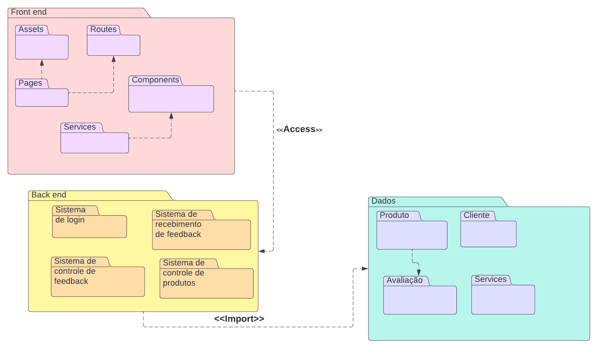

# Diagrama de Pacotes

## Introdução
O Diagrama de Pacotes é uma das formas de modelagem estática usada para representar de forma geral as estruturas dos elementos dentro de um sistema. O pacote faz a representação de um conjunto de unidades UML, que são apresentados em pastas, e proporcionam uma melhor visualização da arquitetura do software. Essa modelagem traz uma série de vantagens para o desenvolvimento do projeto, como melhor visualização da estrutura hierárquica, simplificação de diagramas mais complexos e fácil atualização durante o andamento do projeto.

## Metodologia
Para esboçar o diagrama, os membros Luíza Esteves e João Pedro se reuniram e utilizaram como ferramenta o [Lucid Chart](https://www.lucidchart.com/pages/pt) e foram evoluindo ao longo da sprint. 

## Diagrama de Pacotes

Durante a execução dos diagramas, optamos inicialmente por esboçar a parte mais geral do sistema de avaliação da RiHappy e posteriormente entrarmos em mais detalhes dentro dos pacotes. Nos baseamos no modelo MVC (Model, View, Controller), que nos auxiliou a entender e definir separadamente as camadas de um software. 
De início, montamos um diagrama geral como pode ser visto na Figura 1: 

<figcaption style="text-align: center">
    <b>Figura 1: Diagrama de pacote geral da avaliação de produtos da RiHappy</b>
     <small>Autor: Elaboração Própria (Luíza e João Pedro)</small>
</figcaption>

Logo após, destrinchamos os pacotes em subpacotes e fizemos as devidas relações, que podem ser observadas na Figura 2:

<figcaption style="text-align: center">
    <b>Figura 1: Diagramas de pacote detalhados da avaliação de produtos da RiHappy</b>
     <small>Autor: Elaboração Própria (Luíza e João Pedro)</small>
</figcaption>

## Conclusão
Em conclusão, a utilização do Diagrama de Pacotes foi fundamental para a visualização e organização da estrutura hierárquica do sistema de avaliação de produtos da RiHappy. Através da representação de pacotes, pudemos simplificar diagramas complexos e atualizar facilmente o diagrama durante o andamento do projeto. A metodologia adotada, com a colaboração dos membros Luíza Esteves e João Pedro, utilizando a ferramenta Lucid Chart, permitiu a evolução gradual do diagrama ao longo da sprint. A partir do diagrama geral, pudemos aprofundar os detalhes dos pacotes, seguindo o modelo MVC, e estabelecer as relações necessárias. Com isso, o Diagrama de Pacotes contribuiu para uma melhor compreensão da arquitetura do software e facilitou o desenvolvimento do projeto.

## Referências

[1] UML Package Diagrams Overview, artigo disponível no [link](https://www.uml-diagrams.org/package-diagrams-overview.html). Acesso em 09/05/2023.
[2] Tudo sobre diagramas de pacotes UML, artigo disponível no [link](https://www.lucidchart.com/pages/pt/diagrama-de-pacotes-uml). Acesso em 09/05/2023.

## Histórico de versão

| Versão | Data       | Descrição                                               | Autor(es)                 | Revisor(es)          |
|--------|------------|---------------------------------------------------------|---------------------------|----------------------|
| `1.0`  | 10/05/2023 | Criação das pastas e arquivos da 2° entrega | Lucas Felipe | Nicolas Chagas Souza |
| `2.0`  | 12/05/2023 | Adição dos textos iniciais | Luíza Esteves |  |
| `2.1`  | 13/05/2023 | Adição da conclusão e rotas | João Pedro |  Nicolas Souza |

