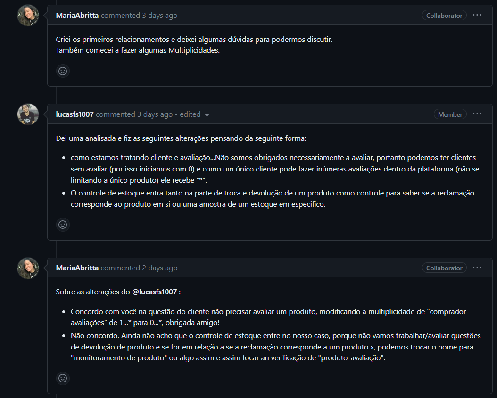
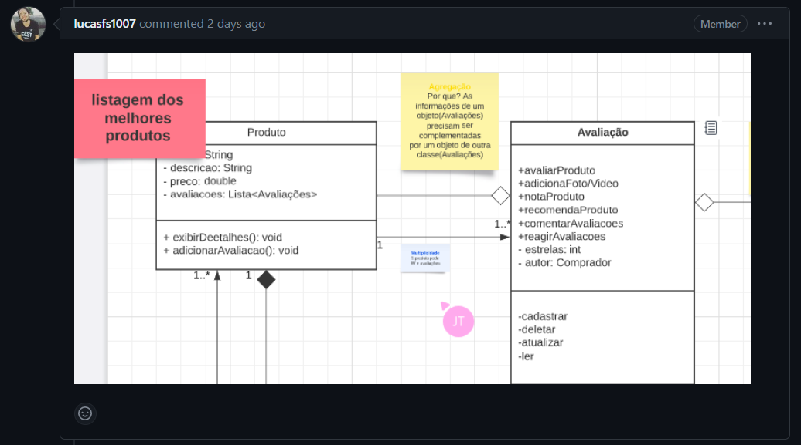
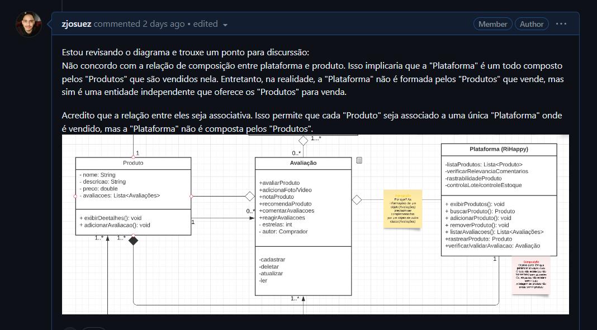

# Diagrama de classes 

## Introdução

Exemplificar e restringir tudo aquilo que deve ou não estar contido dentro de um sistema de software nem sempre é uma atividade simples, com isso a linguagem de modelagem unificada (UML) auxilia esses profissionais a modelar como se darão esses processos e trilhar de maneira mais clara e lógica como vai se dar o processo de desenvolvimento deste software de maneira padronizada e estabelecida dentro da comunidade. O diagrama de classes, um dos mais populares diagramas da arquitetura de software, trata-se de um diagrama da estrutura de software devido sua capacidade de descrever tudo aquilo que estará dentro do sistema e como essas estruturas vão conversar entre si. Mais além nesta seção, veremos com mais detalhes como se deu a modelagem dentro do fluxo em questão da [RiHappy](https://www.lucidchart.com/pages/pt/o-que-e-diagrama-de-classe-uml).

## Metodologia 

O diagrama foi elaborado seguindo a documentação e padronização prevista pela linguagem de modelagem unificada(UML). Para elaboração do mesmo, os alunos Josué Teixeira, Maria Abritta e Lucas Felipe utilizaram a ferramenta [Lucid Chart](https://www.lucidchart.com/pages/pt) para a modelagem do diagrama de classes. As principais discussões foram trazidas para dentro da issue do repósitorio no [Github]("https://github.com/UnBArqDsw2023-1/2023.1_G5_ProjetoRiHappy/issues/39"). Essas e outras ferramentas podem ser melhor visualizadas no artefato de [ferramentas](1.Base/1.2.3.FerramentasUtilizadas.md).

## Discussões de produção do artefato

Este diagrama de classes foi produzido pelos integrantes: Josué Teixeira, Lucas Soares e Maria Abritta. A equipe começou o processo de criação realizando uma análise da plataforma RiHappy e também co-relacionando com os artefatos produzidos na última entrega de maneira detalhada para identificar as entidades principais do sistema e as relações entre elas.

Em seguida, a equipe realizou várias iterações no diagrama, refinando o diagrama de classes à medida que novos requisitos e informações surgiam. Durante o processo de desenvolvimento, a equipe também levantou pontos para discutir as decisões de design e garantir que todos os membros estivessem alinhados. Alguns pontos são listados logo abaixo:

A primera discussão do grupo foi com relação a multiplicidade das classes abaixo sobre o diagrama de classes, Maria iniciou o processo de criação dos relacionamentos e multiplicidades, mas deixou algumas dúvidas para discussão.

Lucas analisou o diagrama e fez algumas alterações, sugerindo que a multiplicidade do relacionamento entre cliente e avaliação fosse alterada para permitir clientes sem avaliar (de 1...* para 0...*) e que o controle de estoque fosse incluído para verificar se a reclamação corresponde ao produto em si ou a uma amostra de estoque.

Maria concordou com a alteração da multiplicidade, mas discordou da inclusão do controle de estoque, propondo a mudança do nome para "monitoramento de produto" para focar na verificação de "produto-avaliação".

-----

-----

Também foram utilizados post-its durante o design do diagrama. Ao adicionar post-its ao diagrama de classes, os desenvolvedores podem fornecer descrições adicionais sobre cada classe, esclarecer as relações entre elas e identificar áreas que precisam de mais atenção durante o processo de desenvolvimento. Essa ferramenta ajuda a garantir que o diagrama de classes seja facilmente compreensível para todos os membros da equipe, independentemente de seu nível de experiência em programação ou conhecimento sobre diagrama de classes.

No geral, os post-its são uma ferramenta simples e eficaz para ajudar a melhorar a clareza e a compreensão de diagramas de classes, tornando o processo de desenvolvimento de software mais eficiente e eficaz. A imagem abaixo apresenta como essa ferramenta foi utilizada dentro do diagrama.

-----

-----

Por último, foi feito um questionamento pelo Josué, com relação ao relacionamento entre as classes "Plataforma" e "Produto". Essas discussões pode ajudar a esclarecer e melhorar a representação do diagrama de classes. A distinção entre a relação de composição e a relação associativa pode ter um impacto significativo na forma como o sistema é modelado e implementado.

No caso específico mencionado, a alteração proposta de mudar a relação entre "Plataforma" e "Produto" para uma relação associativa pode ajudar a representar melhor a realidade, uma vez que a plataforma é uma entidade independente que oferece produtos para venda, e não é formada pelos produtos que vende.

Ao utilizar a relação associativa, cada produto pode ser associado a uma única plataforma, e a plataforma pode oferecer vários produtos para venda. Essa abordagem pode ajudar a simplificar a modelagem e a implementação do sistema, garantindo que cada entidade seja representada de forma clara e precisa. Os integrantes concordaram com essa mudança e ela foi modificada no diagrama.

-----

-----

No geral, o processo de criação do diagrama de classes foi altamente colaborativo e a equipe trabalhou de forma diligente para garantir que o diagrama fosse preciso e atendesse às necessidades do sistema. Esperamos que este diagrama de classes ajude a fornecer uma base sólida para o desenvolvimento futuro.

## Diagrama de classes

(imagem final do diagrama)
--> colocar a imagem de forma limpa, sem os bilhetes de discussão (esses serão debatidos na seção acima).
--> procure explicar essencialmente o que é cada classe, bem qual seus relacionamentos e multiplicidades

## Conclusão

Em virtude de todas as discussões que vem sendo elaboradas desde a entrega anterior, o grupo teve a possibilidade de adentrar ainda mais dentro do fluxo proposto e modelar cada vez mais as ideias por trás da implementação do mesmo. Apesar de ser um diagrama já trabalhado em outras disciplinas, sinto que o grupo cada vez mais ganha maturidade e consegue fazer ainda melhor a linkagem com outros artefatos.

## Bibliografia

[1] O que é um diagrama UML ? Disponível em: <https://www.lucidchart.com/pages/pt/o-que-e-diagrama-de-classe-uml>. Acesso em: 11 mai. 2023.
[2] Unified Modeling Language (UML). Disponível em: <http://www.deinf.ufma.br/~acmo/MOO_Intro.pdf> Acesso em: 11 Mai.2023

## Histórico de versão

| Versão | Data       | Descrição                                               | Autor(es)                 | Revisor(es)          |
|--------|------------|---------------------------------------------------------|---------------------------|----------------------|
| `1.0`  | 10/05/2023 | Criação das pastas e arquivos da 2° entrega | Lucas Felipe | Nicolas Chagas Souza |
| `2.0`  | 11/05/2023 | Criação da introdução, metodologia, base da conclusão e estruturação base de como se dará o artefato | Lucas Felipe | Davi Silva, Davi Lima e Guilherme |
| `3.0`  | 12/05/2023 | Criação da introdução, metodologia, base da conclusão e estruturação base de como se dará o artefato | Josué Teixeira | Davi Silva, Davi Lima e Guilherme |

