# Diagrama de Atividades

## Introdução

Um diagrama de atividade representa fluxos de controle (ou de objetos) dentro de uma aplicação. O presente diagrama visa documentar o fluxo de avaliação de produtos realizado no site [RiHappy](https://rihappy.com.br).

Dentre os elementos presentes em um diagrama de atividades [1], o grupo utilizou os elementos descritos no submenu abaixo.

 <a>Notação Utilizada</a> 

- **Partição**
  Uma partição agrupa atividades com alguma característica em comum[1], no caso do diagramas elaborados as partições agrupam atividades de acordo com os seus **atores**.

  A notação utilizada  para representar uma partição (Figura 1) assemelha-se à notação de piscina, do diagrama [BPMN](../../1.Base/1.2.2.ModelagemBPMN.md).

  

  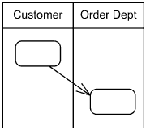
  
  Figura 1. Notação das partições ("Customer" e "Order Dept") no diagrama de atividades. (Fonte: [1]).
  

- **Nó inicial e Nó Final**
  Esses nós, como os próprios nomes sugerem, indicam o início (Figura 2) e o final (Figura 3) de uma atividade. Também é possível indicar o final de um fluxo, utilizando o um nó de fim de fluxo (Figura 4)

    | Nome do nó | Notação UML [1] |
    | - | - |
    | Nó Inicial | 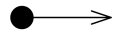   Figura 2. Notação do nó inicial. (Fonte: [1]) |
    | Nó final | 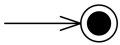   Figura 3. Notação do nó final. (Fonte: [1])
    | Nó de fim de Fluxo | 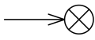   Figura 4. Notação do nó de fim de fluxo. (Fonte: [1])

- **Nó de decisão**
  É um nó de controle a partir do qual é selecionado apenas **um** fluxo de saída (Figura 5).

  

  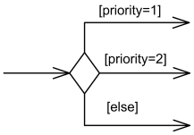

  Figura 5. Notação para os nós de controle (Fonte: [1]).
  
  

- **Fork node**
  É um nó de controle que tem uma aresta de entrada e múltiplas de saída, indica fluxos concorrentes, e surgiu na notação UML para representar atividades paralelas (Figura 6).

  

  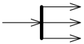

  Figura 6. Notação para o _fork node_ (Fonte: [1]).
  

- **Ações**
  É um elemento nomeado (com verbos) que representa um passo atômico em uma atividade (Figura 7).
  

  
  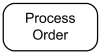
  
  Figura 7. Ação para "processar o pedido" (Fonte: [1]).
  

- **Nós de objeto**
  Um nó de objeto representa um fluxo de objetos em uma atividade, e é representado na forma de retângulo (Figura 8).

  

  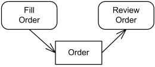

  Figura 8. Representação do objeto "_Order_" gerado após o preenchimento (Fonte: [1]).
  

- **Parâmetros de atividades**
  As atividades podem receber parâmetros, também representados por retângulos (Figura 9).

  

  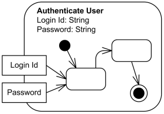

  Figura 9. Representação dos parâmetros _Login Id_ e _Password_ (Fonte: [1]).
  
  

## Metodologia

Para a elaboração do diagrama, a equipe de trabalho, composta pelos estudantes Davi Lima, Davi Matias e Nicolas, dividiu as atividades da seguinte maneira:

1. Estudo individual sobre o assunto: Cada estudante fez um estudo sobre o diagrama UML de atividades, para se familiarizar com as particularidades da notação. Durante o período de estudo, foram registrados na [issue do GitHub (#38)](https://github.com/UnBArqDsw2023-1/2023.1_G5_ProjetoRiHappy/issues/38) os materiais utilizados durante a consulta, para posteriormente serem inseridos nas [referências](#referências).
2. Após os estudos, cada membro elaborou um esboço do diagrama, e registrou suas conclusões e/ou esboço na [issue do GitHub (#38)](https://github.com/UnBArqDsw2023-1/2023.1_G5_ProjetoRiHappy/issues/38).
3. Após a elaboração dos esboços, os três estudantes se reuniram durante o período da aula de dúvidas para sintetizar os elementos presentes nos esboços em uma versão final do diagrama.

As [ferramentas](../../1.Base/1.2.3.FerramentasUtilizadas.md) utilizadas para a elaboração dos diagramas foram o [LucidChart](https://www.lucidchart.com/) e o [brModelo](http://www.sis4.com/brModelo/).

## Elaboração do Diagrama

Na primeira etapa do projeto, foi realizada uma [análise do problema](../../1.Base/1.1.AbordagemNaoEspecifica.md), durante a qual foi possível elencar alguns elementos que devem estar presentes no fluxo de avaliação de produtos, por meio da produção e análise dos artefatos [RichPicture](../../1.Base/1.1.2.RichPicture.md) e [Diagrama Causa-Efeito](../../1.Base/1.1.1.CausaEfeito.md).

De acordo com as conclusões provenientes do Diagrama Causa-Efeito [5], a aplicação deve:

- Permitir a ordenação de avaliações;
- Incluir avaliações de especialistas;
- Apresentar estatísticas;
- Encorajar avaliações de usuários.

Além disso, foram identificados as seguintes atividades no RichPicture[6]:

- Usuário seleciona brinquedo (produto);
- Usuário acessa área de avaliação do produto;
- Usuário incia a avaliação, inserindo:
  - Quantidade de estrelas para a nota;
  - Se recomenda ou não o produto;
  - Zero ou 1 comentário sobre o produto;
  - Zero ou mais fotos;
  - Dados pessoais (email e nome);
- Usuário envia a avaliação;
- Análise da RiHappy avaliação a avaliação.

Durante a elaboração do RichPicture, a equipe de trabalho identificou que o sistema atual não fornece um _feedback_ ao usuário sobre a avaliação enviada, portando, a equipe de trabalho propõe a inserção das seguintes atividades no fluxo, para suprir essa necessidade:

- O sistema envia um email para o usuário confirmando o recebimento da avaliação.
- O sistema envia um email para o usuário indicando se a avaliação foi publicada ou não, após a avaliação.
  - Caso não seja publicada, o email deve conter uma justificativa para a não publicação.

A partir dos elementos supracitados, foram definidos dois fluxos principais de atividade a serem modelados na notação UML do diagrama de Atividades:

- [Avaliação de Produto](#avaliação-de-produto)
- [Visualização de Avaliações](#visualização-de-avaliações)

### Avaliação de Produto

O usuário inicia essa atividade ao clicar em um botão "Avaliar Produto", em seguida:

1. Ele insere seus dados pessoais (email e nome **OU** efetua login)
2. Ele insere na avaliação (atividades paralelas):
    - Texto (obrigatório);
    - Modelo do produto (obrigatório?) [Ex: cor];
    - Fotos (0...n);
    - Data de Compra (0..1);
3. Ele envia a avaliação
4. Um email confirmando o recebimento da avaliação é enviado para o email do usuário
5. A avaliação é revisada pela administração do sistema
6. Um email confirmando se avaliação foi aprovada ou não (e o motivo) é enviado para o usuário

Nessa atividade vejo três raias no diagrama ("usuário", "administrador do sistema" e "sistema").

### Visualização de Avaliações

O usuário inicia essa atividade ao navegar até a seção de avaliações na página do produto, em seguida:

1. O usuário pode filtrar as avaliações:
    - Inserindo no filtro os campos opcionais: Contém Fotos?, Modelo do Produto e Data de Compra.
2. O usuário pode classificar as avaliações:
    - Para cada avaliação ele pode classificar como "relevante" ou "irrelevante".

### Versões do Diagrama de Atividades

 <a>Versão 1.0</a> 

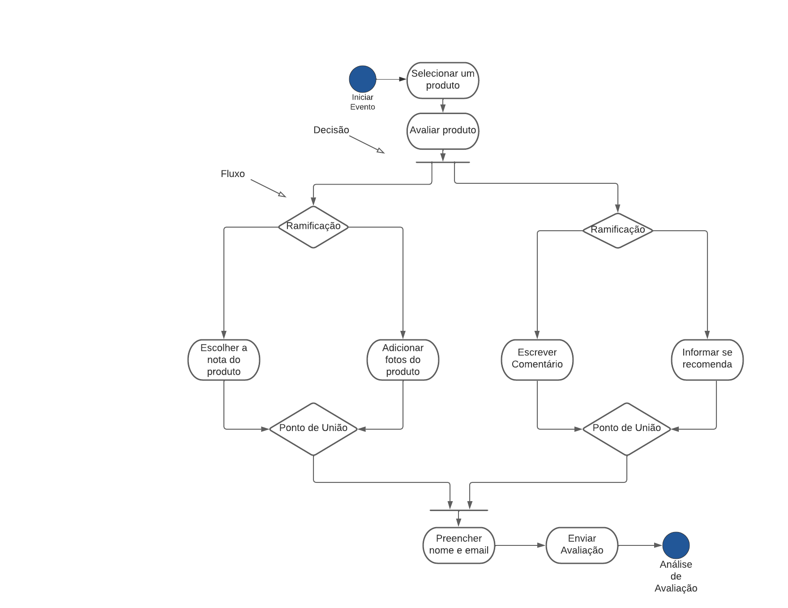

Figura 1. Diagrama de Atividades: Avaliação de produto, versão 1. (Fonte: elaborado pelo Davi Silva, 2023).

 <a>Versão 2.0</a> 

A segunda versão contou com a inserção das partições, para separar os responsáveis por cada atividade.

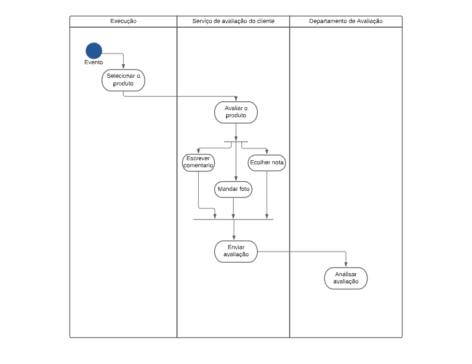

Figura 2. Diagrama de Atividades: Avaliação de produto, versão 2. (Fonte: elaborado pelo Davi Silva, 2023)

#### Terceira versão (3.0)

A partir dos elementos elencados, e das versões anteriores, a versão final (3.0) foi elaborada.

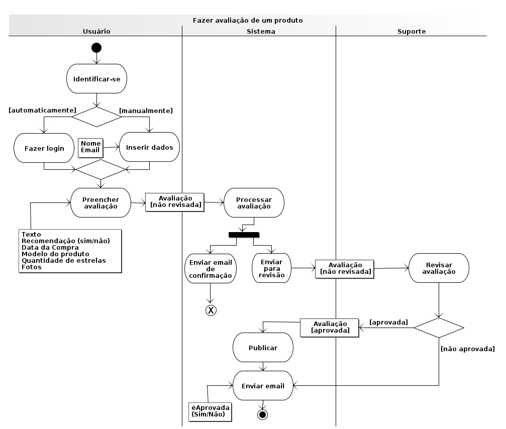

Figura 3. Diagrama de Atividades: Avaliação de produto, versão 3. (Fonte: elaborado por Davi Lima e Nicolas Souza, 2023)

## Conclusão

## Referências

[1] <https://www.uml-diagrams.org/activity-diagrams.html>  
[2] Material da aula (slides sobre modelagem dinâmica)  
[3] <https://www.ibm.com/docs/pt-br/rational-soft-arch/9.7.0?topic=diagrams-activity>  
[4] LucidChart, disponível no [link](https://www.lucidchart.com/pages/).
[5] Diagrama Causa-Efeito
[6] RichPicture

## Histórico de versão

| Versão | Data       | Descrição  | Autor(es)                 | Revisor(es)          |
|--------|------------|------------|---------------------------|----------------------|
| `1.0`  | 10/05/2023 | Criação das pastas e arquivos da 2° entrega | Lucas Felipe | Nicolas Souza |
| `1.1`  | 11/05/2023 | Início da Introdução, inclusão da Metodologia e início da seção Elaboração do Diagrama | Nicolas Souza |
