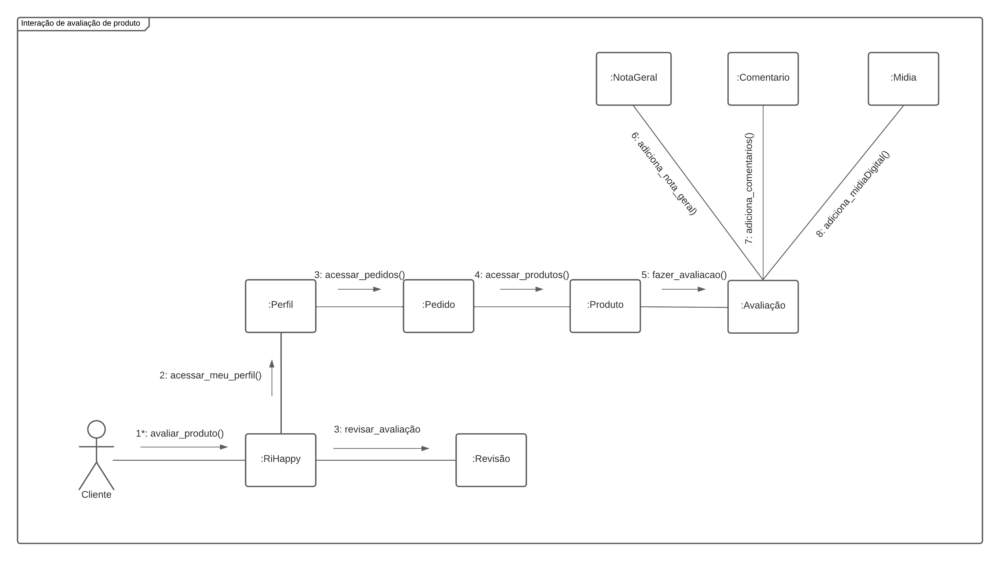
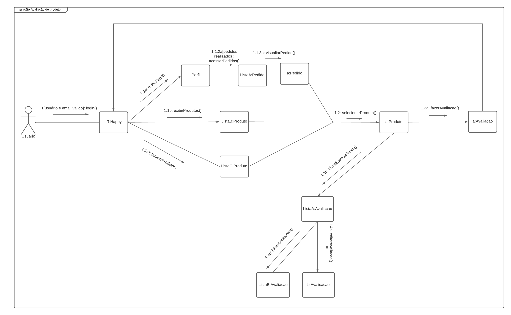

# Diagrama de Comunicação

## Introdução

O Diagrama de Comunicação, também conhecido como Diagrama de Colaboração, em versões anteriores da notação de diagramação Unified Modeling Language (UML) ou Linguagem de Modelagem Unificada, é um diagrama dinâmico que mostra a interação entre objetos e/ou partes usando mensagens sequenciais [1]. O seu objetivo é dar ênfase nas mensagens (indicações de comunicações) e em suas ordens [2], normalmente, com foco em um cenário de uso. Diante disso, esse artefato tem como objetivo aplicar essa forma de representação ao fluxo de avaliação de produtos que ocorre no site [RiHappy](https://rihappy.com.br).

## Metodologia

Para esboçar o diagrama, os membros Guilherme Vilela, Lucas Gabriel e Lucas Gomes se reuniram e utilizaram como ferramenta o [Lucid Chart](https://www.lucidchart.com/pages/pt) e foram evoluindo ao longo da sprint. Além disso, foram utilizadas as informações contidas nos seguintes artefatos para melhor elaboração da solução:

-   [RichPicture](../../1.Base/1.1.2.RichPicture.md)
-   [Diagrama Causa-Efeito](../../1.Base/1.1.1.CausaEfeito.md)
-   [Diagrama de Classes](../2.3.Estatica/2.3.1.DiagramaDeClasses.md)
-   [Diagrama de Atividades](2.4.1.DiagramaDeAtividades.md)

## Diagrama de Comunicação

### Versão Inicial

Inicialmente, foi construída uma versão feita focando em criar um fluxo ideal no processo de enviar um *feedback* no site, como pode ser observado na Figura 1.

<figcaption style="text-align: center">
    <b>Figura 1: Diagrama de comunicação geral da avaliação de produtos da RiHappy</b>
     <small>Autor: Elaboração Própria (Guilherme Vilela, Lucas Gabriel e Lucas Gomes)</small>
</figcaption>

### Versão Final

Posteriormente, foi realizado um processo de melhora do diagrama incial para uma versão final para o processo de enviar um *feedback* no site, como pode ser observado na Figura 2.

<figcaption style="text-align: center">
    <b>Figura 2: Versão final Diagrama de comunicação geral da avaliação de produtos da RiHappy</b>
     <small>Autor: Elaboração Própria (Guilherme Vilela, Lucas Gabriel e Lucas Gomes)</small>
</figcaption>

> **Observação**: <code>Não foram adicionados os parâmetros das funções com objetivo de tornar mais clara a leitura da sequência de atividades.</code>

## Conclusão

Ante o exposto, é possível observar que o Diagrama de Comunicação representa de forma clara a sequência de atividades que ocorre durante o processo representado, facilitando que o leitor entenda o processo. Assim, é possível observar informações relevantes para o projeto, desde de níveis mais simples, como por exemplo atores envolvidos e condições necessárias para as mensagens serem enviadas (executadas) [2], até níveis mais técnicos como o nível de acoplamento referente a uma Classe presente no projeto.

## Referências

[1] SERRANO M., Material da aula: "Arquitetura e Desenho de Software - AULA - MODELAGEM UML DINÂMICA", disponível na plataforma Aprender 3. Acesso em 14/05/2023.
[2] KIRILL FAKHROUTDINOV. UML communication diagrams overview - graphical notations for lifeline, message, etc. Uml-diagrams.org. Disponível em: <https://www.uml-diagrams.org/communication-diagrams.html>. Acesso em: 15 maio 2023.‌

## Histórico de versão

| Versão | Data       | Descrição                                                 | Autor(es)     | Revisor(es)    |
| ------ | ---------- | --------------------------------------------------------- | ------------- | -------------- |
| `1.0`  | 10/05/2023 | Criação das pastas e arquivos da 2° entrega               | Lucas Felipe  | Nicolas Chagas |
| `2.1`  | 14/05/2023 | Adicionando introdução                                    | Lucas Gomes   | Nicolas Chagas |
| `2.2`  | 14/05/2023 | Adicionando diagrama inicial                              | Lucas Gomes   | Nicolas Chagas |
| `2.3`  | 14/05/2023 | Adicionando referencia                                    | Lucas Gomes   | Nicolas Chagas |
| `2.4`  | 14/05/2023 | Ajuste em todas seções do documento e adição da conclusão | Lucas Gabriel | Nicolas Chagas |
| `2.5`  | 14/05/2023 | Adição da versão final do Diagrama de Comunicação         | Lucas Gabriel | Nicolas Chagas |
| `2.6`  | 17/05/2023 | Correção da versão final do Diagrama de Comunicação       | Lucas Gabriel | Nicolas Chagas |

