# Diagrama de Atividades

## Introdução

Um diagrama de atividade é uma representação visual que mostra como os objetos ou controles fluem em uma aplicação. Ele é usado para representar o comportamento dinâmico de um sistema mostrando as atividades, a ordem em que elas ocorrem e as decisões tomadas durante esse processo.

O diagrama tem como objetivo dar aos usuários uma visão clara e organizada do processo de avaliação de produtos e como eles podem visualizá-las no site [RiHappy](https://rihappy.com.br). Ele, o Diagrama de Atividades, facilita a compreensão das etapas e interações entre os componentes do sistema.

O nosso diagrama de atividade visa documentar o fluxo de avaliação de produtos e de visualização de avaliações realizado no site [RiHappy](https://rihappy.com.br).

Dentre os elementos presentes em um diagrama de atividades [1], o grupo utilizou os elementos descritos na <a onclick="document.querySelector('#uml').open = !document.querySelector('#uml').open"><u> seção a seguir</u></a>.

 
  <a>Notação UML</a> 

- **Partição**
  Uma partição agrupa atividades com alguma característica em comum[1], no caso do diagramas elaborados as partições agrupam atividades de acordo com os seus **atores**.

  A notação utilizada para representar uma partição (Figura 1) assemelha-se à notação de piscina, do diagrama [BPMN](../../1.base/processos/modelagembpmn.md).

  

  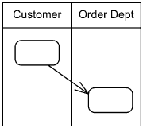

  Figura 1. Notação das partições ("Customer" e "Order Dept") no diagrama de atividades. (Fonte: [1]).
  

- **Nó inicial e Nó Final**
  Esses nós, como os próprios nomes sugerem, indicam o início (Figura 2) e o final (Figura 3) de uma atividade. Também é possível indicar o final de um fluxo, utilizando o um nó de fim de fluxo (Figura 4)

  | Nome do nó         | Notação UML [1]                                                                                               |
  | ------------------ | ------------------------------------------------------------------------------------------------------------- |
  | Nó Inicial         | 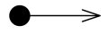   Figura 2. Notação do nó inicial. (Fonte: [1])         |
  | Nó final           | 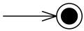   Figura 3. Notação do nó final. (Fonte: [1])           |
  | Nó de fim de Fluxo | 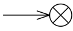   Figura 4. Notação do nó de fim de fluxo. (Fonte: [1]) |

- **Nó de decisão**
  É um nó de controle a partir do qual é selecionado apenas **um** fluxo de saída (Figura 5).

  

  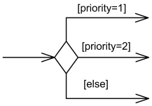

  Figura 5. Notação para os nós de controle (Fonte: [1]).

  

- **Fork node**
  É um nó de controle que tem uma aresta de entrada e múltiplas de saída, indica fluxos concorrentes, e surgiu na notação UML para representar atividades paralelas (Figura 6).

  

  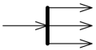

  Figura 6. Notação para o _fork node_ (Fonte: [1]).
  

- **Ações**
  É um elemento nomeado (com verbos) que representa um passo atômico em uma atividade (Figura 7).
  

  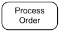

  Figura 7. Ação para "processar o pedido" (Fonte: [1]).
  

- **Nós de objeto**
  Um nó de objeto representa um fluxo de objetos em uma atividade, e é representado na forma de retângulo (Figura 8).

  

  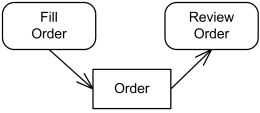

  Figura 8. Representação do objeto "_Order_" gerado após o preenchimento (Fonte: [1]).
  

- **Parâmetros de atividades**
  As atividades podem receber parâmetros, também representados por retângulos (Figura 9).

  

  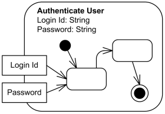

  Figura 9. Representação dos parâmetros _Login Id_ e _Password_ (Fonte: [1]).

  

## Metodologia

Para a elaboração do diagrama, a equipe de trabalho, composta pelos estudantes Davi Lima, Davi Matias e Nicolas, dividiu as atividades da seguinte maneira:

1. **Estudo individual sobre o assunto**: Para se familiarizar com as especificações da notação, cada aluno realizou um estudo individual do diagrama UML de atividades. Eles usaram vários materiais e recursos de consulta durante a pesquisa. Durante o período de estudo, foram registrados na [issue do GitHub (#38)](https://github.com/UnBArqDsw2023-1/2023.1_G5_ProjetoRiHappy/issues/38) os materiais utilizados durante a consulta, para posteriormente serem inseridos nas [referências](#referências).
2. **Elaboração de esboços individuais**: Após concluírem soseus estudos, cada membro da equipe elaborou um esboço do diagrama e registrou suas conclusões e/ou esboço na [issue do GitHub (#38)](https://github.com/UnBArqDsw2023-1/2023.1_G5_ProjetoRiHappy/issues/38).
3. **Reunião para reunir os elementos do diagrama**: Ao longo da aula de dúvidas, os três alunos se reuniram para discutir e sintetizar os conteúdos dos esboços individuais. O encontro teve como objetivo reunir as melhores ideias de toda an equipe para construir uma versão final do diagrama.

As [ferramentas](../../1.base/processos/ferramentasutilizadas.md) utilizadas para a elaboração dos diagramas foram o [LucidChart](https://www.lucidchart.com/) e o [brModelo](http://www.sis4.com/brModelo/).

## Elaboração do Diagrama

O objetivo principal da análise do problema e da criação dos artefatos RichPicture e Diagrama Causa-Efeito foi encontrar e entender os procedimentos envolvidos no sistema de avaliação de produtos. Os artefatos destacaram atividades específicas que devem ser consideradas ao implementar o sistema, enquanto a análise permitiu elencar elementos essenciais que devem estar presentes no fluxo de avaliação.

Na primeira etapa do projeto, foi realizada uma [análise do problema](../../1.base/nao-especificos/abordagemnaoespecifica.md), durante a qual foi possível elencar alguns elementos que devem estar presentes no fluxo de avaliação de produtos, por meio da produção e análise dos artefatos [RichPicture](../../1.base/nao-especificos/richpicture.md) e [Diagrama Causa-Efeito](../../1.base/nao-especificos/causaefeito.md).

De acordo com as conclusões provenientes do Diagrama Causa-Efeito [5], a aplicação deve:

- **Ordenação de avaliações**: O sistema deve permitir que as avaliações sejam ordenadas por data, classificação ou relevância. Isso tornará mais fácil para os usuários ver e comparar avaliações.;
- **Incluindo avaliações realizadas por especialistas**: O sistema deve ter a capacidade de realizar avaliações de especialistas além das avaliações de usuários. Essas avaliações podem fornecer aos usuários uma visão mais ampla do produto;
- **Apresentação de estatísticas**: As avaliações devem permitir que o sistema produza estatísticas. Gráficos de distribuição de avaliações, médias de classificação e percentuais de recomendação podem fazer parte disso. Os usuários terão uma melhor visão geral dos produtos e poderão tomar melhores decisões de compra com a ajuda dessas estatísticas;
- **Incentivo às avaliações de usuários**: O sistema deve incentivar os clientes a escrever avaliações sobre os produtos que compraram. Para atingir esse objetivo, você pode usar notificações, incentivos ou até mesmo recompensas para aumentar a participação dos usuários e aumentar a base de avaliações.

Além disso, foram identificados as seguintes atividades no RichPicture[6]:

- Usuário seleciona brinquedo (produto);
- Usuário acessa área de avaliação do produto;
- Usuário incia a avaliação, inserindo:
  - Quantidade de estrelas para a nota;
  - Se recomenda ou não o produto;
  - Zero ou 1 comentário sobre o produto;
  - Zero ou mais fotos;
  - Dados pessoais (email e nome);
- Usuário envia a avaliação;
- Análise da RiHappy avaliação a avaliação.

Durante a elaboração do RichPicture, a equipe de trabalho identificou que o sistema atual não fornece um _feedback_ ao usuário sobre a avaliação enviada, portando, a equipe de trabalho propõe a inserção das seguintes atividades no fluxo, para suprir essa necessidade:

- **Envio de email de confirmação**: O sistema deve enviar um email para o usuário para confirmar que a avaliação foi recebida. Isso garante ao usuário que sua avaliação foi recebida e tratada.
- **Publicação da avaliação enviada por email**: O sistema deve enviar um email para o usuário informando se sua avaliação foi publicada ou não após a análise da avaliação pela RiHappy. Caso a avaliação não seja divulgada, o email deve conter uma explicação para a decisão de não ter sido publicada. Esse feedback é crucial para que o usuário entenda por que não foi publicado e possa tomar as medidas necessárias.

A partir dos elementos supracitados, foram definidos dois fluxos principais de atividade a serem modelados na notação UML do diagrama de Atividades:

- [Avaliação de Produto](#avaliação-de-produto)
- [Visualização de Avaliações](#visualização-de-avaliações)

### Avaliação de Produto

O usuário inicia essa atividade ao clicar em um botão "Avaliar Produto", em seguida:

1. Ele insere seus dados pessoais (email e nome **OU** efetua login)
2. Ele insere na avaliação (atividades paralelas):
   - Texto (obrigatório);
   - Modelo do produto (obrigatório?) [Ex: cor];
   - Fotos (0...n);
   - Data de Compra (0..1);
3. Ele envia a avaliação
4. Um email confirmando o recebimento da avaliação é enviado para o email do usuário
5. A avaliação é revisada pela administração do sistema
6. Um email confirmando se avaliação foi aprovada ou não (e o motivo) é enviado para o usuário

### Visualização de Avaliações

O usuário inicia essa atividade ao navegar até a seção de avaliações na página do produto, em seguida:

1. O usuário pode filtrar as avaliações:
   - Inserindo no filtro os campos opcionais: Contém Fotos?, Modelo do Produto e Data de Compra.
2. O usuário pode classificar as avaliações:
   - Para cada avaliação ele pode classificar como "relevante" ou "irrelevante".

#### Atividade - Avaliações de um Produto

 <a>Versão 1.0</a> 

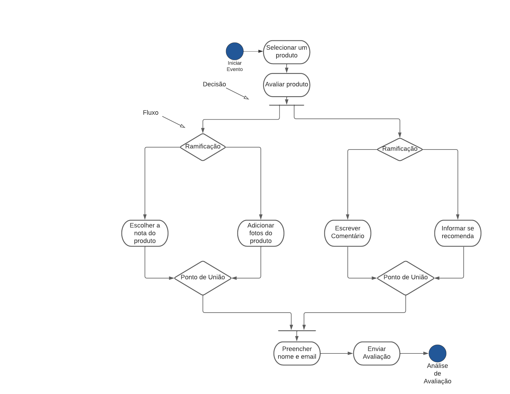

Figura 10. Diagrama de Atividades: Avaliação de produto, versão 1. (Fonte: elaborado por Davi Silva, 2023).

 <a>Versão 2.0</a> 

A segunda versão (Figura 11) contou com a inserção das partições, para separar os responsáveis por cada atividade.

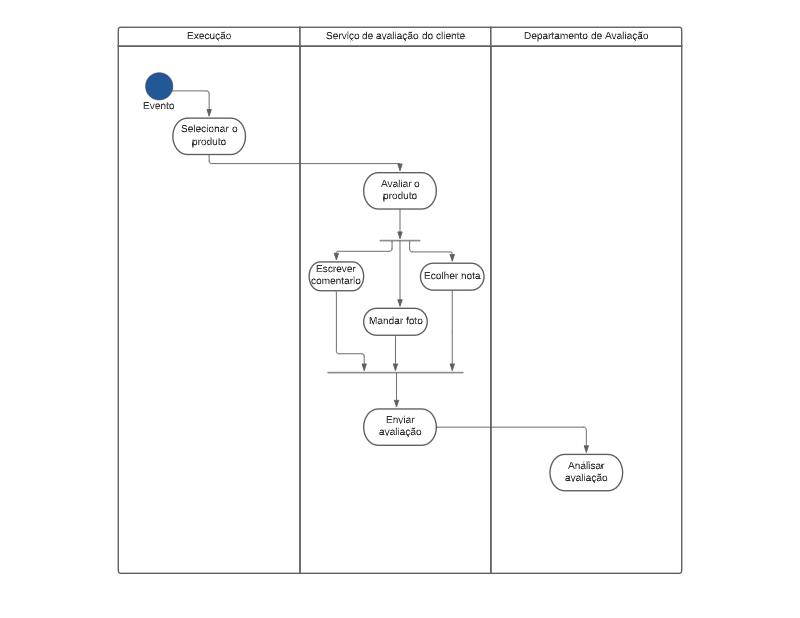

Figura 11. Diagrama de Atividades: Avaliação de produto, versão 2. (Fonte: elaborado por Davi Silva, 2023)

#### Terceira versão (3.0)

A partir dos elementos elencados, e das versões anteriores, a versão final do diagrama (Figura 12) foi elaborada.

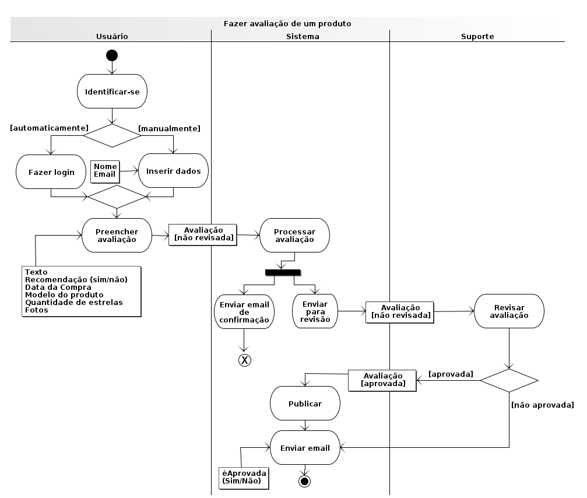

Figura 12. Diagrama de Atividades: Avaliação de produto, versão 3. (Fonte: elaborado por Davi Lima e Nicolas Souza, 2023)

#### Primeira Versão (1.0)

A partir dos elementos elencados, a primeira versão (1.0) foi elaborada.

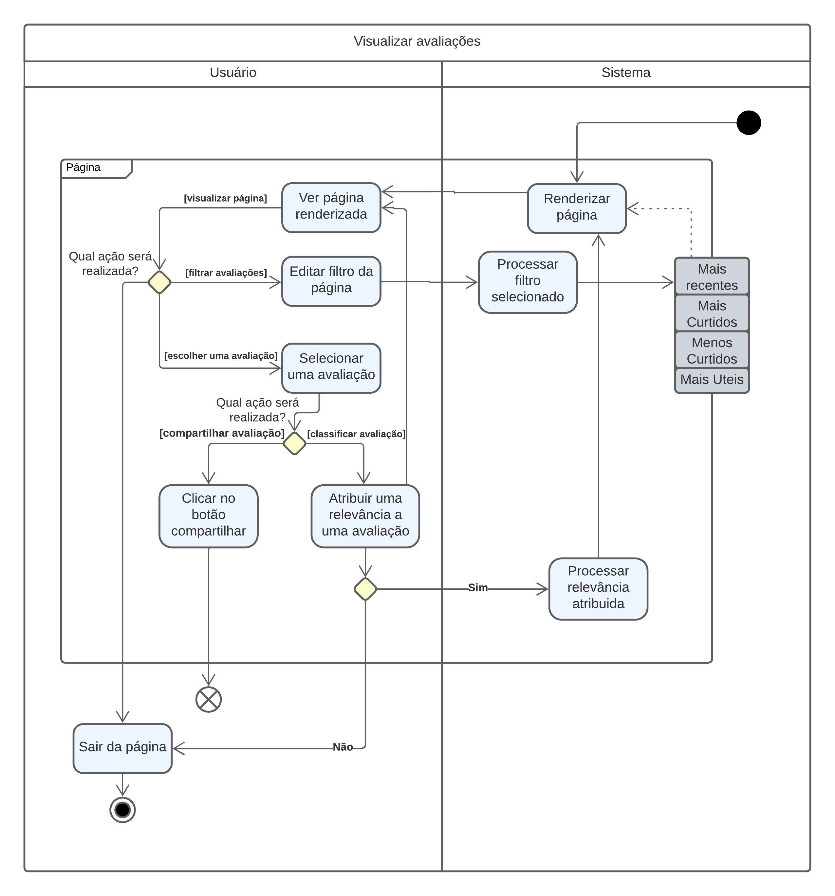

Figura 13. Diagrama de Atividades: Visualização de Avaliação, versão 1. (Fonte: elaborado por Davi Lima e Nicolas Souza, 2023)

## Conclusão

O diagrama de atividades é uma excelente maneira de representar o fluxo de avaliação de um site de compras como o da [RiHappy](https://rihappy.com.br). Esse tipo de diagrama permite que os usuários visualizem facilmente cada etapa do processo de avaliação e entendam como o sistema funciona. Além disso, o diagrama de atividades pode ajudar a identificar possíveis problemas e gargalos no fluxo, permitindo que os desenvolvedores do site realizem melhorias para tornar o processo de avaliação mais eficiente e agradável para os usuários. Em suma, um diagrama de atividades pode se tornar uma ferramente poderosa para criar uma experiência de compra on-line mais eficaz e agradável o possivel para os usuários.

## Referências

[1] Activity Diagrams, artigo no site UML Diagrams, disponível no [link](https://www.uml-diagrams.org/activity-diagrams.html). Acesso em 13/05/2023.  
[2] SERRANO, M. Modelagem UML Dinâmica, slides disponíveis na plataforma Aprender3.  
[3] Diagrama de atividades, artigo disponível no [link](https://www.ibm.com/docs/pt-br/rational-soft-arch/9.7.0?topic=diagrams-activity). Acesso em 13/05/2023;  
[4] Ferramenta LucidChart, disponível no [link](https://www.lucidchart.com/pages/). Acesso em 12/05/2023  
[5] Diagrama Causa-Efeito, artefato elaborado por Grupo 5, disponível no [link](../../1.base/1.1.1.CausaEfeito.md) Acesso em 12/05/2023.  
[6] RichPicture, artefato elaborado por Grupo 5, disponível no [link](../../1.base/1.1.2.RichPicture.md). Acesso em 12/05/2023.  
[7] O que é diagrama de atividades UML?, disponível no [link](https://www.lucidchart.com/pages/pt/o-que-e-diagrama-de-atividades-uml). Acesso em 12/05/2023. 
[8] Ferramenta brModelo, disponível no [link](http://www.sis4.com/brModelo/). Acesso em 13/05/2023.

## Histórico de versão

| Versão | Data       | Descrição                                                                                                                   | Autor(es)     | Revisor(es)   |
| ------ | ---------- | --------------------------------------------------------------------------------------------------------------------------- | ------------- | ------------- |
| `1.0`  | 10/05/2023 | Criação das pastas e arquivos da 2° entrega                                                                                 | Lucas Felipe  | Nicolas       |
| `1.1`  | 11/05/2023 | Início da Introdução, inclusão da Metodologia e início da seção Elaboração do Diagrama                                      | Nicolas       | Davi Matias   |
| `1.2`  | 13/05/2023 | Finalização da introdução, metodologia e inclusão das primeiras versões do diagrama e versão final do diagrama de avaliação | Nicolas       | Davi Matias   |
| `1.3`  | 13/05/2023 | Adição do diagrama de visualização de avaliações                                                                            | Davi Matias   | Davi Lima     |
| `1.4`  | 13/05/2023 | Adição da conclusão                                                                                                         | Davi Lima     | Luiza Esteves |
| `1.5`  | 02/07/2023 | Revisão geral                                                                                                               | Maria Abritta | Luiza Esteves |
