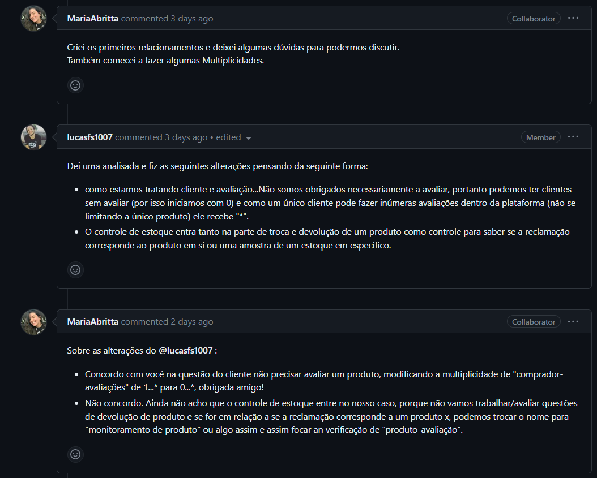
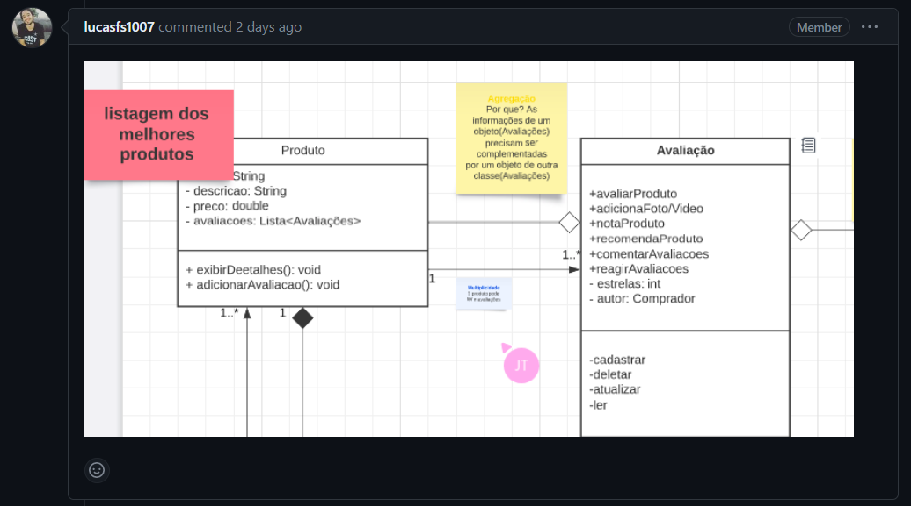
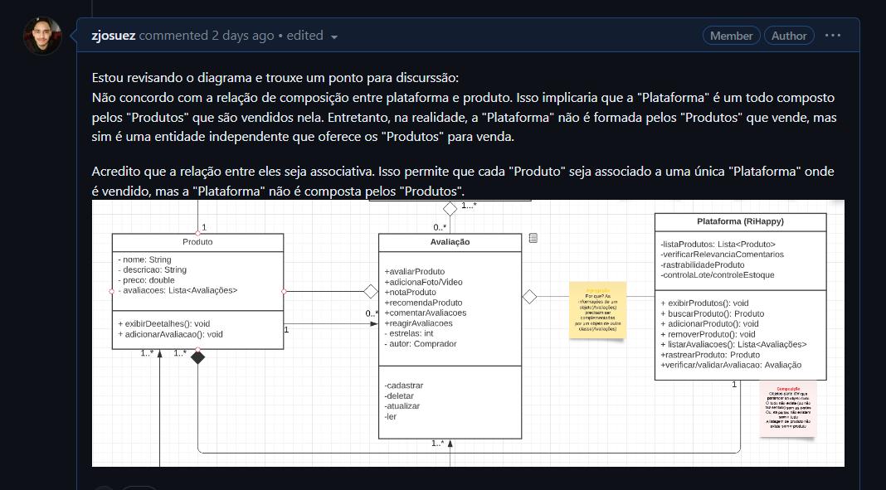
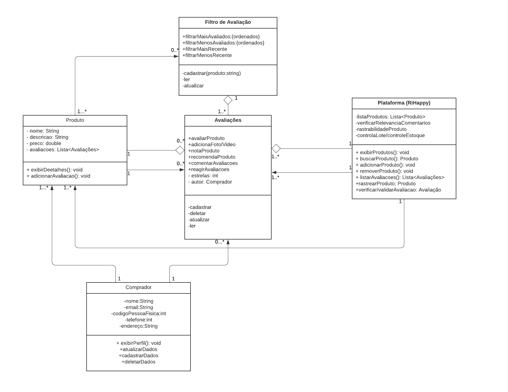

# Diagrama de classes

## Introdução

Exemplificar e restringir tudo aquilo que deve ou não estar contido dentro de um sistema de software nem sempre é uma atividade simples, com isso a linguagem de modelagem unificada (UML) auxilia esses profissionais a modelar como se darão esses processos e trilhar de maneira mais clara e lógica como vai se dar o processo de desenvolvimento deste software de maneira padronizada e estabelecida dentro da comunidade. O diagrama de classes, um dos mais populares diagramas da arquitetura de software, trata-se de um diagrama da estrutura de software devido sua capacidade de descrever tudo aquilo que estará dentro do sistema e como essas estruturas vão conversar entre si. Mais além nesta seção, veremos com mais detalhes como se deu a modelagem dentro do fluxo em questão da [RiHappy](https://www.lucidchart.com/pages/pt/o-que-e-diagrama-de-classe-uml).

## Metodologia

O diagrama foi elaborado seguindo a documentação e padronização prevista pela linguagem de modelagem unificada(UML). Para elaboração do mesmo, os alunos Josué Teixeira, Maria Abritta e Lucas Felipe utilizaram a ferramenta [Lucid Chart](https://www.lucidchart.com/pages/pt) para a modelagem do diagrama de classes. As principais discussões foram trazidas para dentro da issue do repósitorio no [Github]("https://github.com/UnBArqDsw2023-1/2023.1_G5_ProjetoRiHappy/issues/39"). Essas e outras ferramentas podem ser melhor visualizadas no artefato de [ferramentas](1.Base/1.2.3.FerramentasUtilizadas.md).

## Discussões de produção do artefato

Este diagrama de classes foi produzido pelos integrantes: Josué Teixeira, Lucas Soares e Maria Abritta. A equipe começou o processo de criação realizando uma análise da plataforma RiHappy e também co-relacionando com os artefatos produzidos na última entrega de maneira detalhada para identificar as entidades principais do sistema e as relações entre elas.

Em seguida, a equipe realizou várias iterações no diagrama, refinando o diagrama de classes à medida que novos requisitos e informações surgiam. Durante o processo de desenvolvimento, a equipe também levantou pontos para discutir as decisões de design e garantir que todos os membros estivessem alinhados. Alguns pontos são listados logo abaixo:

A primera discussão do grupo foi com relação a multiplicidade das classes abaixo sobre o diagrama de classes, Maria iniciou o processo de criação dos relacionamentos e multiplicidades, mas deixou algumas dúvidas para discussão.

Lucas analisou o diagrama e fez algumas alterações, sugerindo que a multiplicidade do relacionamento entre cliente e avaliação fosse alterada para permitir clientes sem avaliar (de 1..._para 0..._) e que o controle de estoque fosse incluído para verificar se a reclamação corresponde ao produto em si ou a uma amostra de estoque.

Maria concordou com a alteração da multiplicidade, mas discordou da inclusão do controle de estoque, propondo a mudança do nome para "monitoramento de produto" para focar na verificação de "produto-avaliação".

Também foram utilizados post-its durante o design do diagrama. Ao adicionar post-its ao diagrama de classes, os desenvolvedores podem fornecer descrições adicionais sobre cada classe, esclarecer as relações entre elas e identificar áreas que precisam de mais atenção durante o processo de desenvolvimento. Essa ferramenta ajuda a garantir que o diagrama de classes seja facilmente compreensível para todos os membros da equipe, independentemente de seu nível de experiência em programação ou conhecimento sobre diagrama de classes.

No geral, os post-its são uma ferramenta simples e eficaz para ajudar a melhorar a clareza e a compreensão de diagramas de classes, tornando o processo de desenvolvimento de software mais eficiente e eficaz. A imagem abaixo apresenta como essa ferramenta foi utilizada dentro do diagrama.

Por último, foi feito um questionamento pelo Josué, com relação ao relacionamento entre as classes "Plataforma" e "Produto". Essas discussões pode ajudar a esclarecer e melhorar a representação do diagrama de classes. A distinção entre a relação de composição e a relação associativa pode ter um impacto significativo na forma como o sistema é modelado e implementado.

No caso específico mencionado, a alteração proposta de mudar a relação entre "Plataforma" e "Produto" para uma relação associativa pode ajudar a representar melhor a realidade, uma vez que a plataforma é uma entidade independente que oferece produtos para venda, e não é formada pelos produtos que vende.

Ao utilizar a relação associativa, cada produto pode ser associado a uma única plataforma, e a plataforma pode oferecer vários produtos para venda. Essa abordagem pode ajudar a simplificar a modelagem e a implementação do sistema, garantindo que cada entidade seja representada de forma clara e precisa. Os integrantes concordaram com essa mudança e ela foi modificada no diagrama.

No geral, o processo de criação do diagrama de classes foi altamente colaborativo e a equipe trabalhou de forma diligente para garantir que o diagrama fosse preciso e atendesse às necessidades do sistema. Esperamos que este diagrama de classes ajude a fornecer uma base sólida para o desenvolvimento futuro.

## Diagrama de classes

Nessa parte, serão explicados os relacionamentos criados dentro do nosso Diagrama de Clasees. Serão explorados casos específicos dessas relações para cada classe, com exemplos de uso de multiplicidade em cada caso. Assim, logo abaixo apresentamos nosso diagrama final:

### Agregação entre "Produto" e "Avaliações"

O relacionamento de **agregação** é utilizado para representar uma relação entre objetos em que um deles é composto por outros objetos. No caso específico mencionado, onde a agregação é entre a classe _Produto_ e a classe _Avaliações_, significa que um objeto da classe _Produto_ é composto por objetos da classe _Avaliações_.

A utilização desse tipo de relacionamento é útil em casos em que se quer representar a relação de "todo-parte", em que um objeto é composto por outros objetos que têm vida própria. No caso em questão, uma instância de _Produto_ pode ter várias _Avaliações_ associadas, e essas _Avaliações_ podem ser criadas, alteradas e excluídas independentemente do _Produto_ ao qual estão associadas.

Ao representar essa relação de agregação no nosso diagrama de classes, é possível identificar facilmente essa relação de composição entre os objetos e entender como eles interagem. No caso da classe _Produto_, é possível representar a lista de _Avaliações_ como um atributo da classe, indicando que um objeto _Produto_ contém uma lista de objetos _Avaliações_.

### Associação entre "Produto" e "Avaliações"

O relacionamento de **associação** é utilizado em um diagrama de classes para representar uma relação entre objetos de diferentes classes, onde um objeto de uma classe é associado a um ou vários objetos de outra classe.

Neste caso em específico da classe _Produto_ e _Avaliações_, a associação é utilizada para representar a relação existente entre essas duas classes. Ou seja, um objeto da classe _Produto_ pode estar associado a zero ou vários objetos da classe _Avaliações_.

Isso significa que cada instância da classe _Produto_ pode ter uma ou várias instâncias da classe _Avaliações_ associadas a ela. Por exemplo, um produto pode ter diversas avaliações de clientes, que são representadas por instâncias da classe _Avaliações_.

### Agregação entre "Avaliações" e "Plataforma (RiHappy)"

No caso em questão, se a classe _Avaliações_ é composta por partes que podem ser compartilhadas com outras instâncias de classe, e a _Plataforma (RiHappy)_ tem o objeto listarAvaliacoes(): Lista<Avaliações>, então o grupo percebeu que seria adequado usar o relacionamento de **agregação**. Isso significa que uma instância da classe _Avaliações_ é um "todo" que é composto por partes que podem ser compartilhadas com outras instâncias da classe _Plataforma (RiHappy)_.

Uma avaliação pode ser feita por um cliente na plataforma RiHappy, mas a mesma avaliação também pode ser compartilhada em outras plataformas, como Amazon ou Mercado Livre. Nesse caso, a classe _Avaliações_ é um todo que é composto de partes (atributos ou métodos) que podem ser compartilhados com outras instâncias da classe _Plataforma_. Então, o relacionamento de agregação pode ser utilizado para representar essa relação de todo-parte.

### Associação entre "Avaliações" e "Plataforma (RiHappy)"

No relacionamento de associação entre as classes _Avaliações_ e _Plataforma (RiHappy)_, nesse caso específico em que um _Produto_ pode ter uma ou várias _Avaliações_, a multiplicidade "muitos" é utilizada no lado da classe _Avaliações_. Isso porque uma Avaliação está relacionada a um único Produto, mas um Produto pode ter várias Avaliações, o que significa que várias instâncias da classe _Avaliações_ podem estar associadas a uma única instância da classe _Produto_.

Já a multiplicidade "um" é utilizada no lado da classe _Plataforma (RiHappy)_, pois cada Avaliação é feita em uma única Plataforma, mas uma Plataforma pode ter várias Avaliações, o que significa que várias instâncias da classe _Avaliações_ podem estar associadas a uma única instância da classe _Plataforma (RiHappy)_.

O uso do relacionamento de associação foi definido como adequado nesse caso, pois ele representa a ligação entre as duas classes sem implicar que uma delas é composta por outra. Além disso, o uso da multiplicidade "um" ou "muitos" ajuda a especificar a natureza do relacionamento e a definir as restrições entre as classes.

### Associação entre "Produto" e "Filtro de Avaliação"

A classe _Produto_ e a classe _Filtro de Avaliação_ têm uma relação de dependência, pois um produto pode ter vários filtros de avaliação aplicados a ele, enquanto um filtro de avaliação pode ser aplicado a vários produtos.

A multiplicidade "0 ou vários" do lado dos _filtros de avaliação_ significa que um produto pode não ter nenhum filtro de avaliação aplicado a ele ou pode ter vários filtros de avaliação aplicados a ele. Isso permite que os produtos sejam listados e filtrados com base em diferentes critérios de avaliação. Por exemplo, um filtro de avaliação pode ser "mais recente" ou "mais avaliados" e um produto pode ter ambos os filtros aplicados a ele, ou nenhum.

Já a multiplicidade "1 ou mais" do lado dos _produtos_ significa que um filtro de avaliação deve ser aplicado a pelo menos um produto, mas pode ser aplicado a vários. Essa multiplicidade garante que os filtros de avaliação sejam úteis e tenham impacto na exibição e na classificação dos produtos. Sem ela, um filtro de avaliação aplicado a nenhum ou a apenas um produto seria ineficaz.

### Associação entre "Comprador" e "Produto"

O relacionamento de Associação entre as classes _Comprador_ e _Produto_ indica que um comprador pode ter um ou vários produtos. Essa multiplicidade existe porque um comprador pode comprar mais de um produto em uma única compra ou em compras diferentes. Além disso, um comprador pode comprar produtos de diferentes categorias o que também justifica a multiplicidade.

A multiplicidade de "um" significa que **um** _comprador_ pode comprar vários produtos diferentes ao longo do tempo, enquanto um produto pode ser comprado por diferentes compradores. Já a multiplicidade "um para muitos" indica que um _comprador_ podem comprar muitos produtos diferentes.

### Associação entre "Comprador" e "Avaliações"

O relacionamento de associação entre as classes _Comprador_ e _Avaliações_ é utilizado para representar que um comprador pode fazer zero ou várias avaliações. A multiplicidade é determinada pela possibilidade de um comprador realizar diversas compras e ter diferentes experiências com os produtos adquiridos, podendo avaliar cada um deles separadamente.

Por exemplo, um comprador pode ter feito diversas compras na loja online e ter avaliado cada produto adquirido, dando um comentário sobre cada um deles. Portanto, a multiplicidade "0..\*" é utilizada para indicar que um comprador pode ter feito nenhuma ou várias avaliações.

### Associação entre "Avaliações" e "Produto"

Nesse caso da classe _Plataforma (RiHappy)_ e _Produto_, o relacionamento de **Associação** é utilizado para indicar que uma Plataforma (RiHappy) pode ter 1 ou várias instâncias da classe Produto.

Essa multiplicidade é justificada pelo fato de que uma plataforma de comércio como a RiHappy pode oferecer um amplo conjunto de produtos em sua loja virtual, desde brinquedos, jogos, artigos infantis e etc. Dessa forma, é possível que a plataforma tenha uma grande quantidade de produtos em seu catálogo. Por exemplo, a RiHappy pode ter centenas ou milhares de brinquedos diferentes em sua loja online.

No caso de uma plataforma é esperado que haja diversos produtos disponíveis para compra, portanto, a multiplicidade indica que uma plataforma pode ter vários produtos. Por outro lado, um produto deve estar associado a apenas uma plataforma, portanto, a multiplicidade indica que um produto pertence a apenas uma plataforma.

(imagem final do diagrama)
--> colocar a imagem de forma limpa, sem os bilhetes de discussão (esses serão debatidos na seção acima).
--> procure explicar essencialmente o que é cada classe, bem qual seus relacionamentos e multiplicidades

## Conclusão

Em virtude de todas as discussões que vem sendo elaboradas desde a entrega anterior, o grupo teve a possibilidade de adentrar ainda mais dentro do fluxo proposto e modelar cada vez mais as ideias por trás da implementação do mesmo. Apesar de ser um diagrama já trabalhado em outras disciplinas, sinto que o grupo cada vez mais ganha maturidade e consegue fazer ainda melhor a linkagem com outros artefatos.

## Bibliografia

[1] O que é um diagrama UML ? Disponível em: [Link](https://www.lucidchart.com/pages/pt/o-que-e-diagrama-de-classe-uml). Acesso em: 11 mai. 2023.  
[2] Unified Modeling Language (UML). Disponível em: [Link](http://www.deinf.ufma.br/~acmo/MOO_Intro.pdf) Acesso em: 11 Mai.2023  
[3] Serrano, Milene. DSW-Modelagem - Agregacao Composicao. São Paulo: 25 jul, 2020. Disponível em: [Link](https://unbbr-my.sharepoint.com/personal/mileneserrano_unb_br/_layouts/15/stream.aspx?id=%2Fpersonal%2Fmileneserrano%5Funb%5Fbr%2FDocuments%2FArqDSW%20%2D%20V%C3%ADdeosOriginais%2F05e%20%2D%20VideoAula%20%2D%20DSW%2DModelagem%20%2D%20Agregacao%20Composicao%2Emp4&ga=1). Acesso em: 11 mai. 2023.  
[4] Serrano, Milene. DSW-Modelagem - Classe Concreta Abstrata Sobrescrita Sobrecarga. São Paulo: 25 jul, 2020. Disponível em: [Link](https://unbbr-my.sharepoint.com/personal/mileneserrano_unb_br/_layouts/15/stream.aspx?id=%2Fpersonal%2Fmileneserrano%5Funb%5Fbr%2FDocuments%2FArqDSW%20%2D%20V%C3%ADdeosOriginais%2F05d%20%2D%20VideoAula%20%2D%20DSW%2DModelagem%20%2D%20Classe%20Concreta%20Abstrata%20Sobrescrita%20Sobrecarga%2Emp4&ga=1). Acesso em: 11 mai. 2023.  
[5] Serrano, Milene. DSW-Modelagem - Dependencia Associacao: 25 jul, 2020. Disponível em: [Link](https://unbbr-my.sharepoint.com/personal/mileneserrano_unb_br/_layouts/15/stream.aspx?id=%2Fpersonal%2Fmileneserrano%5Funb%5Fbr%2FDocuments%2FArqDSW%20%2D%20V%C3%ADdeosOriginais%2F05c%20%2D%20VideoAula%20%2D%20DSW%2DModelagem%20%2D%20Dependencia%20Associacao%2Emp4&ga=1). Acesso em: 11 mai. 2023.  
[6] Serrano, Milene. DSW-Modelagem - Agregacao Composicao: 25 jul, 2020. Disponível em: [Link](https://unbbr-my.sharepoint.com/personal/mileneserrano_unb_br/_layouts/15/stream.aspx?id=%2Fpersonal%2Fmileneserrano%5Funb%5Fbr%2FDocuments%2FArqDSW%20%2D%20V%C3%ADdeosOriginais%2F05e%20%2D%20VideoAula%20%2D%20DSW%2DModelagem%20%2D%20Agregacao%20Composicao%2Emp4&ga=1). Acesso em: 11 mai. 2023. 

## Histórico de versão

| Versão | Data       | Descrição                                                                                            | Autor(es)      | Revisor(es)                       |
| ------ | ---------- | ---------------------------------------------------------------------------------------------------- | -------------- | --------------------------------- |
| `1.0`  | 10/05/2023 | Criação das pastas e arquivos da 2° entrega                                                          | Lucas Felipe   | Nicolas Chagas Souza              |
| `2.0`  | 11/05/2023 | Criação da introdução, metodologia, base da conclusão e estruturação base de como se dará o artefato | Lucas Felipe   | Davi Silva, Davi Lima e Guilherme |
| `3.0`  | 12/05/2023 | Criação da introdução, metodologia, base da conclusão e estruturação base de como se dará o artefato | Josué Teixeira | Davi Silva, Davi Lima e Guilherme |
| `4.0`  | 12/05/2023 | Criação das explicações do porquê nosso diagrama ficou da forma que ficou no diagrama final          | Maria Abritta  | Davi Lima                                  |
| `5.0`  | 15/05/2023 | Ajustando a multiplicidade do diagrama e incrementando bibliografia | Josué Teixeira  | Davi Lima |
