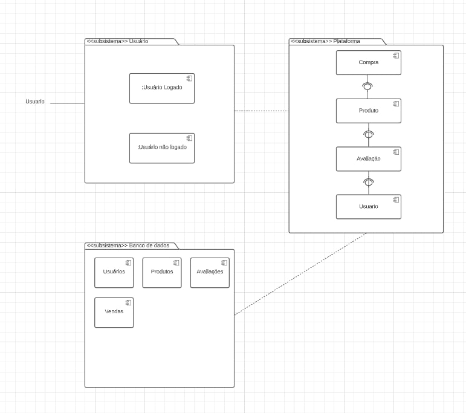
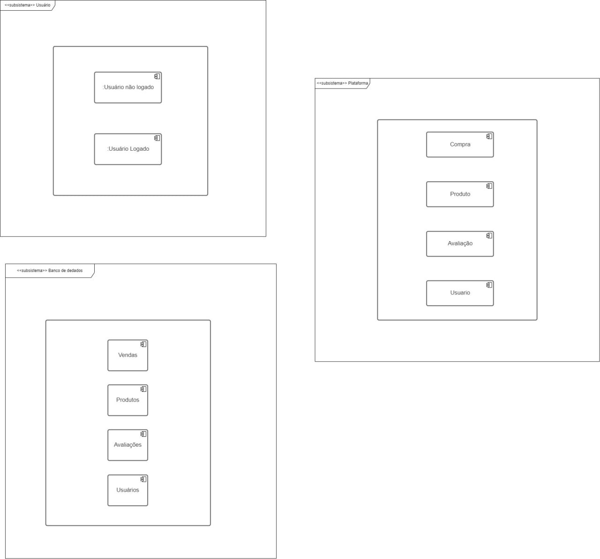
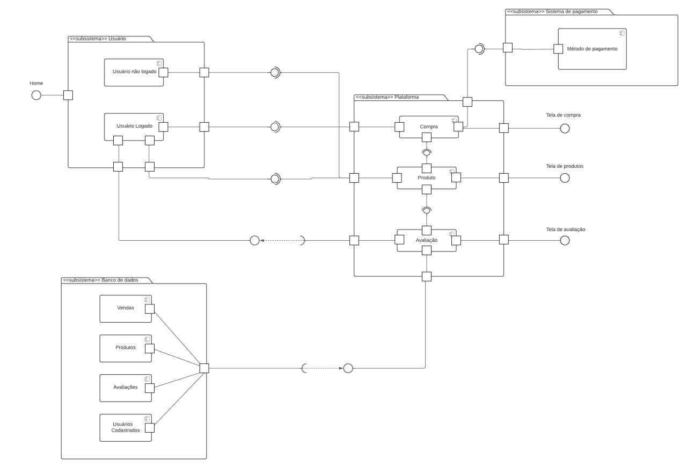

# Diagrama de Componentes

## Introdução

O diagrama de componentes é uma ferramenta de modelagem visual que representa a estrutura de um sistema em termos de seus componentes principais e suas interações. Ele pode ser usado em várias fases do ciclo de vida de um projeto de software, incluindo a fase de implantação.
Já na fase de implantação, o diagrama de componentes pode ser usado para auxiliar na distribuição e implantação dos componentes de um sistema em um ambiente de produção.

## Metodologia

Para a criação do diagrama de componentes foi usado o Lucidchart, uma ferramenta de design e desenho que pode ser compartilhada entre várias pessoas. Assim, foi usado também o diagrama de classes como base para a criação deste diagrama, já que a lista como as classes são dispostas no projeto e parte dos seus relacionamentos também. Ao todo foram criadas 3 versões do diagrama de componentes que após análise e estudo chegamos a versão final dele que estará lista da aba de #Diagrama de componentes. Foi necessário 3 versões porque ao fim de cada versão vimos que era necessário especificar mais um componentes e suas relações com eles mesmos, tanto relações de componentes filhos e pais.

## Diagrama de Componentes

Ao longo do processo foram elaboradas 3 versões do diagrama de componentes, que após cada versão foi analisada a necessidade de novas relações e mudanças como seria representado os seus componentes e suas interações entre eles. Na versão final do diagrama, apresenta dois fluxos para os componentes para usuários logados e não logados. Assim, dando acesso a ações como compra de produtos e criação de avaliação de produtos. Segue abaixo as 3 versões dos diagramas, sendo a 3º versão a mais completa e final.

<figcaption style="text-align: center">
    <b>Figura 1: Versão 1 do diagrama de componentes</b>
     <small>Autor: Elaboração Própria (Josue e João Pedro)</small>
</figcaption>

<figcaption style="text-align: center">
    <b>Figura 3: Versão 2 do diagrama de componentes</b>
     <small>Autor: Elaboração Própria (Josue e João Pedro)</small>
</figcaption>

<figcaption style="text-align: center">
    <b>Figura 3: Versão 3 do diagrama de componentes</b>
     <small>Autor: Elaboração Própria (Josue e João Pedro)</small>
</figcaption>

## Conclusão

## Referências

[1] UML Package Diagrams Overview, artigo disponível no [link](https://www.uml-diagrams.org/package-diagrams-overview.html). Acesso em 09/05/2023.

## Histórico de versão

| Versão | Data       | Descrição                                               | Autor(es)                 | Revisor(es)          |
|--------|------------|---------------------------------------------------------|---------------------------|----------------------|
| `1.0`  | 10/05/2023 | Criação da pasta e dos arquivos do diagrama de componentes  | Joao Pedro | Maria Abritta |
| `1.1`  | 10/05/2023 | Adiçao dos textos e imagens no documento do diagrama de componentes  | Joao Pedro | Maria Abritta |

