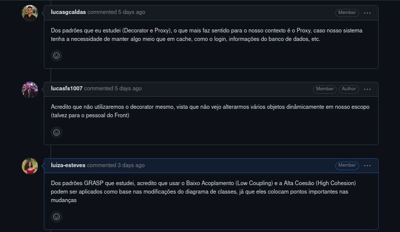
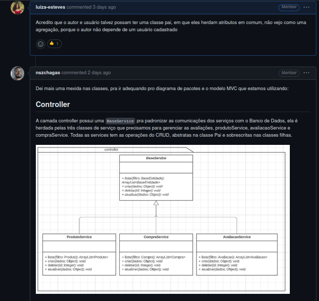

# Comunicação do Backend com a camada de persistência

## Introdução

Padrões de projeto são soluções para problemas comuns encontrados  no desenvolvimento ou manutenção de software. Tais padrões seguem paradigmas de programação específicos, principalmente a orientação a objetos. Entre os padrões mais conhecidos e amplamente utilizados estão os Padrões de Projeto GOF (Gang of Four), que foram apresentados no livro "Design Patterns: Elements of Reusable Object-Oriented Software" por Erich Gamma, Richard Helm, Ralph Johnson e John Vlissides.

Nesse artefato, veremos como foram aplicado GOFs na modelagem da comunicação do backend com a camada de persistência da aplicação, em específico no fluxo de avaliação de produtos e de visualização de avaliações realizado no site [RiHappy](https://rihappy.com.br), que é o foco do projeto.

## Metodologia

Para a realização da modelagem, os membros Lucas Felipe, Lucas Gomes, Lucas Gabriel, Luíza e Nicolas se reuniram e fizeram correções e modificações no [Diagrama de Classes](https://encr.pw/DiagramaDeClasse), visto que haviam modificações a serem feitas para uma melhor modelagem dos padrões de projeto escolhidos. O grupo também optou por registrar as discussões e comunicação por meio da [issue do GitHub (#56)](https://github.com/UnBArqDsw2023-1/2023.1_G5_ProjetoRiHappy/issues/56).

O grupo, após um período de análise, optou por seguir com o primeiro padrão GOF, o "**Proxy**". Optou-se pelo uso do Proxy" devido à sua capacidade de otimização, como a implementação de um cache de objetos, além de permitir que o local do objeto real permaneça transparente para o cliente. Dessa forma, o cliente não precisa ter conhecimento se o objeto está local ou remoto, caracterizando esse tipo de proxy como um Proxy Remoto. Considerando o contexto atual de avaliações no site da RiHappy, faz sentido adotar o padrão Proxy para criar uma autenticação de usuário, armazenando seus dados em cache e evitando a necessidade de fazer requisições frequentes ao banco de dados. Além disso, evita-se que usuários não autenticados ou que não tenham comprado o produto consigam fazer a avaliação do produto.

Durante as modelagens do diagrama de classes, o grupo utilizou muito da essência de outro padrão GOF, o "**Singleton**". O objetivo do padrão Singleton é garantir que apenas uma única instância de uma determinada classe seja criada durante a execução de um programa. A utilidade desse padrão, é que conseguimos evitar a criação de múltiplas instâncias de uma classe e também economizamos recursos do sistema.

Outro padrão que também foi bastante revisado e utilizado durante as modelagens foi o padrão "**Abstract Factory**". O objetivo principal do padrão Abstract Factory é abstrair a criação de objetos, permitindo que o código do cliente fique desacoplado das classes concretas específicas que estão sendo criadas. Isso promove a modularidade, a flexibilidade e a extensibilidade do sistema, tornando mais fácil adicionar novas variantes de produtos sem modificar o código existente.

## Discussões

Durante os estudos dos padrões de projeto, optamos por manter nossa comunicação através das [issues](https://github.com/UnBArqDsw2023-1/2023.1_G5_ProjetoRiHappy/issues/56), para garantir que tudo ficasse documentado e de fácil acesso à toda equipe. Assim, inicialmente colocamos os pontos principais estudados de cada padrão, como pode ser visto na Figura 1 abaixo:

 

  
  
  Figura 1. Definição de padrões pela equipe (Fonte: Repositório da equipe).
  

Após identificarmos padrões GOF que fizeram sentido com o escopo do nosso projeto, fizemos as devidas sugestões e alterações em conjunto com os feedbacks da professora em nossa última entrega, no diagrama de classes, de forma a detalhar melhor e desenvolvê-lo com base no que foi apresentado dos padrões. A Figura 2 mostra um pouco da discussão da equipe:

 

  
  
  Figura 2. Definições no diagrama de classes (Fonte: Repositório da equipe).
  

### GoF - Proxy

#### Intenção

O Proxy é um padrão de projeto estrutural que permite a utilização de um substituto, ou um espaço destinado, para um outro objeto. Em outras palavras, esse padrão controla o acesso ao objeto original permitindo que se faça alterações antes mesmo de se modificar o objeto original. O funcionamento básico do Proxy envolve a implementação de uma interface comum tanto pelo objeto proxy quanto pelo objeto real, mantendo uma referência ao objeto real e, quando recebe uma solicitação do cliente, pode executar determinadas ações antes ou depois de repassar a solicitação ao objeto real. Essa abstração ajuda a melhorar a modularidade, o desempenho, a segurança e a transparência do sistema.

#### Motivação

Como a abstração do padrão Proxy permite que os usuários consigam fazer solicitações sem trazer quaisquer modificações no objeto original. Com isso, ganhamos um grande aspecto de segurança vista que temos uma garantia que com esse controle de acesso, usuários específicos vão poder fazer requisições especificas dentro do sistema e com isso não afetar como um todo em aspectos de desempenho e qualidade. Além mais, todas essas camadas permitem que o usuário possa a vir interagir com outras classes que não sejam a original sem sentir necessáriamente uma diferença em sua utilização.

#### Aplicação

A principal aplicação do padrão dentro do fluxo do projeto, vai se dar no processo de criação de uma avaliação para um determinado produto. Dentro deste contexto, é necessário que o usuário faça uma verificação de login para que a plataforma tenha uma garantia de quem é a pessoa por trás da avaliação e se ela de fato fez a compra deste produto, para trazer uma maior relêvancia para a avaliação. Nesse fluxo, a depender do tipo de acesso que o usuário venha a ter não necessariamente ele precisa operar com a instância original.

#### Estrutura

#### Participantes

#### Colaborações

#### Consequências

#### Implementação

#### Código

## Referências

[1] Padrão Proxy, página web disponível no [link](https://refactoring.guru/pt-br/design-patterns/proxy). Acesso em 29/05/2023.  
[2] Padrão Proxy, página web disponível no [link](https://diogomoreira.gitbook.io/padroes-de-projeto/padrao-proxy). Acesso em 29/05/2023  
[3] Arquitetura e Desenho de software - Aula Gofs criacionais - Profa. Milene  

## Histórico de Versão

| Versão | Data | Descrição | Autor(es) | Revisor(es) |
|--------|------|-----------|-----------|-------------|
| `1.0`  | 26/05/2023     | Criação do documento com estrutura padrão.          | Nicolas   | Lucas Felipe            |
| `1.1`  | 29/05/2023     | Criação da base do artefato com os padrões escolhidos        | Lucas Felipe e Lucas Gomes   | Nicolas            |
| `1.2`  | 30/05/2023     | Adicionando Padrão Proxy       | Lucas Felipe e Lucas Gomes   | Nicolas            |
| `1.3`  | 02/06/2023     | Adicionando comunicações da equipe       | Luíza Esteves e Lucas Gomes   | Lucas Felipe    |
| `1.4`  | 04/06/2023     | Adapta estrutura dos textos para receber apenas os padrões GOF       | Lucas Felipe   |     |
