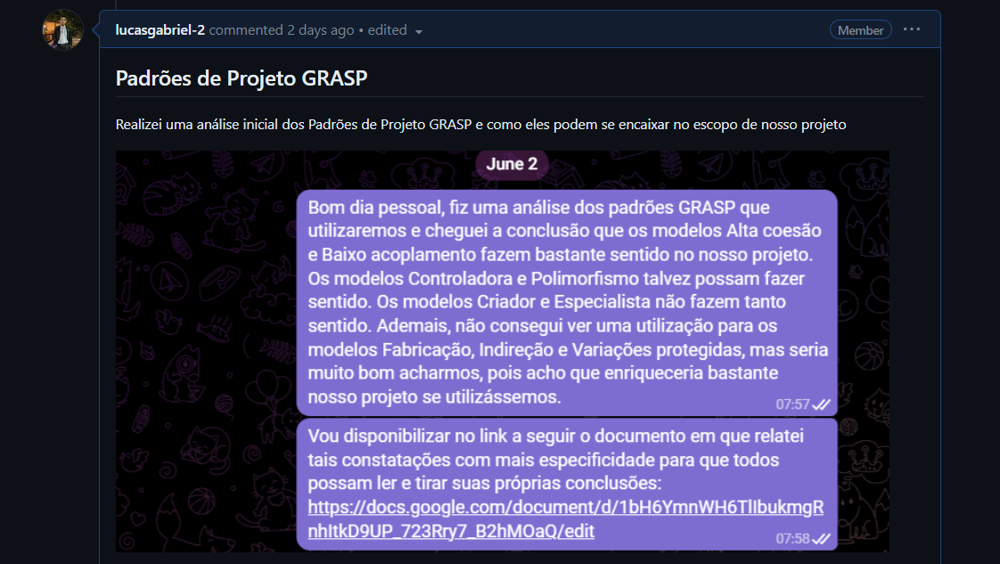
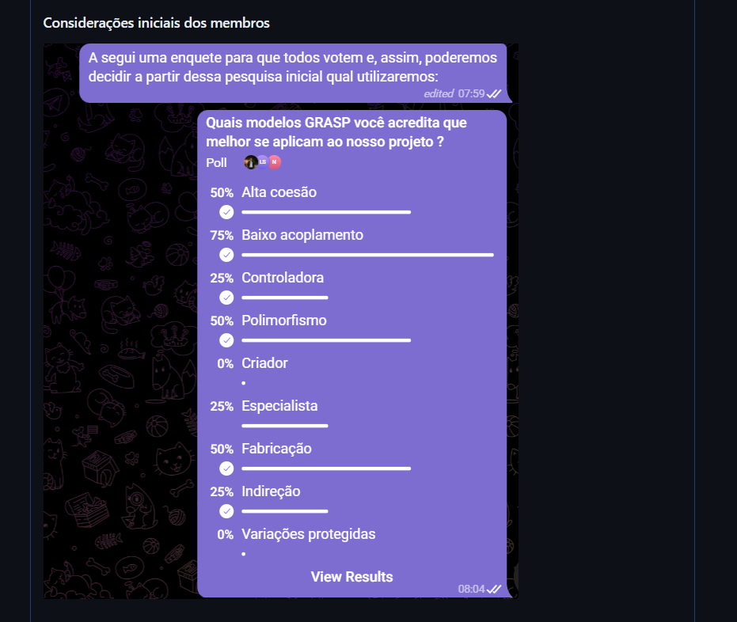
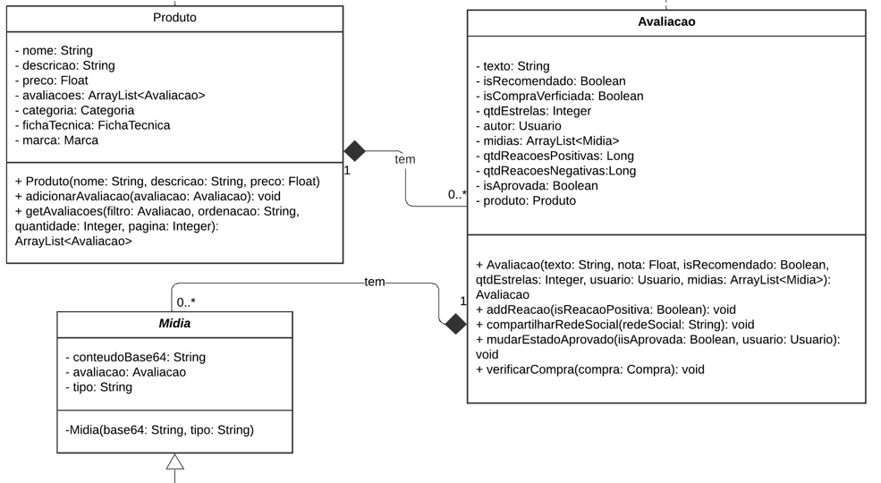

# Comunicação do Backend com a camada de persistência - GRASP

## Introdução

Padrões de projeto são soluções para problemas comuns encontrados no desenvolvimento ou manutenção de software, codificados em formato estruturado, descrevendo o problema e a solução adotada [1]. Tais padrões seguem paradigmas de programação específicos, principalmente a Orientação a Objetos. Diante disso, os padrões de projeto General responsibility assignment software patterns (GRASP), que traduzido para o português podem ser entendido como Padrões de Software para Atribuição de Responsabilidade Geral, se relacionam a isso com o principal objetivo de seguir boas práticas de paradigma de programação orientado a objetos, visando elucidar as práticas que devem ser adotadas ao longo do desenvolvimento de um produto de software. Ademais, existem outros tipos de padrões que buscam estabelecer de forma mais concreta essas práticas, entre os padrões mais conhecidos e amplamente utilizados estão os Padrões de Projeto GoF (Gang of Four), que foram apresentados no livro "Design Patterns: Elements of Reusable Object-Oriented Software" por Erich Gamma, Richard Helm, Ralph Johnson e John Vlissides. 

O presente artefato, visa documentar como foram aplicados os padrões de projeto GRASP na modelagem da comunicação do backend com a camada de persistência da aplicação e sua relação com os padrões de projeto GoF, em específico no fluxo de avaliação de produtos e de visualização de avaliações realizado no site [RiHappy](https://www.rihappy.com.br/), que é o foco do projeto.

### GRASP (General responsibility assignment software patterns):

São padrões de projeto para se obter a melhor atribuição de responsabilidades em um projeto de software, analisando a modelagem do software e identidades envolvidas a fim de mitigar problemas como por exemplo os relacionados a coesão, acoplamento e criação de instâncias de classes. Buscando, assim, atingir objetivos como uma alta coesão (o que facilita o reaproveitamento de código, pois uma mesma classe pode ser reutilizada em diferentes contextos) e baixo acoplamento (o que facilita a manutenção do software, pois objetiva que a alteração em uma classe não cause grande impacto no projeto como um todo) [1]. Dessa forma, é importante dar atenção a questões como por exemplo: "Quais classes têm as responsabilidades de criar uma instância ?", pois nem sempre é a própria classe, visto que é necessário considerada a semântica envolvida na relação dos objetos (dado que relações de todo e parte levam a necessidades diferentes de projeto, podendo ser necessário utilizar composições ou agregações) [1]. Assim, para avaliar questões como essa os padrões de projeto GRASP são divididos em:

- Criador
- Especialista 
- Alta Coesão
- Baixo Acoplamento
- Controladora
- Polimorfismo
- Fabricação ou Invenção Pura 
- Indireção
- Variações Protegidas

## Metodologia

Para a realização da modelagem, os membros Lucas Felipe, Lucas Gomes, Lucas Gabriel, Luíza e Nicolas se reuniram e optaram por fazer primeiramente a modelagem dos padrões [GoF](/2023.1_G5_ProjetoRiHappy/docs/3.padroesdeprojeto/back/gof.md), por serem muito mais objetivas e concretos nas resoluções dos principais problemas envolvidos no escopo do projeto. Posteriormente, por conta da maior abstração e simplificação a da outra classe de padrões, foram selecionados quais padrões GRASP serão utilizados pela equipe.

A partir disso e das correções efetuadas no documento do [Diagrama de Classes](../../2.modelagem/estatica/diagramadeclasses.md), gerando a [Versão 2 do diagrama](../../2.modelagem/estatica/diagramadeclasses.md#versão-2), visto que haviam modificações a serem feitas para uma melhor modelagem dos padrões de projeto foram selecionados os padrões [GoF](/2023.1_G5_ProjetoRiHappy/docs/3.padroesdeprojeto/back/gof.md) e realizado uma análise inicial dos padrões GoF que mais se adequariam ao projeto. Para a seguir definir os padrões GRASP que seriam utilizados de fato.

### Discussões

As discussões do grupo foram registradas na [Issue (#56) do GitHub](https://github.com/UnBArqDsw2023-1/2023.1_G5_ProjetoRiHappy/issues/56).

Após as principais discussões a respeito dos Padrões GoF se iniciaram as discussões acerca dos padrões GRASP, a partir de uma avaliação inicial foi realizado uma pesquisa de concordância entre o grupo para definição dos padrões a serem utilizados, como pode ser observado na Figura 1, 2 e 3 abaixo: 

  Figura 1: pesquisa inicial (Fonte: Repositório da equipe). 

  Figura 2: Considerações iniciais dos membros (Fonte: Repositório da equipe). 

  Figura 3: Considerações adicionais (Fonte: Repositório da equipe). 

## Desenvolvimento

### Análise inicial dos Padrões de projeto GRASP

Conforme observado na seção de Discussões, foi realizado uma análise inicial dos Padrões de projeto GRASP e sugestões de como eles podem ser utilizados no projeto para melhorar o desenho do software, essa pode ser observada a seguir: 

- **Criador** 

Devido o sistema possuir dois relacionamentos de forte conexão dada pela semântica da palavra "tem" da relação dos objetos Produto e Avaliação e Avaliação e Midia presente no [Diagrama de Classes](../../2.modelagem/estatica/diagramadeclasses.md#versão-2) representada pela composição, como pode ser observado na Figura 4 abaixo. A utilização do padrão de projeto Criador pode ser uma opção interessante para solução de problemas associados à criação de instâncias dessas classes, principalmente a criação de Midia através da classe Avaliação.

  Figura 4: Relacionamentos de composições do projeto (Fonte: Diagrama de Classes do projeto). 

- **Especialista**

De forma análoga à análise do modelo Criador. Devido à conexão de composição entre Produto e Avaliação e Avaliação e Mídia, gerado pela forte semântica do "tem" e observado no [Diagrama de Classes](../../2.modelagem/estatica/diagramadeclasses.md#versão-2), como pode ser observado na Figura 4 acima. A utilização do padrão de projeto Especialista pode ser uma opção interessante para solução de problemas associados à execução de tarefas que utilizam informações de outros objetos, nas classes mencionadas, principalmente na utilização de informações de Midia através da classe Avaliação.

- **Alta Coesão**

Atribui de forma coerente as responsabilidades das classes, utilizando de entidades para cada função específica. O que é importante para melhorar o projeto como um todo e facilitar atividades de manutenção e evolução de software, logo se faz relevante para o projeto em questão.

- **Baixo Acoplamento**

Objetiva diminuir o acoplamento entre as classes, diminuindo as relações de dependência e centralizando as atividades. O que é importante para melhorar o projeto como um todo e facilitar atividades de manutenção e evolução de software, logo se faz relevante para o projeto em questão.

> **Observação**: <code>É necessário uma atenção na relação da Alta Coesão e do Baixo Acoplamento, pois **ao minimizar o acoplamento** diminuindo o número de objetos e adicionando as responsabilidades a esses **pode-se diminuir a coesão**. O contrário também é verdadeiro, pois ao se **aumentar a coesão** adicionando mais objetos (com responsabilidades focadas no seu escopo) pode-se **aumentar o acoplamento** [5]</code>

- **Controladora**

Objetiva a adição de camadas (controladoras) desacoplando o código, colocando coisas específicas de domínio nas entidades de cada domínio. É uma boa solução para manter o Baixo Acoplamento e Alta Coesão entretanto, não existe uma grande demanda para adição de várias controladoras, porém poderia ser adicionada uma controladora para persistência e validação dos dados fornecidos pelo usuário e caso implementado a validação de avaliações poderia ser adicionada outra para envio das avaliações para a etapa de verificação (envio para checagem de possíveis comentários ofensivos).  

- **Polimorfismo**

Encapsulamento de variações de comportamento com base no tipo, usando de métodos abstratos em níveis generalistas para que uma instância se comporte de acordo com uma especificidade, de acordo com a assinatura (quantidade e tipo de parâmetros) do método ou realizando sua sobrescrita, assim; eliminando a necessidade da lógica condicional(if, else e switch) para especificação do comportamento [5]. O polimorfismo é também um dos pilares da Orientação a Objetos e pode ser aplicado ao projeto, por exemplo com a utilização da sobrescrita de métodos ao se obter detalhes de uma lista de objetos pode-se ter diferentes comportamentos a depender do tipo de lista, caso seja um lista de produto, lista de avaliação ou lista de compra. Além disso, pode-se utilizar da sobrecarga do polimorfismo (utilização de métodos com o mesmo nome, mas com assinaturas diferentes) para por exemplo em métodos relacionados a adição de avaliação tratar os dados de forma diferente de acordo com o que for recebido como em um caso apenas uma nota, ou em outro caso recebendo nota, texto, vídeo e fotos.

- **Fabricação ou Invenção Pura** 

Criação de uma classe intermediária para execução de funções (decomposição comportamental) [5], por questões de segurança, privacidade, usabilidade ou autorização. Muito utilizado para diminuir o acoplamento e facilitar a reutilização, em casos em que a semântica o faz necessário, para isso se cria objetos específicos para uma função. No caso do projeto em questão, pode ser uma opção caso seja decidido utilizar o padrão Especialista, para garantir a manutenção do Baixo Acoplamento e Alta Coesão, entretanto para esse caso não se revela muito relevante sua utilização. Porém, caso implementada a opção de envio para checagem de possíveis comentários ofensivos, essa pode ser uma opção de padrão bastante interessante.

- **Indireção**

Criação de uma classe intermediadora para realização de uma chamada necessária entre dois objetos. Constatações equivalentes às do modelo de Invenção Pura.

- **Variações Protegidas**

Protege o objeto de variações utilizando de uma interface estável. É bastante interessante de ser utilizado no projeto para garantir que apenas um usuário que realmente tenha feito uma compra do produto realize de forma efetiva uma avaliação do mesmo, assim; um usuário não autenticado pode realizar modificações em um objeto e essas modificações somente serem armazenadas no objeto real quando houver a autenticação do usuário e verificação da compra do produto. Ademais, no caso de implementada a opção de envio para checagem de possíveis comentários ofensivos pode ser usado para que variações correspondentes a mensagens  ofensivas não sejam vistas pelos clientes antes de passarem por um processo de checagem, já com relação a proteção de modificações de domínio não se revela muito relevante a utilização desse padrão, pois há baixo risco de modificação da regra de negócio (forma como funciona a avaliação de um produto).

### Padrões GRASP utilizados

Diante da análise inicial a equipe optou por uma seleção inicial dos padrões de projeto GoF devido a esses serem mais concretos e facilitarem o entendimento, inicialmente foi escolhido o padrão de projeto Proxy como documentado no artefato [GoF](/2023.1_G5_ProjetoRiHappy/docs/3.padroesdeprojeto/back/gof.md), e posteriormente a complementação com a adição do padrão de projeto Singleton. Após tal processo, foram definidos os padrões GRASP a serem utilizados, sendo esses: 

#### Relação dos padrões de projeto GRASP com os padrões GoF escolhidos 

## Conclusão 

## Referências

[1] SERRANO, M. AULA - GRASP – PARTE I.

[2] SERRANO, M. AULA - GRASP – PARTE II.

[3] IEEE. SWEBOK-Guide to the Software Engineering Body of
Knowledge, 2004. Acesso em 29/05/2023.

[4] SOMMERVILLE, Ian. Engenharia de Software. 8a. edição.
Pearson, 2007. Acesso em 29/05/2023.

[5] BRAIDA, Filipe. Modelagem e Projeto de Software. Braida.com.br. Disponível em: <http://filipe.braida.com.br/pages/courses/modelagem/#grasp>. Acesso em: 7 jun. 2023.

‌

## Histórico de Versão

| Versão | Data       | Descrição                                                                                                         | Autor(es)     | Revisor(es) |
| ------ | ---------- | ----------------------------------------------------------------------------------------------------------------- | ------------- | ----------- |
| `1.0`  | 05/06/2023 | Análise inicial dos padrões GRASP adequados para o projeto                                                        | Lucas Gabriel |             |
| `1.1`  | 05/06/2023 | Revisão da base criada e complementação com ligações envolvendo padrões GOF                                       | Lucas Felipe  |             |
| `2.0`  | 07/06/2023 | Refatoração das seções de introdução, metodologia, discussão e análise incial                                     | Lucas Gabriel |             |
| `2.1`  | 07/06/2023 | Adição da seções de Padrões GRASP utilizados e Relação dos padrões de projeto GRASP com os padrões GoF escolhidos | Lucas Gabriel |             |