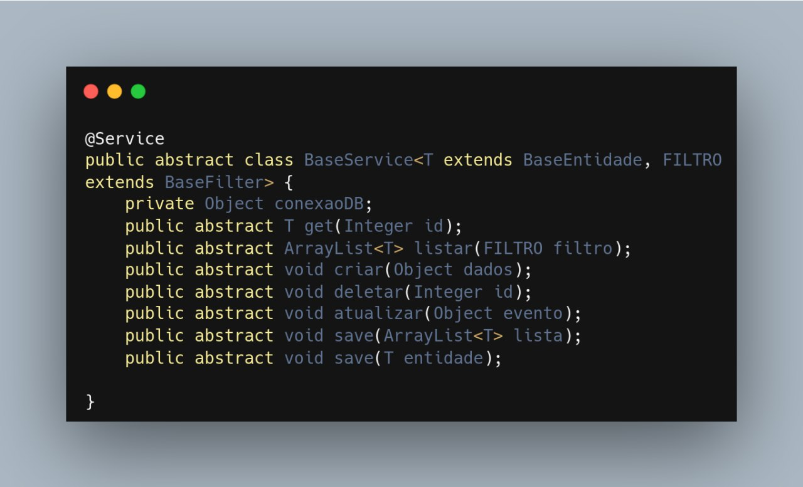

# Padrões de Projeto Emergentes

## Introdução

Padrões de projeto são soluções para problemas comuns encontrados no desenvolvimento ou manutenção de software, codificados em formato estruturado, descrevendo o problema e a solução adotada [1]. Tais padrões seguem paradigmas de programação específicos, principalmente a Orientação a Objetos. Sendo esses de extrema relevância para garantir que um produto de software seja robusto, flexível, manutenível e reutilizável facilitando assim a evolução do sistema ao longo do tempo.

## Metodologia

A partir do estudo e modelagem dos padrões [GoF](../back/gof.md) e [GRASP](../back/grasp.md), foi percebido a relevância da utilização de padrões de projetos para o desenvolvimento de um software manutenível e escalável e como tais características estão intimamente relacionadas com os princípios do paradigma de programação Orientado a Objetos descritos por Robert C. Martin no artigo "The Principles of OOD" [3]. A partir disso e das correções efetuadas no documento do [Diagrama de Classes](../../2.modelagem/estatica/diagramadeclasses.md), gerando a [Versão 2 do diagrama](../../2.modelagem/estatica/diagramadeclasses.md#versão-2) foi selecionado o SOLID como padrão de projeto emergente a ser utilizado no projeto de fluxo de avaliação de produtos e de visualização de avaliações do site [RiHappy](https://www.rihappy.com.br/), o qual permite a criação de códigos limpos, a diminuição do acoplamento, a maior coesão (separação de responsabilidades), maior facilidade na refatoração e estimula o reaproveitamento do código [2].

## SOLID

O SOLID é uma acrônimo para as a representação dos 5 princípios da Programação Orientada a Objetos, são esses:

- S — Single Responsibility Principle (Princípio da responsabilidade única)
- O — Open-Closed Principle (Princípio Aberto-Fechado)
- L — Liskov Substitution Principle (Princípio da substituição de Liskov)
- I — Interface Segregation Principle (Princípio da Segregação da Interface)
- D — Dependency Inversion Principle (Princípio da inversão da dependência)

O Princípio da responsabilidade única define que uma classe deve ter apenas um motivo para mudar, ou seja, um classe deve ser especializada em um assunto e ter apenas uma responsabilidade dentro do software. Evitando que exista uma classe que seja responsável por executar diversas tarefas diferentes gerando falta de coesão, alto acoplamento, dificuldade de implementar testes automatizados, dificuldade de reaproveitar o código, assim dificultando alterações no sistema [2].

O Princípio Aberto-Fechado define que objetos ou entidades devem estar abertas para extensão e fechadas para modificação, quando novos comportamentos ou recursos forem necessários de serem adicionados ao software deve-se estender ao invés de realizar alterações no software, evitando inclusão de bugs [2].

O Princípio da substituição de Liskov define que uma classe derivada deve ser substituível por sua classe base [2].

O Princípio da Segregação da Interface define que uma classe não deve implementar interfaces e métodos que não serão utilizados, optando pela criação de interfaces específicas, ao invés genéricas, evitando adição de métodos que não serão utilizados [2].

O Princípio da inversão da dependência define que se deve depender de abstrações e não de implementações [2], pois módulos de alto nível não devem depender de módulos de baixo nível e ambos devem depender da abstração, sendo essas independente de detalhes, para isso os detalhes que devem depender de abstrações [3].

### Modelagem SOLID

Diante disso, a incorporação do SOLID ao projeto pode ser visualizada por sua representação no Princípio da Responsabilidade Única, o qual indica que uma classe deve ter apenas um motivo para mudar, ou seja, indica que uma classe deve ser especializada em apenas um assunto e possuir apenas uma responsabilidade [2]. Dentro desse contexto, foi implementado uma herança dentro da camada Controller como pode ser observado a seguir na Figura 1:

   Figura 1. Representação das heranças da superclasse BaseService (Fonte: Diagrama de Classes do projeto). 

### Implementação SOLID

A implementação pode ser observada no trecho de código a seguir em Java, demonstrando o Princípio da responsabilidade única do SOLID, no qual a classe BaseService que tem o papel de um serviço de Base para unificar a comunicação do projeto com o Banco de Dados, possuindo apenas uma responsabilidade a de realizar a comunicação do projeto com o Banco de Dados, além disso essa superclasse é herdada pelas subclasses ProdutoService, CompraService e AvaliaçãoService o que permite maior especialização no processo e contribui com o Princípio da responsabilidade única.

Trecho de código referente à BaseService. (Fonte: Elaborado por Nicolas)

> O arquivo original elaborado referente a BaseService encontra-se disponível no links: [BaseService](https://github.com/UnBArqDsw2023-1/2023.1_G5_ProjetoRiHappy/blob/main/codigo/src/main/java/br/com/rihappy/avaliacaoService/service/BaseService.java).

## Conclusão

Dentro desse contexto é possível observar a importância do princípio de Single Responsibility contribuindo para o baixo acoplamento, a alta coesão e a reutilização de código. Obtendo-se então um projeto manutenível e escalável.

## Referências

[1] SERRANO, M. AULA - GRASP – PARTE I.

[2] ROBERTO. O que é SOLID: O guia completo para você entender os 5 princípios da POO. Medium. Disponível em: <https://medium.com/desenvolvendo-com-paixao/o-que-%C3%A9-solid-o-guia-completo-para-voc%C3%AA-entender-os-5-princ%C3%ADpios-da-poo-2b937b3fc530>. Acesso em: 12 jun. 2023.

[3] ArticleS.UncleBob.PrinciplesOfOod. Butunclebob.com. Disponível em: <http://butunclebob.com/ArticleS.UncleBob.PrinciplesOfOod>. Acesso em: 12 jun. 2023.
‌

## Histórico de Versão

| Versão | Data       | Descrição                                                                        | Autor(es)     | Revisor(es)  |
| ------ | ---------- | -------------------------------------------------------------------------------- | ------------- | ------------ |
| `1.0`  | 12/06/2023 | Adição da documentação do SOLID                                                  | Lucas Gabriel | Lucas Felipe |
| `1.1`  | 03/07/2023 | Adição do trecho de código do SOLID referente ao Single Responsibility Principle | Lucas Gabriel | Nicolas |
