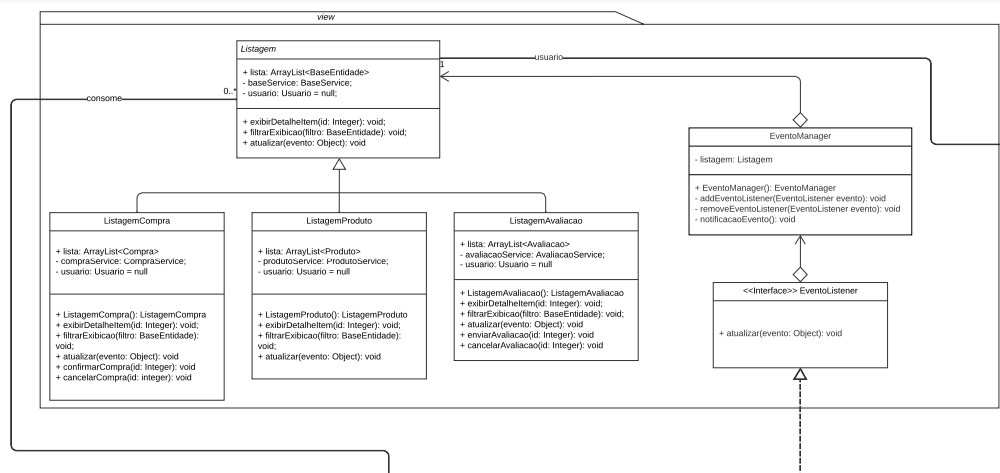

# Padrão Observer e sua Implementação no Diagrama

## Introdução

O padrão de projeto Observer é utilizado quando há a necessidade de estabelecer uma relação de dependência entre
objetos, de modo que quando um objeto emite um evento, todos os objetos interessados em ouvir esse evento são
notificados e podem tomar ações correspondentes. O objetivo é promover o desacoplamento entre os objetos, permitindo que
eles interajam de forma flexível e sem acoplamentos rígidos.

No diagrama fornecido, a classe `Listagem` atua como um objeto que emite eventos, sendo representado
pelo `EventManager`, e a classe `BaseService` atua como um objeto que ouve esses eventos, sendo representado
pelo `EventListener` que são implementações genéricas do padrão Observer.

## Motivação

No projeto fornecido, a utilização do padrão Observer é justificada pelo objetivo de promover a comunicação e o
gerenciamento de eventos entre objetos de forma desacoplada e flexível.

O padrão Observer é adequado em nesse projeto devido a existência de objetos que precisam ser notificados e atualizados
quando ocorrem alterações em outros objetos. Nesse contexto, o padrão Observer permite que os objetos "observadores"
sejam registrados como ouvintes dos objetos "observáveis" e sejam notificados automaticamente quando ocorrerem mudanças
relevantes nesses objetos.

## 1. Modelagem

Imagem 1. Modelagem da view 

Imagem 2. Modelagem da controller 

O padrão Observer é baseado em duas principais entidades: o Observable (gerenciador de eventos) e o Observer (ouvinte de
eventos).

- O Observable é a entidade que emite os eventos e mantém uma lista de EventListeners registrados. Ele é responsável por
  notificar os EventListeners quando ocorre um evento relevante.
- O Observer é a entidade que está interessada em ouvir e responder aos eventos emitidos pelo EventManager. Ele se
  registra no EventManager para receber as notificações de eventos e define a lógica de como lidar com esses eventos.

## 2. Interface EventManager

A interface `EventManager` define os métodos que um objeto emissor de eventos deve implementar. No diagrama, a
interface `EventManager` possui três métodos:

- `addEventoListener(EventoListener evento): void`: adiciona um EventListener à lista de ouvintes registrados no objeto
  emissor de eventos.
- `removeEventoListener(EventoListener evento): void`: remove um EventListener da lista de ouvintes registrados no
  objeto emissor de eventos.
- `notificacaoEvento(): void`: notifica todos os EventListeners registrados no objeto emissor de eventos, chamando o
  método `atualizar()` de cada ouvinte.

## 3. Interface EventListener

A interface `EventListener` define o método que um ouvinte de eventos deve implementar para receber as notificações do
objeto emissor de eventos. No diagrama, a interface `EventListener` possui o método:

- `atualizar(eventoo: Object): void`: é chamado pelo objeto emissor de eventos quando um evento relevante ocorre. O
  ouvinte de eventos pode usar as informações fornecidas no parâmetro `evento` para tomar ações correspondentes.

## 4. Classe Listagem como EventManager e BaseService como EventListener

No diagrama, a classe `BaseService` atua como um objeto emissor de eventos, implementando a interface `EventManager`. A
classe `Listagem` atua como um objeto ouvinte de eventos, implementando a interface `EventListener`.

A classe `Listagem` possui a responsabilidade de manter uma lista de EventListeners registrados e notificar esses
ouvintes quando um evento relevante ocorre. Ela implementa os métodos `addEventoListener()`, `removeEventoListener()`
e `notificaEvento()` da interface `EventManager`.

A classe `BaseService` é responsável por se registrar como EventListener na classe `Listagem` e receber as notificações
de eventos. Ela implementa o método `atualizar()`, que é chamado pela classe `Listagem` quando um evento relevante
ocorre.

## Conclusão

No diagrama fornecido, a classe `Listagem` atua como um objeto emissor de eventos, representado pelo EventManager,
enquanto a classe `BaseService` atua como um objeto ouvinte de eventos, representado pelo EventListener.

Através das interfaces `EventManager` e `EventListener`, é estabelecida uma relação de dependência flexível e
desacoplada entre essas classes, permitindo que o BaseService seja notificado e possa responder aos eventos emitidos
pela Listagem de maneira adaptável e flexível.

## Referências

[1] Observer, página na web disponível no [link](https://refactoring.guru/design-patterns/observer). Acesso em
04/06/2023.

[2] Diagrama de classes, página na web disponível
no [link](https://lucid.app/lucidchart/4dd6a296-dbea-46b7-8bb7-b515fbc1fb05/edit?invitationId=inv_32177c76-50f9-40b1-95df-7711173e673f&page=HWEp-vi-RSFO#).
Acesso em 03/06/2023.

## Histórico de Versão

| Versão | Data       | Descrição                                      | Autor(es)      | Revisor(es)   |
|--------|------------|------------------------------------------------|----------------|---------------|
| `1.0`  | 05/06/2023 | Criação do documento                           | Josué Teixeira | Nicolas       |
| `1.1`  | 08/06/2023 | Pequeno ajuste no texto                        | Josué Teixeira | Nicolas       |
| `1.2`  | 12/06/2023 | adiciona imagem metodologia. Ajuste nos textos | Josué Teixeira | Lucas Gabriel |