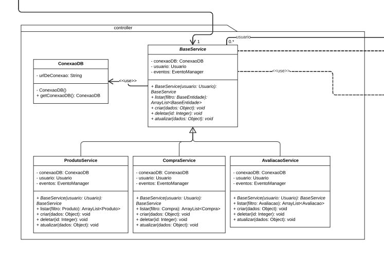

# Padrões de Design: Controller no Desenvolvimento Front-End do Site da Ri Happy

## Introdução

A comunicação entre o frontend e o backend é um aspecto crucial no desenvolvimento de aplicações web. É necessário estabelecer uma interação eficiente e estruturada entre essas duas partes, a fim de criar sistemas robustos e de fácil manutenção. Nesse contexto, os padrões de projeto GRASP (General Responsibility Assignment Software Patterns) e GOF (Gang of Four) desempenham um papel fundamental, fornecendo diretrizes e soluções consolidadas para lidar com os desafios da comunicação frontend-backend.
Neste documento, exploraremos a importância dos padrões de projeto GRASP e GOF na comunicação do frontend com o backend. Veremos como esses padrões podem ser aplicados para a definição de responsabilidades claras e coesas em cada componente e para promover a reutilização de código e a manutenibilidade do sistema dad [RiHappy](https://www.rihappy.com.br/) como um todo.

O padrão Controlador é aplicado no contexto da arquitetura de software para separar a lógica de negócio das interfaces de usuário e dos modelos de dados. No desenvolvimento de sistemas web, o padrão Controlador desempenha um papel fundamental na implementação da camada de controle, responsável por receber as requisições do usuário, processá-las e coordenar as ações necessárias para atender a essas requisições. O Controlador age como o ponto central de entrada para o sistema, recebendo as requisições, interpretando-as e tomando decisões com base nas informações recebidas

No contexto do site da Ri Happy, o padrão Controlador poderia ser aplicado para gerenciar as interações dos usuários com a interface, como a submissão de formulários, a navegação entre páginas e a execução de ações específicas. O Controlador seria responsável por receber as requisições do usuário, validar os dados, executar as ações necessárias e atualizar os modelos de dados correspondentes. Dessa forma, a separação clara das responsabilidades entre as camadas de controle, interface e modelo facilita a manutenção e evolução do sistema, além de promover a reutilização de código.

## Metodologia Padrão GRASP: Controlador (Controller)

O padrão GRASP Controlador é um padrão de design que define a responsabilidade de gerenciar e coordenar as ações e eventos do sistema. Ele está fortemente relacionado ao conceito de controlador no padrão MVC. O Controlador é responsável por receber as solicitações do usuário, coordenar as operações do sistema e decidir qual ação tomar com base nessas solicitações. A partir do padrão GOF MVC, a implementação do padrão GRASP Controlador pode ser realizada da seguinte maneira: <br>

1. O Controlador recebe as solicitações do frontend (API) e interpreta as ações do usuário. <br>
2. Com base nas solicitações recebidas, o Controlador pode chamar os métodos apropriados do modelo (ou serviços relacionados ao modelo) para manipular os dados do sistema. <br>
3. O Controlador também é responsável por atualizar a visão correspondente à solicitação recebida. Ele pode consultar o modelo para obter os dados necessários e passá-los para a visão para que sejam exibidos corretamente. <br>
4. O Controlador pode executar validações de entrada, aplicar regras de negócios e garantir que as operações sejam executadas corretamente e dentro das restrições definidas. <br>
5. O Controlador pode coordenar ações entre diferentes objetos ou componentes do sistema, garantindo que a lógica de negócios seja executada corretamente. <br>

## Modelagem


<p align="center">Imagem 1. Classe controller do diagrama de classes</p>

O padrão Controller nesse diagrama está representado por quatro classes de serviço: BaseService, ProdutoService, CompraService e AvaliacaoService. Essas classes são responsáveis por fornecer os métodos necessários para realizar operações relacionadas a diferentes entidades (base, produto, compra e avaliação) no sistema.

A classe BaseService é a classe base para os serviços específicos das outras entidades. Ela possui uma instância de ConexaoDB, responsável pela conexão com o banco de dados, e também uma instância de Usuario e EventoManager. A classe BaseService tem os seguintes métodos:

listar(filtro: BaseEntidade): ArrayList<BaseEntidade>: retorna uma lista de entidades do tipo BaseEntidade com base em um filtro.
criar(dados: Object): void: cria uma nova entidade com base nos dados fornecidos.
deletar(id: Integer): void: exclui a entidade com o ID fornecido.
atualizar(dados: Object): void: atualiza os dados de uma entidade existente.
As outras classes (ProdutoService, CompraService e AvaliacaoService) herdam da classe BaseService e possuem os mesmos métodos, mas com implementações específicas para as entidades correspondentes.

Todas as classes de serviço têm uma instância de ConexaoDB para acessar o banco de dados e uma instância de Usuario e EventoManager para lidar com informações do usuário e gerenciamento de eventos.

O objetivo do padrão Controller é separar a lógica de negócio e o acesso aos dados em diferentes classes, permitindo uma melhor organização e modularidade do sistema. Cada classe de serviço é responsável por lidar com operações específicas de uma entidade e encapsular a lógica necessária para executá-las. A classe ConexaoDB fornece a funcionalidade de conexão com o banco de dados, enquanto a classe Usuario representa informações sobre o usuário e a classe EventoManager lida com o gerenciamento de eventos.

## O Controlador recebe as solicitações do frontend (API) e interpreta as ações do usuário.

Podemos inferir a presença do padrão GRASP: Controlador (Controller). O Controlador é responsável por receber as solicitações do frontend (no caso do site, as interações do usuário) e interpretar as ações realizadas por ele.
No contexto do site da Ri Happy, o Controlador receberia as solicitações do frontend, como cliques em botões, preenchimento de formulários e outras interações do usuário. Ele seria responsável por interpretar essas ações e determinar como lidar com elas.
Por exemplo, quando um usuário adiciona um produto ao carrinho de compras no site da Ri Happy, o Controlador seria acionado para processar essa ação. Ele interpretaria a solicitação de adição do produto ao carrinho e tomaria as medidas necessárias, como verificar a disponibilidade do produto, calcular o preço total e atualizar o carrinho.
Além disso, o Controlador também pode ser responsável por coordenar a interação entre o frontend e outras camadas do sistema, como a camada de persistência de dados (banco de dados) ou a camada de serviços externos (por exemplo, processamento de pagamentos). Ele seria o intermediário entre o frontend e essas camadas, garantindo a correta execução das ações solicitadas pelo usuário.
Em suma, o padrão GRASP: Controlador (Controller) é aplicável ao site da Ri Happy, pois o Controlador recebe as solicitações do frontend (interações do usuário) e interpreta as ações realizadas por ele, coordenando a interação entre o frontend e outras camadas do sistema.
Pseudocódigo para ilustrar a estrutura dos controladores e suas operações genéricas

```java
import java.util.ArrayList;

class BaseService {
    ArrayList<BaseEntidade> listar(BaseEntidade filtro) {
        // Lógica para listar entidades base
        return null;
    }
    void criar(Object dados) {
        // Lógica para criar entidade base
    }
    void deletar(Integer id) {
        // Lógica para deletar entidade base
    }
    void atualizar(Object dados) {
        // Lógica para atualizar entidade base
    }
}

class ProdutoService extends BaseService {
    ArrayList<Produto> listar(Produto filtro) {
        // Lógica para listar produtos
        return null;
    }
    void criar(Object dados) {
        // Lógica para criar produto
    }
    void deletar(Integer id) {
        // Lógica para deletar produto
    }
    void atualizar(Object dados) {
        // Lógica para atualizar produto
    }
}

class CompraService extends BaseService {
    ArrayList<Compra> listar(Compra filtro) {
        // Lógica para listar compras
        return null;
    }
    void criar(Object dados) {
        // Lógica para criar compra
    }
    void deletar(Integer id) {
        // Lógica para deletar compra
    }
    void atualizar(Object dados) {
        // Lógica para atualizar compra
    }
}

class AvaliacaoService extends BaseService {
    ArrayList<Avaliacao> listar(Avaliacao filtro) {
        // Lógica para listar avaliações
        return null;
    }
    void criar(Object dados) {
        // Lógica para criar avaliação
    }
    void deletar(Integer id) {
        // Lógica para deletar avaliação
    }
    void atualizar(Object dados) {
        // Lógica para atualizar avaliação
    }
}

class BaseController {
    BaseService serviço;
    BaseController(BaseService serviço) {
        this.serviço = serviço;
    }
    ArrayList<BaseEntidade> listar(BaseEntidade filtro) {
        return serviço.listar(filtro);
    }
    void criar(Object dados) {
        serviço.criar(dados);
    }
    void deletar(Integer id) {
        serviço.deletar(id);
    }
    void atualizar(Object dados) {
        serviço.atualizar(dados);
    }
}

class ProdutoController extends BaseController {
    ProdutoService produtoServiço;
    ProdutoController(ProdutoService produtoServiço) {
        super(produtoServiço);
        this.produtoServiço = produtoServiço;
    }
}

class CompraController extends BaseController {
    CompraService compraServiço;
    CompraController(CompraService compraServiço) {
        super(compraServiço);
        this.compraServiço = compraServiço;
    }
}

class AvaliacaoController extends BaseController {
    AvaliacaoService avaliacaoServiço;
    AvaliacaoController(AvaliacaoService avaliacaoServiço) {
        super(avaliacaoServiço);
        this.avaliacaoServiço = avaliacaoServiço;
    }
}
```

Vamos passar explicando o nosso ponto de vista ao criar esse pseudocódigo: <br>

1. A classe _‘BaseService’_ é uma classe base que contém métodos comuns para lidar com entidades. Ela possui os métodos _‘listar’_, _‘criar’_, _‘deletar’_ e _‘atualizar’_, que serão implementados nas classes derivadas. <br>
2. A classe _‘ProdutoService’_ é uma subclasse de _‘BaseService’_ e adiciona métodos específicos para lidar com produtos. Ela implementa os métodos _‘listar’_, _‘criar’_, _‘deletar’_ e _‘atualizar’_ de acordo com a lógica específica para produtos. <br>
3. As classes _‘CompraService’_ e _‘AvaliacaoService’_ são semelhantes à _‘ProdutoService’_ e também derivam de _‘BaseService’_, adicionando métodos específicos para lidar com compras e avaliações, respectivamente. <br>
4. A classe _‘BaseController’_ é uma classe base para os controladores das entidades. Ela possui uma referência para um serviço específico (_‘BaseService’_) e implementa métodos comuns para lidar com as operações de listar, criar, deletar e atualizar. <br>
5. As classes _‘ProdutoController’_, _‘CompraController’_ e _‘AvaliacaoController’_ são subclasses de _‘BaseController’_ e adicionam funcionalidades específicas para cada tipo de entidade. <br>

## O Controlador poder chamar os métodos apropriados do modelo (ou serviços relacionados ao modelo) para manipular os dados do sistema

No pseudocódigo criado pela equipe, foi criada uma estrutura básica de classes para ilustrar a implementação do padrão GRASP: Controlador no contexto do site da Ri Happy.

1. **Classes de serviço (ProdutoService, CompraService, AvaliacaoService)**:
   - Essas classes representam os serviços relacionados a entidades específicas do sistema (produtos, compras, avaliações).
   - Cada classe de serviço herda da classe BaseService, que contém métodos comuns para lidar com entidades.
   - Cada classe de serviço implementa métodos específicos para listar, criar, deletar e atualizar entidades relacionadas.

<br>

2. **Classe BaseController**:
   - Essa classe serve como uma classe base para os controladores de entidades.
   - Ela possui uma referência a um serviço específico (BaseService) que será utilizado para manipular os dados do sistema.
   - A classe BaseController implementa métodos genéricos para listar, criar, deletar e atualizar entidades.

<br>

3. **Classes de Controlador (ProdutoController, CompraController, AvaliacaoController)**:
   - Essas classes são responsáveis por receber as solicitações do frontend (API) e coordenar as ações e eventos relacionados às entidades correspondentes (produtos, compras, avaliações).
   - Cada classe de controlador herda da classe BaseController, aproveitando os métodos genéricos implementados e estabelecendo a associação com um serviço específico (ProdutoService, CompraService, AvaliacaoService).
   - Os controladores podem chamar os métodos apropriados do serviço relacionado para manipular os dados do sistema.

## A relação com o site da Ri Happy:

- O site da Ri Happy provavelmente terá entidades principais, como produtos, compras e avaliações.
- Os controladores do site seriam responsáveis por receber as solicitações do frontend, interpretar as ações do usuário e coordenar as operações relacionadas às entidades (listar, criar, deletar, atualizar).
- Os controladores poderiam interagir com os serviços correspondentes (ProdutoService, CompraService, AvaliacaoService) para realizar as operações necessárias nos dados do sistema.
- Por exemplo, o controlador de produtos poderia chamar métodos do ProdutoService para listar os produtos, criar um novo produto, atualizar as informações de um produto existente ou deletar um produto.
- Essa estrutura de classes permite uma separação clara de responsabilidades, facilitando a manutenção, extensibilidade e reutilização de código no contexto do site da Ri Happy.

## Referências

[1] https://web.tecgraf.puc-rio.br/~ismael/Cursos/Cidade_FPSW/aulas/Modulo1_Intro_Grasp_GoF/Grasp/PadroesGRASP.pdf <br>
[2] https://medium.com/@leandrovboas/padr%C3%B5es-grasp-padr%C3%B5es-de-atribuir-responsabilidades-1ae4351eb204 <br>
[3] https://www.youtube.com/watch?v=ubYSGJPDWVQ <br>
[4] http://www.ic.uff.br/~leomurta/courses/2009.1/es1/aula12.pdf <br>

## Histórico de Versão

| Versão | Data       | Descrição                          | Autor(es)     | Revisor(es)    |
| ------ | ---------- | ---------------------------------- | ------------- | -------------- |
| `1.0`  | 02/06/2023 | Esboço inicial do documento        | Maria Abritta | Josué Teixeira |
| `1.1`  | 05/06/2023 | Criação e Finalização do documento | Maria Abritta | Nicolas        |
| `1.2`  | 12/06/2023 | adicionado o tópico de metodologia | Josué Teixeira |    |
