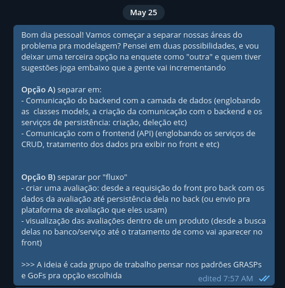
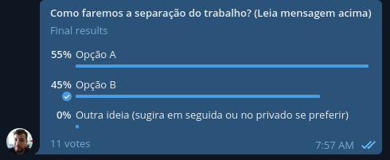
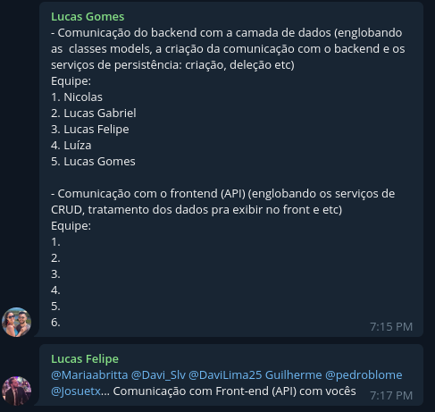

# Padrões de Projeto

## Introdução

<!-- @TODO: contextualização -->

## Metodologia

A distribuição inicial de tarefas foi realizada na [reunião do dia 18/05](../0.planejamento/atas/ata_18_05_2023.md), na qual os integrantes optaram por se dividir em tarefas relacionadas ao frontend, backend e modelagem de dados. Os questionamentos que surgiram durante a reunião foram levados à docente no dia seguinte, e após uma maior clarificação das atividades a serem feitas a redistribuição das tarefas foi feita, de maneira assíncrona, por meio do [telegram](../1.base/processos/ferramentasutilizadas.md). Durante a definição, cada membro da equipe escolheu dois mais padrões de projeto para estudar, e registrou suas escolhas nas issues [#12](https://github.com/UnBArqDsw2023-1/2023.1_G5_ProjetoRiHappy/issues/12) e [#13](https://github.com/UnBArqDsw2023-1/2023.1_G5_ProjetoRiHappy/issues/13) e em seguida os resumos após estudos.

Na [reunião do dia 24/05](../0.planejamento/atas/ata_24_05_2023.md) cada membro apresentou brevemente os padrões que foram estudados, e ficou decidido que o grupo seria dividido em dois subgrupos de trabalho responsáveis por modelar uma parte do sistema. A definição das categorias foi feita por votação no telegram, conforme ilustram as Figuras 1 e 2.

Figuras 1 e 2. Definição dos grupos de trabalho.

Após a finalização da enquete, também por meio do [telegram](../1.base/processos/ferramentasutilizadas.md), a separação dos grupos de trabalho foi feita por meio de escolha individual, o que gerou os resultados da Figura 3.

Figura 3. Separação dos membros entre as tarefas.

## Conclusão

## Versionamento

## Histórico de Versão

| Versão | Data | Descrição | Autor(es) | Revisor(es) |
|--------|------|-----------|-----------|-------------|
| `1.0`  | 26/05/2023     | Criação do documento com a metodologia.          | Nicolas   | Lucas Felipe            |
