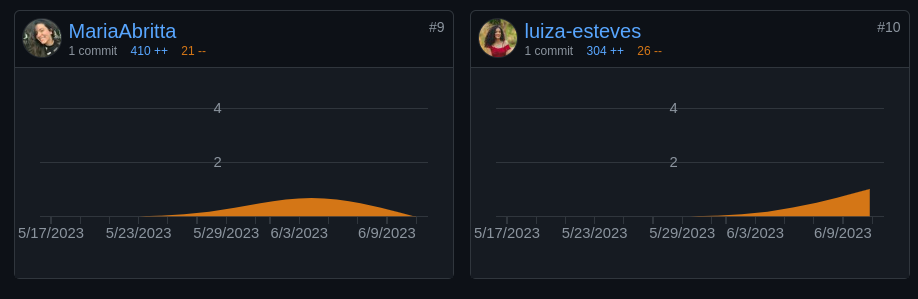

# 3.4. Participações - Padrões de Projeto

Breve relato sobre as participações/contribuições de cada membro à entrega.

## Refatoração do Diagrama de Classes

| Nome do Membro | Contribuição                                 | Rastro                                                                                                                                        | Relevância |
|----------------|----------------------------------------------|-----------------------------------------------------------------------------------------------------------------------------------------------|-----------|
| Lucas Gomes    | Participação nas discussões e implementação. | [Issue #56](https://github.com/UnBArqDsw2023-1/2023.1_G5_ProjetoRiHappy/issues/56)                                                            | Boa       |
| Lucas Felipe   | Participação nas discussões e implementação. | [Issue #56](https://github.com/UnBArqDsw2023-1/2023.1_G5_ProjetoRiHappy/issues/56)                                                            | Boa       |
| Luiza          | Participação nas discussões e implementação. | [Issue #56](https://github.com/UnBArqDsw2023-1/2023.1_G5_ProjetoRiHappy/issues/56)                                                            | Boa       |  
| Josué          | Implementação do Observer na modelagem.      | [Issue #60](https://github.com/UnBArqDsw2023-1/2023.1_G5_ProjetoRiHappy/issues/60)                                                            | Excelente |  
| Nicolas        | Participação nas discussões e implementação. | [Issue #56](https://github.com/UnBArqDsw2023-1/2023.1_G5_ProjetoRiHappy/issues/56) e [Artefato](../2.modelagem/estatica/diagramadeclasses.md) | Excelente |  

## Padrão GRASP - Comunicação Back-End com camada de persistência

| Nome do Membro | Contribuição                                                            | Rastro                                                                             | Relevância |
|----------------|-------------------------------------------------------------------------|------------------------------------------------------------------------------------|-----------|
| Nicolas        | Inclusão dos padrões GRASP a nível de modelagem no diagrama de classes. | [Issue #56](https://github.com/UnBArqDsw2023-1/2023.1_G5_ProjetoRiHappy/issues/56) | Boa       |
| Lucas Felipe   | Documentação dos padrões GRASP utilizados.                              | [Artefato](./back/grasp.md)                                                        | Boa       |
| Lucas Gabriel  | Documentação dos padrões GRASP utilizados.                              | [Artefato](./back/grasp.md)                                                        | Excelente |

## Padrão GRASP - Comunicação Front-End com Back-end

| Nome do Membro | Contribuição                            | Rastro                                                                                                                     | Relevância |
|----------------|-----------------------------------------|----------------------------------------------------------------------------------------------------------------------------|-----------|
| Maria Abritta  | Modelagem e documentação da Controller  | [Artefato](./front-api/front-api2.md) e [Issue #60](https://github.com/UnBArqDsw2023-1/2023.1_G5_ProjetoRiHappy/issues/60) | Excelente
| Josué          | Modelagem e documentação da Controller. | [Artefato](./front-api/front-api2.md) e [Issue #60](https://github.com/UnBArqDsw2023-1/2023.1_G5_ProjetoRiHappy/issues/60) | Excelente
| João Pedro     | Implementação do padrão Controller.     | [PR #69](https://github.com/UnBArqDsw2023-1/2023.1_G5_ProjetoRiHappy/pull/69)                                              | Baixa     |
| Davi Matias    | Implementação do padrão Controller.     | [PR #69](https://github.com/UnBArqDsw2023-1/2023.1_G5_ProjetoRiHappy/pull/69)                                              | Baixa     |

## Padrão GoF - Comunicação Back-End com a camada de persistência

| Nome do Membro | Contribuição                                 | Rastro                                                                                                         | Relevância |
|----------------|----------------------------------------------|----------------------------------------------------------------------------------------------------------------|-----------|
| Nicolas        | Participação nas discussões e implementação. | [Artefato](./back/gof.md) e [Issue #56](https://github.com/UnBArqDsw2023-1/2023.1_G5_ProjetoRiHappy/issues/56) | Boa       |
| Lucas Felipe   | Participação nas discussões e implementação. | [Artefato](./back/gof.md) e [Issue #56](https://github.com/UnBArqDsw2023-1/2023.1_G5_ProjetoRiHappy/issues/56) | Excelente |
| Lucas Gomes    | Participação nas discussões e implementação. | [Artefato](./back/gof.md) e [Issue #56](https://github.com/UnBArqDsw2023-1/2023.1_G5_ProjetoRiHappy/issues/56) | Excelente |
| Luiza          | Participação nas discussões e implementação. | [Artefato](./back/gof.md) e [Issue #56](https://github.com/UnBArqDsw2023-1/2023.1_G5_ProjetoRiHappy/issues/56) | Excelente |

## Padrão GoF - Comunicação Front-End com a Back-End

| Nome do Membro | Contribuição                            | Rastro                                                                                                                                                                                                        | Relevância |
|----------------|-----------------------------------------|---------------------------------------------------------------------------------------------------------------------------------------------------------------------------------------------------------------|-----------|
| Josué          | Modelagem e documentação do Observer.   | [Artefato GOF](./front-api/diagrama-front.md), [Artefato Modelagem GOF](./front-api/front-api.md) e [Issue #60](https://github.com/UnBArqDsw2023-1/2023.1_G5_ProjetoRiHappy/issues/60)                        | Excelente |
| Maria Abritta  | Modelagem e documentação da Controller. | [Artefato](./front-api/front-api2.md) e [Issue #60](https://github.com/UnBArqDsw2023-1/2023.1_G5_ProjetoRiHappy/issues/60)                                                                                    | Excelente |
| Davi Lima      | Implementação do código do Observer.    | [Artefato](./front-api/diagrama-front.md), [Issue #60](https://github.com/UnBArqDsw2023-1/2023.1_G5_ProjetoRiHappy/issues/60) e [PR #71](https://github.com/UnBArqDsw2023-1/2023.1_G5_ProjetoRiHappy/pull/71) | Baixa     |
| Guilherme      | Implementação do código do Observer.    | [Artefato](./front-api/diagrama-front.md), [Issue #60](https://github.com/UnBArqDsw2023-1/2023.1_G5_ProjetoRiHappy/issues/60) e [PR #71](https://github.com/UnBArqDsw2023-1/2023.1_G5_ProjetoRiHappy/pull/71) | Baixa     |

## Padrão Extra

| Nome do Membro | Contribuição                      | Rastro                               | Relevância |
|----------------|-----------------------------------|--------------------------------------|-----------|
| Lucas Gabriel  | Documentação do padrão Emergente. | [Artefato](./extras/padroesextra.md) | Excelente |

## Estatísticas de Participação (Período de 16/05 a 12/06)

A seguir as estatísticas de participação, embora número de commits e alterações não sejam um indicativo fidedigno da participação dos membros, é possível identificar os padrões de participação.

Pelos rastros elicitados acima, percebe-se que alguns membros, embora não tenham muita participação nos commits, demonstram proatividade durante as discussões e reuniões. Outros, mostram-se ocultos durante as atividades e commits.

## Histórico de Versão

| Versão | Data       | Descrição                                            | Autor(es)     | Revisor(es)   |
|--------|------------|------------------------------------------------------|---------------|---------------|
| `1.0`  | 12/06/2023 | Criação da estruturação de participações da 3° etapa | Lucas Felipe  | Nicolas       |
| `1.1`  | 12/06/2023 | Adição da contribuição do membro Lucas Gabriel       | Lucas Gabriel | Lucas Gomes   |
| `1.2`  | 12/06/2023 | Adição da contribuição do membro Lucas Gomes         | Lucas Gomes   | Lucas Gabriel |
| `1.3`  | 12/06/2023 | Adição da contribuição do membro João Pedro          | João Pedro    | Lucas Gomes   |
| `1.4`  | 12/06/2023 | Finalização das participações.                       | Nicolas       | |
