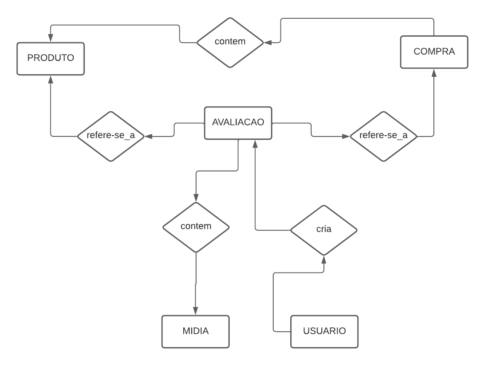
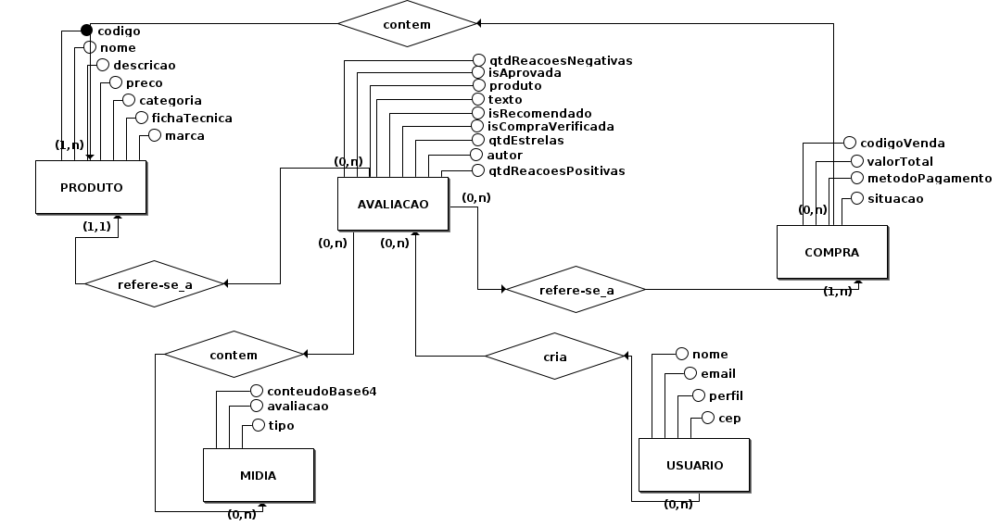
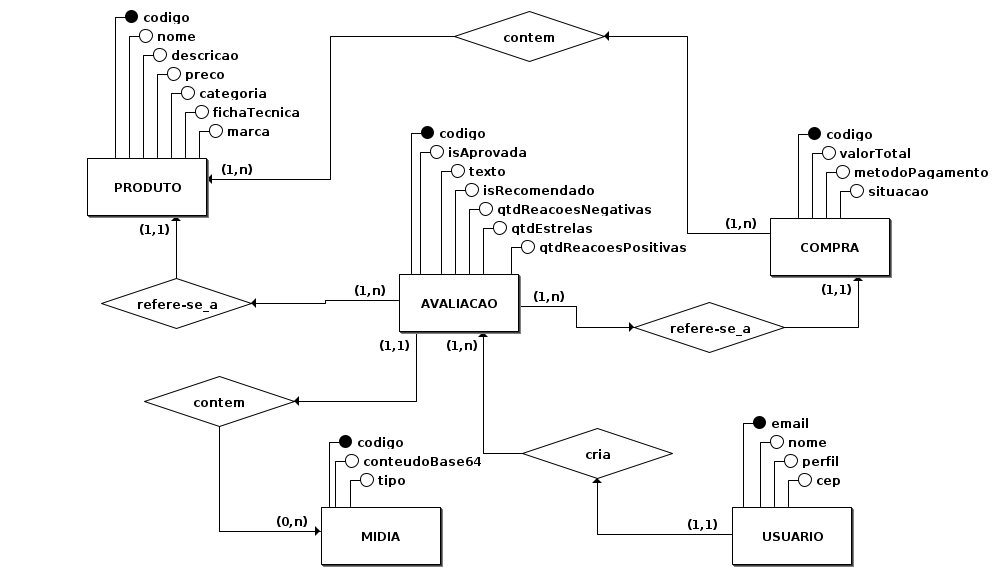

### Metodologia

A natureza dos dados armazenados e os relacionamentos entre as entidades identificadas justificam a utilização de um banco de dados relacional, decisão que foi formalizada [durante a reunião de definição de tecnologias](0.planejamento/atas/ata_18_05_2023.md), na qual a equipe optou por utilizar o Sistema Gerenciador de Banco de Dados [PostgreSQL](https://www.postgresql.org/).

O diagrama foi elaborado em três versões, com discussão registrada na [Issue #82](https://github.com/UnBArqDsw2023-1/2023.1_G5_ProjetoRiHappy/issues/82) do Github, utilizando as [ferramentas](../../1.base/processos/ferramentasutilizadas.md) brModelo e LucidChart.

A primeira versão foi elaborada no LucidChart, em baixa fidelidade, para investigar as entidades e relacionamentos envolvidos, a partir da modelagem realizada no [diagrama de classes](../../2.modelagem/estatica/diagramadeclasses.md).

 Versão 1 

 Diagrama DER (versão 1). (Fonte: Elaborado por Lucas Felipe e Nicolas).

As versões seguintes foram elaboradas no brModelo, dada a facilidade de utilização da ferramenta para inserção de atributos nas entidades e mapeamento das cardinalidades, haja vista que é uma ferramenta própria para elaboração de diagramas de bancos de dados.

 Versão 2

 Diagrama DER (versão 2). (Fonte: Elaborado por Lucas Felipe e Nicolas).

Para a versão final foram realizados alguns ajustes nas cardinalidades e posicionamento dos elementos no espaço do diagrama.

 Diagrama DER (versão final). (Fonte: Elaborado por Lucas Felipe e Nicolas). 

