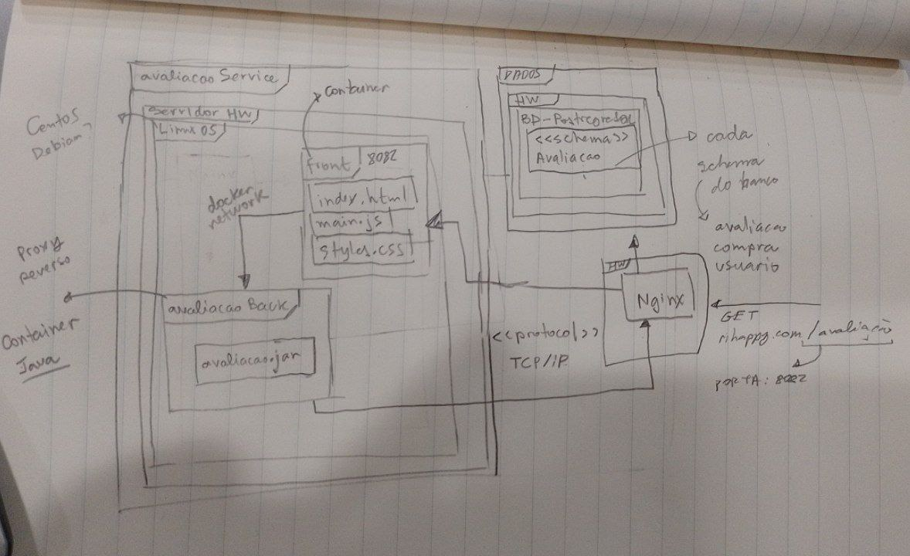
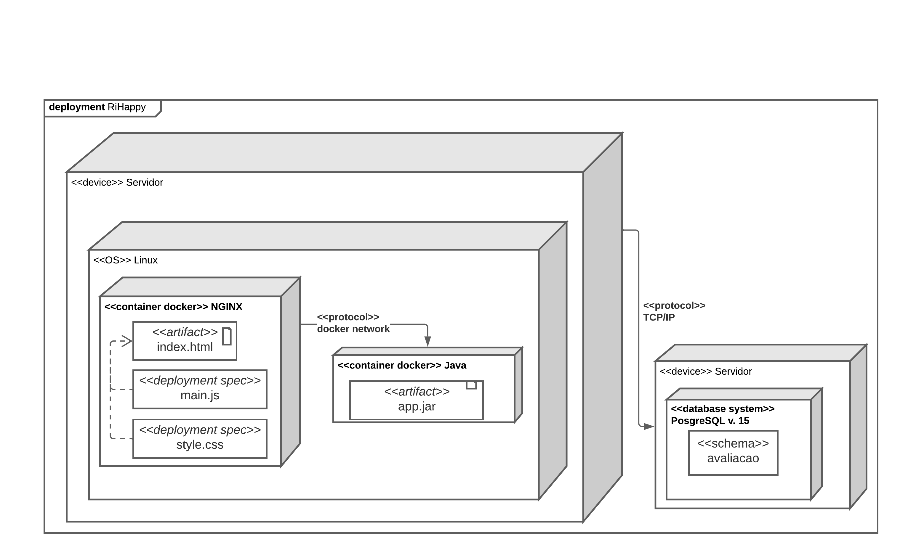

# Implantação

A primeira versão foi elaborada em uma representação de baixa fidelidade, para identificar os componentes participantes da modelagem e como eles interagem entre si. Durante a primeira modelagem foram identificados os seguintes elementos descritos a seguir. A modelagem levou em conta a implantação apenas do módulo de avaliação da plataforma, encarando-o como um microsserviço.

## Elementos Identificados

Três servidores, indicados como HW (hardware) na diagramação, cuja especificação não está detalhada por não se tratar do escopo da disciplina. Cada um destes servidores tem como sistema operacional alguma distribuição de linux, sendo apontada pelos estudantes a possibilidade de utilização do _debian_ ou _centOS_.

O primeiro servidor, à esquerda na representação da figura a seguir, é a máquina servidora da aplicação, com dois _containers docker_, um deles baseado em uma imagem de _Java_, contendo o _\<\<artifact>>_ `avaliacaoService.jar`. O segundo container é responsável por servir os arquivos estáticos gerados pelo _build_ do frontend: `index.html`, `main.js` e `styles.css`. A comunicação entre esses dois containers deve ser feita de forma interna, por meio da rede do docker (docker network), uma vez que os dois containers estão na mesma rede.

O segundo servidor é responsável por disponibilizar o serviço de bancos de dados [PostgreSQL](https://postgresql.org), com o _\<\<schema>>_ `avaliacao` contendo os elementos representados na [Visão de Dados](#visão-de-dados).

Por fim, o terceiro servidor é responsável pelo serviço de _proxy reverso_, isto é, ele é responsável por receber todas as requisições externas e redirecionar internamente de acordo com regras definidas, como por exemplo verificação dos _headers_ da requisição. O serviço utilizado é o [NGINX](https://www.nginx.com/), escolhido devido à sua ampla utilização dentro da comunidade. A comunicação entre o NGINX e os containers é feita por meio do _\<\<protocol>>_ TCP/IP.

 Versão 1 

 Diagrama de implantação (versão 1). (Fonte: Elaborado por Lucas Felipe e Nicolas).

A segunda versão do diagrama, em maior fidelidade, foi feita na plataforma [Creately](https://creately.com/), uma vez que esta oferece recursos nativos para diagramas UML de implantação.

 Versão 2

 Diagrama de implantação (versão 2). (Fonte: Elaborado por Lucas Felipe e Nicolas).

Porém, como a ferramenta não fornece uma opção gratuita de compartilhamento de diagramas, para a edição simultânea do diagrama, a terceira versão foi elaborada no LucidChart, com menor fidelidade aos elementos da representação UML. Após mais estudos sobre as ferramentas utilizadas, foram realizadas outras mudanças no diagrama, removendo o container responsável por servir os arquivos estáticos do frontend, uma vez que o [NGINX](https://www.nginx.com/) é também um servidor WEB, e é capaz de servir esses arquivos, além de fazer o redirecionamento das requisições.

 Versão 3

 Diagrama de implantação (versão 3 - Final). (Fonte: Elaborado por Lucas Felipe e Nicolas).

