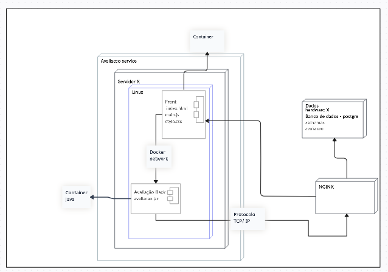

A primeira versão foi elaborada em uma representação de baixa fidelidade, para identificar os componentes participantes da modelagem e como eles interagem entre si. Posteriormente foi utilizado a plataforma Creaty para que seja possível fazer dessa modelagem com um maior detalhamento

 Versão 1 

 Diagrama de implementação (versão 1). (Fonte: Elaborado por Lucas Felipe e Nicolas).

As versões seguintes foram elaboradas no brModelo, dada a facilidade de utilização da ferramenta para inserção de atributos nas entidades e mapeamento das cardinalidades, haja vista que é uma ferramenta própria para elaboração de diagramas de bancos de dados.

 Versão 2

 Diagrama de implementação (versão 2). (Fonte: Elaborado por Lucas Felipe e Nicolas).

