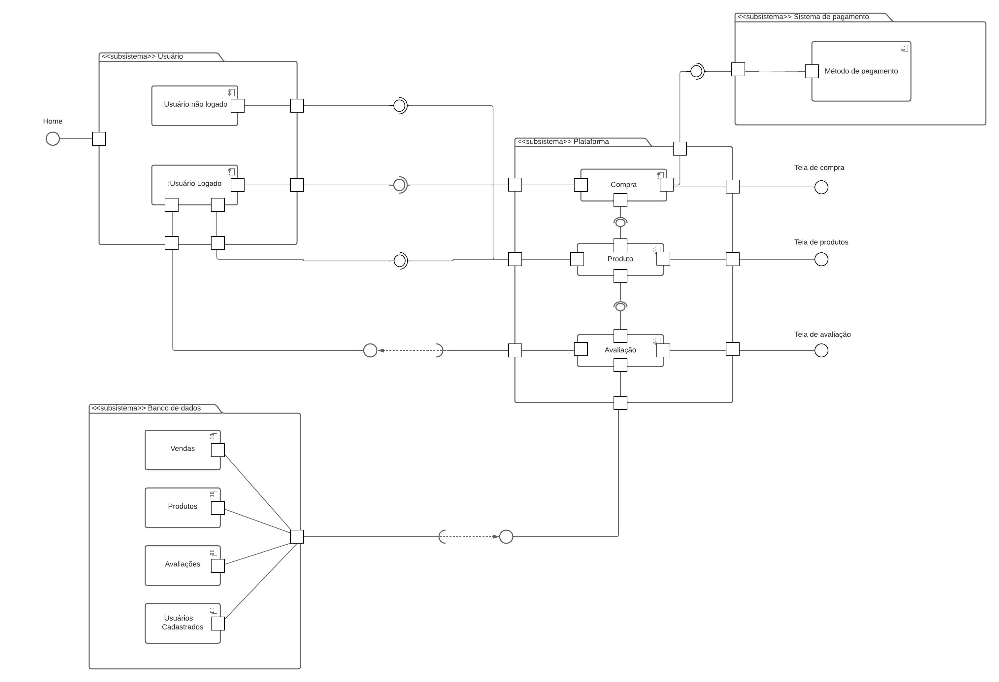

A perspectiva do DAS (Diagrama de Arquitetura de Software) parte do diagrama de componentes, que tem como objetivo principal facilitar a visualização dos componentes do projeto. Seu objetivo é descrever as conexões e interdependências entre esses componentes. Além disso, o diagrama procura demonstrar a estrutura dos subsistemas em termos de camadas e hierarquias, melhorando assim a compreensão da arquitetura abrangente do sistema.
### Diagrama de Componentes

 Diagrama de Pacotes (Fonte: elaborado por Josué, João Pedro.)

#### **Componentes:**
Os componentes do diagrama foram criados baseado no diagrama de [classes](../../2.modelagem/estatica/diagramadeclasses.md). Eles foram divididos em seus respectivos subsistemas, e cada um faz a requisição ou provê uma interface/serviço. A seguir, descreverei mais detalhadamente cada componente e seu relacionamento.

- **Usuário:** Dentro desse componente pai, foram modelados dois componentes filho: `Usuário não logado` e `Usuário logado`. A ideia aqui é que o serviço fornecido para cada um deles seja diferente. O usuário logado possui mais privilégios e pode acessar serviços aos quais um usuário não logado não tem acesso.
- **Plataforma:** No componente pai de plataforma, foram modelado 3 componentes filho: `Compra`, `Produto` e `Avaliação`. Esses componentes foram modelados levando em consideração os serviços que serão consumidos pelos usuários, com base no escopo do nosso projeto.
- **Sistema de Pagamentos:** Esse componente contém apenas um filho `Método de pagamento`. Ele é responsável por fornecer ao sistema as opções de pagamento disponíveis para os produtos, como, por exemplo, pix, cartão de credito, boleto, entre outros.
- **Banco de dados:** O componente pai `Banco de dados` é o que a maior quantidade de componentes filhos. Ao todo, são 4 componentes, sendo eles: `Vendas`, `Produtos`, `Avaliações`, e `Usuários Cadastrados`. Esse componente é responsável por fornecer os dados necessários para a plataforma e tem a tarefa de armazenar as informações do sistema.

#### **Relacionamentos e dependências**
- **Usuário - Plataforma:** O relacionamento do componente pai é estabelecido por meio dos componentes filhos. Primeiramente, o componente `Usuário não logado` se relaciona apenas com o serviço de `produto`. Ele fornece uma interface para o componente produto para que haja comunicação entre eles. O mesmo ocorre com o `usuário logado`, que possui a mesma relação com o componente `produto`. Além disso, o componente `usuário logado` também se relaciona com outros dois componentes do subsistema de plataforma: `compra` e `avaliação`. A plataforma solicita a interface do usuário em ambos os casos, mas há uma dependência especial entre a `avaliação` e o usuário, pois o serviço de avaliação depende da interface do `usuário logado`.
- **Plataforma - Sistema de pagamentos:** O objetivo do relacionamento entre esses dois componentes é que o serviço de compra forneça métodos de pagamentos diferentes. Isso ocorre por meio da disponibilização da interface do componente `compra` para o componente `método de pagamento`.
- **Banco de dados - Plataforma:** Por último, temos o relacionamento entre o componente `banco de dados` e a `plataforma`. Nesses dois componentes, podemos observar que os componentes filhos do `banco de dados` requisitam a interface dos componentes filhos da plataforma. O `banco de dados` é responsável por armazenar os dados e fornecê-los à `plataforma`. O banco possui uma relação de dependência com a plataforma, pois ele só recebe dados se houver uma interface que forneça esse serviço..
- **Banco de dados - Plataforma:** Por último, temos o relacionamento entre o componente "banco de dados" e a "plataforma". Nesses dois componentes, podemos observar que os componentes filhos do "banco de dados" requisitam a interface dos componentes filhos da plataforma. O "banco de dados" é responsável por armazenar os dados e fornecê-los à "plataforma". O banco possui uma relação de dependência com a plataforma, pois ele só recebe dados se houver uma interface que forneça esse serviço.
