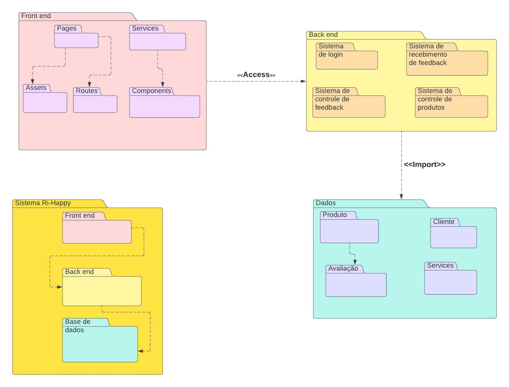

A visão lógica, no contexto da arquitetura de software, corresponde a uma parcela de conjunto que contempla: **Classes, Pacotes** e até mesmo os **Casos de uso**. Com as modelagem do [diagrama de classes](https://unbarqdsw2023-1.github.io/2023.1_G5_ProjetoRiHappy/#/2.modelagem/estatica/diagramadeclasses) e do [diagrama de pacotes](https://unbarqdsw2023-1.github.io/2023.1_G5_ProjetoRiHappy/#/2.modelagem/estatica/diagramadepacotes), é possível passar por grande parte das camadas arquiteturais implementadas até o presente momento com um maior nível de abstração e co-relação entre os mesmos. A seguir veremos como se deu essas visões com as ópticas de tais diagramas.

### Diagrama de classes

Diagrama de Classes (Fonte: elaborado por Josué, Luíza, Lucas Gomes, Lucas Felipe e Nicolas.)

[Link](https://lucid.app/lucidchart/4dd6a296-dbea-46b7-8bb7-b515fbc1fb05/edit?invitationId=inv_32177c76-50f9-40b1-95df-7711173e673f&page=HWEp-vi-RSFO#)
do diagrama de classes

### Diagrama de Pacotes

 Diagrama de Pacotes (Fonte: elaborado por Josué, Luíza, Lucas Felipe e João Pedro.)

[Link](https://lucid.app/lucidchart/9956a0a6-44c2-40f3-a6fe-50e6dd67fb24/edit?page=0_0&invitationId=inv_616ce34d-7d0d-427c-88fc-734e31dcaf7c#)
do diagrama de pacotes

### Visão Geral

Basicamente quando visualizamos a modelagem do **Diagrama de classes**, percebemos como ele foi construído em cima do padrão arquitetural **MVC**. Basicamente esse padrão separa as responsabilidades em três grandes componentes principais, esses são, **Modelos, Visão e Controlador**. Trazendo um pouco mais a fundo essas divisões dentro do contexto do projeto.

#### Visão

As principal responsabilidade da camada de visão, é possibilitar uma interfâce para que o usuário possa interagir com o sistema. Com isso, adentramos em aspectos de estudos que envolvem a UX/UI. Então basicamente esse componente possibilita que o usuário possa de fato fazer sua avaliação dentro do contexto da riHappy. Essa camada é responsável por apresentar os dados da aplicação para o usuário final em forma de interface. Essa camada se relaciona com o controlador, recebendo os dados da aplicação e apresentando em forma de interface.

#### Controlador

A principal responsabilidade da camada de controlador, é possibilitar uma camada intermediária entre a camada de modelo e a camada de visão. Basicamente esse intermedio tem como função possibilitar a comunicação entre as duas camadas, ou seja, ela recebe recebe e trata os dados do usuário(envolvevendo um escopo mais relacionado com a camada de modelo) e devolve a visualiação desses dados para o usuário (o que ele consegue visualizar com a camada de de visão). O controlador é responsável pela parte lógica da aplicação. Ele processa a requisição do usuário e gera a resposta na camada de visão.

#### Modelo

As principais responsabilidades da camada model, representada no diagrama de classes, estão mais relacionadas com a forma que será implementada as regras de negócio dentro do sistema e como vamos tratar os dados em questão. Dentro do escopo do projeto atrelado a riHappy, tratamos as maneiras distintas que os usuários podem fazer sua etapa de avaliação. Nesse contexto, visualizamos como se organizam os pedidos, os produtos, os usuários, como se dão as avaliações dos mesmos e as mídias que também podem estar inseridas neste contexto.

#### Diagrama de pacotes

A modelagem em cima do diagrama de pacotes, também temos uma representação muito forte do que nos diz respeito o padrão arquitetural MVC. Dentro dessa modelagem, temos uma separação mais evidente desses componentes e sobretudo como se da suas responsabilidades e também da comunicação entre as mesmas. De maneira geral, temos: o pacote de Front-End que é responsável pela interfaĉe com o usuário tal qual a camada de visão. O Back-End, representando a camada de controlador, é responsável por receber os dados que o usuário insere no Front-End, trata-los e enviar para o banco de dados. E por último, o banco de dados, que trás de fato como se da essas regras de negócio e armazenamento desses dados para procedimentos adequados, tal qual o camada de Modelo.

### Pacotes de design arquitetonicamente significativos
ACREDITO QUE AQUI VAMOS TER DE SUBIR FRAGMENTOS DE IMAGEM COM ESSAS SEPARAÇÕES PARA ILUSTRAR...FEITO ISSO MORREU
VOU PUXAR AS IMAGENS...tenta puxar elas separadas em camadas aí que agt faz as descrições rapidão...VOU PEGAR A VIEW JUNTO COM SEGURANÇA, OU PEGO SAPARADO MESMO? essas que conversam pode tentar pegar juntos que aí na hora do texto agt trata isso... EU NÃO CONSIGO COLOCAR AS IMAGENS PQ TA NO TEU PC, VOU MANDAR NO TELEGRA AI VC BAIXA E COLOCA bele, vou por ela e commitar prai ir embora, BELEZA

<!--Para cada pacote significativo, inclua uma subseção com seu nome, sua breve descrição e um diagrama com todas as classes e pacotes significativos contidos no pacote.
Para cada classe significativa no pacote, inclua seu nome, breve descrição e, opcionalmente, uma descrição de algumas de suas principais responsabilidades, operações e atributos.-->
 