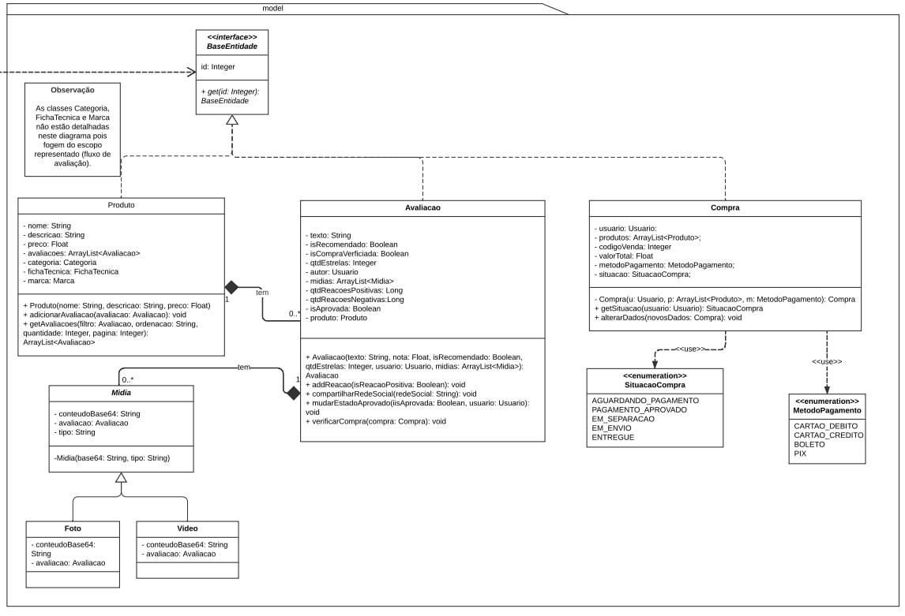
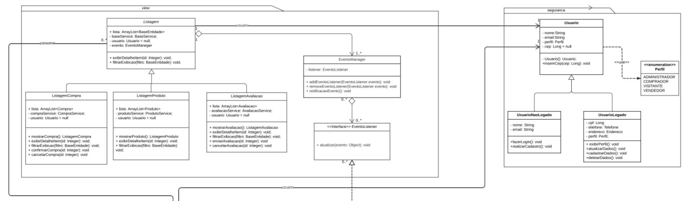
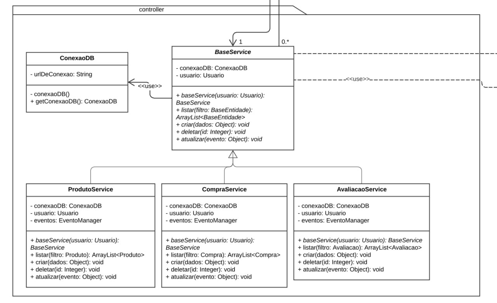

A visão lógica, no contexto da arquitetura de software, corresponde a uma parcela de conjunto que contempla: **Classes, Pacotes** e até mesmo os **Casos de uso**. Essa visão, nada mais é que uma abstração dos modelos criados, onde são evidenciados suas características principais e com uma diminuição da complexidade de suas respectivas representações. Com as modelagem do [diagrama de classes](https://unbarqdsw2023-1.github.io/2023.1_G5_ProjetoRiHappy/#/2.modelagem/estatica/diagramadeclasses) e do [diagrama de pacotes](https://unbarqdsw2023-1.github.io/2023.1_G5_ProjetoRiHappy/#/2.modelagem/estatica/diagramadepacotes), podemos tratar com maior propriedade acerca das principais camadas arquiteturais modeladas até então. Ademais, reforçando essa mesma óptica mas com um nível de abstração ainda maior,  temos o [diagrama de atividades](https://unbarqdsw2023-1.github.io/2023.1_G5_ProjetoRiHappy/#/2.modelagem/dinamica/diagramadeatividades) e também o  [diagrama de comunicação](https://unbarqdsw2023-1.github.io/2023.1_G5_ProjetoRiHappy/#/2.modelagem/dinamica/diagramadecomunicacao). A seguir veremos como esses quatro diagramas se relacionam entre si e também com a visão lógica no contexto da riHappy.

### Diagrama de classes
<!--Como é o nosso diagrama de mais detalahemento vai ser o principal, mas usaremos o de pacotes para reforçar o MVC-->

Diagrama de Classes (Fonte: elaborado por Josué, Luíza, Lucas Gomes, Lucas Felipe e Nicolas.)

[Link](https://lucid.app/lucidchart/4dd6a296-dbea-46b7-8bb7-b515fbc1fb05/edit?invitationId=inv_32177c76-50f9-40b1-95df-7711173e673f&page=HWEp-vi-RSFO#)
do diagrama de classes

### Diagrama de Pacotes

 Diagrama de Pacotes (Fonte: elaborado por Josué, Luíza, Lucas Felipe e João Pedro.)

[Link](https://lucid.app/lucidchart/9956a0a6-44c2-40f3-a6fe-50e6dd67fb24/edit?page=0_0&invitationId=inv_616ce34d-7d0d-427c-88fc-734e31dcaf7c#)
do diagrama de pacotes

### Visão Geral

Basicamente quando visualizamos a modelagem do **Diagrama de classes**, percebemos como ele foi construído em cima do padrão arquitetural **MVC**. Basicamente esse padrão separa as responsabilidades em três grandes componentes principais, esses são, **Modelos, Visão e Controlador**. Trazendo um pouco mais a fundo essas divisões dentro do contexto do projeto.

#### Visão

As principal responsabilidade da camada de visão, é possibilitar uma interfâce para que o usuário possa interagir com o sistema. Com isso, adentramos em aspectos de estudos que envolvem a UX/UI. Então basicamente esse componente possibilita que o usuário possa de fato fazer sua avaliação dentro do contexto da riHappy. Essa camada é responsável por apresentar os dados da aplicação para o usuário final em forma de interface. Essa camada se relaciona com o controlador, recebendo os dados da aplicação e apresentando em forma de interface.

#### Controlador

A principal responsabilidade da camada de controlador, é possibilitar uma camada intermediária entre a camada de modelo e a camada de visão. Basicamente esse intermedio tem como função possibilitar a comunicação entre as duas camadas, ou seja, ela recebe recebe e trata os dados do usuário(envolvevendo um escopo mais relacionado com a camada de modelo) e devolve a visualiação desses dados para o usuário (o que ele consegue visualizar com a camada de de visão). O controlador é responsável pela parte lógica da aplicação. Ele processa a requisição do usuário e gera a resposta na camada de visão.

#### Modelo

As principais responsabilidades da camada model, representada no diagrama de classes, estão mais relacionadas com a forma que será implementada as regras de negócio dentro do sistema e como vamos tratar os dados em questão. Dentro do escopo do projeto atrelado a riHappy, tratamos as maneiras distintas que os usuários podem fazer sua etapa de avaliação. Nesse contexto, visualizamos como se organizam os pedidos, os produtos, os usuários, como se dão as avaliações dos mesmos e as mídias que também podem estar inseridas neste contexto.

#### Diagrama de pacotes

A modelagem baseada em diagrama de pacote fornece uma representação extremamente sólida do padrão de arquitetura MVC. Nessa abordagem, temos uma separação bem clara dos componentes, destacando suas responsabilidades e a comunicação entre eles. Em geral, identificamos o pacote front-end, responsável por construir a interface do usuário, bem como a camada de visualização. O backend representa a camada controller e é responsável por receber os dados inseridos pelo usuário no frontend, processá-los e enviá-los ao banco de dados. Por fim, o banco de dados desempenha um papel vital, definindo regras de negócio e garantindo o armazenamento correto dos dados, consistente com a camada de modelo. Essa abordagem modular estruturada fornece um ambiente eficiente e organizado para desenvolvimento e manutenção do sistema.

### Pacotes de design arquitetonicamente significativos

#### Modelo

A camada de modelo, trás consigo a maneira que as regras de negócio são implementadas em nosso contexto, fornecendo uma estrutura base para a aplicação. Basicamente vemos que todas as classes que estão relacionadas em certo nível com o fluxo de avaliação de um produto. Um ponto interessante quanto essa camada é a possibilidade de já poder se abstrair em boa parte como as outras camadas irão atuar.

Representação da camada Model (Fonte: elaborado por Josué, Luíza, Lucas Gomes, Lucas Felipe e Nicolas.)

#### Visão

A camada de visão traz consigo a maneira pela qual todos esses dados são apresentados ao usuário e possibilita que, de acordo com eventos de interação do usuário, tenhamos tratamentos adequados em outras camadas. Além disso, observamos que, em conjunto com essa camada, temos aspectos que envolvem a camada de segurança, no que diz respeito ao controle do tipo de usuário responsável por cada ação. Tal aspecto nos dá a garantia de que um determinado evento não possa comprometer o sistema de alguma forma.

Representação da camada Model (Fonte: elaborado por Josué, Luíza, Lucas Gomes, Lucas Felipe e Nicolas.)

#### Controlador

Basicamente a camada de Controller em questão trás consigo aspectos envolvendo os serviços relacionados aos produtos presentes na plataforma, as avaliações dos mesmos e os dados relacionados a compra. Tudo isso sendo tratado e armazenado em um banco de dados. Essa camada é responsável por se comunicar com a visão e enviar os dados da aplicação através dos serviços.

Representação da camada  Controller (Fonte: elaborado por Josué, Luíza, Lucas Gomes, Lucas Felipe e Nicolas.)

### Outras modelagens em mais alto nível
<!--Se quiser podemos fora os links colocar as imagens mas sem entrar muito em detalhes pq é mais um extra-->
Além do diagrama de classes que está representado com uma maior riqueza de detalhamento e o diagrama de pacotes que reforça uma visão muito ampla para o padrão de arquiteura MVC. Também foram modelados em mais alto nível os diagramas de: [Atividades](https://unbarqdsw2023-1.github.io/2023.1_G5_ProjetoRiHappy/#/2.modelagem/dinamica/diagramadeatividades), que demonstra com certo nível de abstração como se da o fluxo de avaliação dentro do contexto do projeto e também o [diagrama de comunicação](https://unbarqdsw2023-1.github.io/2023.1_G5_ProjetoRiHappy/#/2.modelagem/dinamica/diagramadecomunicacao), que trás uma abstração de como se da a implementação deste fluxo via mensagens sequenciais.