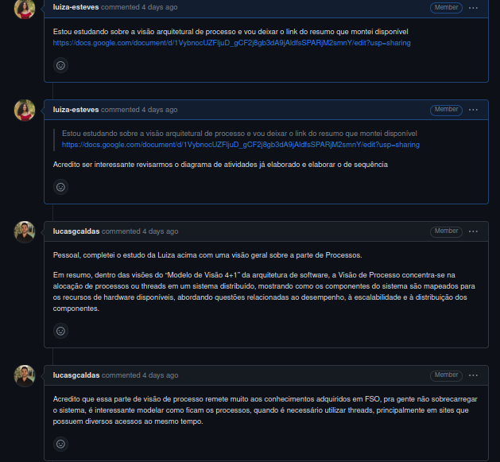
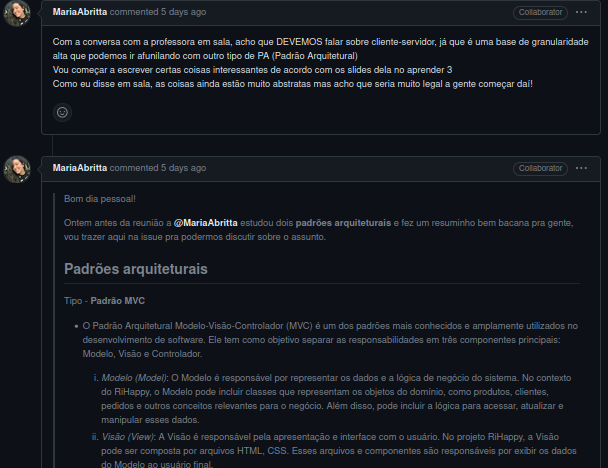
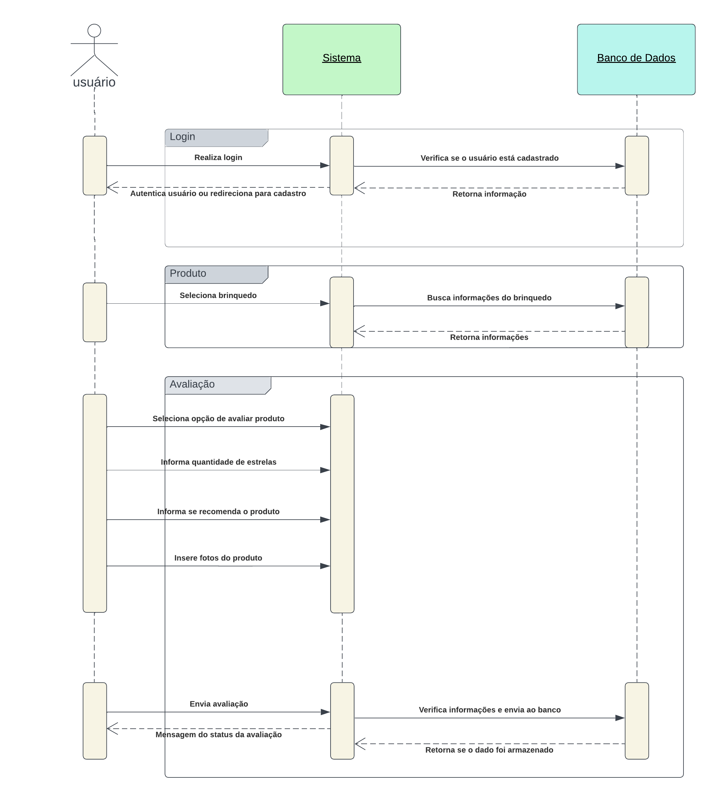

# Visão de processos

## Introdução

A visão de processo em um documento de arquitetura de software descreve os processos, atividades e fluxos de trabalho envolvidos no desenvolvimento, manutenção e evolução do software ao longo de seu ciclo de vida. Ela fornece uma perspectiva sobre como as diferentes partes envolvidas no projeto irão interagir e colaborar para atingir os objetivos do projeto de software.

Essa visão pode incluir fluxos de trabalho, que representam a sequência lógica das atividades e as dependências entre elas. Os fluxos de trabalho podem ser representados por meio de diagramas de atividades, fluxogramas ou outras representações gráficas que ilustram como as atividades são executadas e como as informações fluem entre os diferentes participantes do projeto.

Para desenvolver a visão de processo, é necessário considerar os seguintes elementos:

1. Componentes: Identifique os principais componentes do sistema e como eles se relacionam entre si. Considere os serviços que cada componente oferece e as dependências existentes entre eles.
2. Processos: Determine quais componentes do sistema serão executados em processos ou threads separados. Essa decisão depende de fatores como a carga de trabalho, a escalabilidade e a disponibilidade dos recursos de hardware.
3. Distribuição: Caso o sistema seja distribuído, defina como os componentes serão alocados em diferentes nós de processamento. Considere questões como latência da rede, balanceamento de carga e tolerância a falhas.
4. Comunicação: Descreva como os componentes irão se comunicar entre si. Identifique os protocolos de comunicação, os formatos de dados e os mecanismos de troca de mensagens utilizados. Considere também a segurança e a autenticação das comunicações.
5. Sincronização e concorrência: Caso existam componentes que compartilhem recursos ou que precisem coordenar suas atividades, defina os mecanismos de sincronização e concorrência a serem utilizados. Isso pode envolver o uso de mutexes, semáforos, monitores ou outras estruturas de controle de acesso.
6. Gerenciamento de processos: Determine como os processos ou threads serão gerenciados, incluindo a inicialização, finalização, escalonamento e monitoramento de atividades. Considere também a gestão de recursos, como memória e processamento.
7. Escalabilidade e desempenho: Análise dos requisitos de desempenho do sistema e identifique possíveis gargalos. Considere estratégias de escalabilidade, como a distribuição de carga entre diferentes processadores, para garantir um bom desempenho do sistema.

Entender os fluxos de processos facilita a coordenação entre as equipes, ajuda na identificação de pontos de integração, e permite que os stakeholders tenham uma visão clara dos processos envolvidos no desenvolvimento e operação do software.

No geral, a visão de processo em um documento de arquitetura de software fornece uma descrição completa e estruturada dos processos que serão seguidos durante o ciclo de vida do software, auxiliando na compreensão e na implementação eficaz da arquitetura proposta.

## Metodologia

Na [reunião do dia 21/06](https://unbarqdsw2023-1.github.io/2023.1_G5_ProjetoRiHappy/#/0.planejamento/atas/ata_21_06_2023), foram definidos que os integrantes Lucas Gomes, Luíza Esteves e Maria Abritta ficariam responsáveis por elaborar esse documento. A partir disso, foram feitas comunicações dentro da [issue do Github](https://github.com/UnBArqDsw2023-1/2023.1_G5_ProjetoRiHappy/issues/82), para que outros membros pudessem contribuir e verificar o andamento das atividades, que pode ser visto nas Figura 1 e Figura 2 abaixo:

 Figura 1. Comunicação feita entre os membros sobre o as visões

 Figura 2. Comunicação feita entre os membros sobre o as visões

## Diagrama de sequência

O diagrama de sequência é  utilizado na modelagem de sistemas para representar a interação entre objetos ao longo do tempo. Ele pode ser usado para ilustrar a interação entre processos e componentes em um documento de arquitetura de software.

Dentro de um documento de arquitetura de software, um diagrama de sequência pode ser usado para descrever como as diferentes partes do sistema se comunicam e interagem para realizar uma determinada funcionalidade. Ele ajuda a capturar a sequência de mensagens trocadas entre os componentes e processos envolvidos em um cenário específico.

Dentro do nosso foco, elaboramos esse diagrama com o objetivo de mostrar a ordem das atividades ou etapas em um fluxo de trabalho, ajudando a visualizar como os diferentes elementos do sistema se comunicam e colaboram para alcançar uma determinada tarefa ou objetivo.

A seguir está o diagrama elaborado com o foco em entender processos dentro do fluxo de avaliação do sistema da RiHappy:

 Figura 3. Diagrama de sequência (Fonte: elaborado por Luíza Esteves e Lucas Gomes)

### Fluxo

**Login:** O usuário realiza login, o sistema verifica no banco de dados se o usuário está cadastrado e retorna a informação para o sistema. Caso o usuário esteja cadastrado, ele é autenticado e pode navegar no sistema, caso contrário, ele é redirecionado à tela de cadastro.

**Produto:** O usuário seleciona o brinquedo que deseja, o sistema busca as informações do brinquedo no banco de dados e retorna as informação ao sistema.

**Avaliação:** O usuário seleciona a opção de avaliar produto no sistema, informa a quantidade de estrelas, se recomenda o produto e as fotos do produto ao sistema. Depois, o usuário envia a avaliação completa ao sistema, que verifica e envia ao banco de dados, e esse retorna se o dado foi armazenado com sucesso ao sistema. Por último, o sistema envia ao usuário a mensagem de status da sua avaliação.

### Tabela de símbolos

| Símbolo                                                                                              | Nome                             | Descrição                                                                                                                                                                                             |
| :--------------------------------------------------------------------------------------------------- | -------------------------------- | ----------------------------------------------------------------------------------------------------------------------------------------------------------------------------------------------------- |
|     | Símbolo de mensagens síncronas   | Representa uma classe ou objetos em UML. O símbolo do objeto demonstra como um objeto se comportará no contexto do sistema. Atributos de classe não devem ser listados nesta forma.                   |
|  | Símbolo de mensagens assíncronas | Representado por uma linha sólida com uma ponta de seta em linha. Mensagens assíncronas não necessitam de uma resposta para que o remetente continue. Apenas a chamada deve ser incluída no diagrama. |
|         | Símbolo de responder à mensagem  | Representado por uma linha tracejada com uma ponta de seta em linha, estas mensagens são respostas às chamadas.                                                                                       |

## Conclusão

Por fim, dentro da visão de processo, tomando o diagrama de sequência em questão, foi possível descrever como o sistema será executado, ou seja, como as tarefas serão distribuídas e executadas em diferentes situações e até mesmo levando para o baixo nível, em que deve se pensar em threads/processos. Além disso, foi importante para identificar dependências e interações, destacando as interações necessárias para que o sistema funcione corretamente. Assim, conseguimos entender os pontos críticos de integração e compreender como as partes do sistema se relacionam entre si.

## Bibliografia

[1] Tutorial do Diagrama de Sequência: Guia completo com exemplos. Disponível em: [Link](https://creately.com/blog/pt/diagrama/tutorial-do-diagrama-de-sequencia/). Acesso em: 26 jun. 2023.  
[2] Serrano, Milene. Arquitetura e Desenho de Software. São Paulo: 28 jun. 2020. Disponível em: [Link](https://unbbr-my.sharepoint.com/personal/mileneserrano_unb_br/_layouts/15/stream.aspx?id=%2Fpersonal%2Fmileneserrano%5Funb%5Fbr%2FDocuments%2FArqDSW%20%2D%20V%C3%ADdeosOriginais%2F05e%20%2D%20VideoAula%20%2D%20DSW%2DModelagem%20%2D%20Agregacao%20Composicao%2Emp4&ga=1). Acesso em: 11 mai. 2023.  

## Histórico de versão

| Versão | Data       | Descrição                                                                                            | Autor(es)      | Revisor(es)                       |
| ------ | ---------- | ---------------------------------------------------------------------------------------------------- | -------------- | --------------------------------- |
| `1.0`  | 27/06/2023 | Criação da página de diagrama de componentes     | Luíza | Lucas Gabriel |
| `1.1`  | 27/06/2023 | Adição da Conclusão     | Lucas Gomes | Lucas Gabriel |
| `1.2`  | 29/06/2023 | Adição de desenvolvimento do Processo | Lucas Gomes | Lucas Gabriel |
| `1.3`  | 29/06/2023 | Adição de explicações ao diagrama | Lucas Gomes | Lucas Gabriel |
