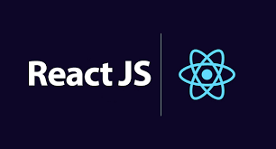
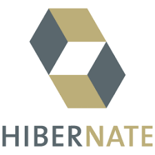
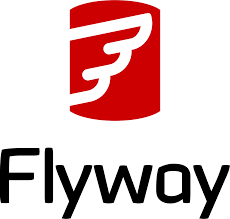

### Bibliotecas

#### RXJS no contexto de Observador

Um observer ou observador é um receptor de valores entregues por um componente observável. São um conjunto de retornos de chamada, um para cada tipo de componente. 

Os observadores podem ser parciais, ou seja, se nao fornecer retorno, a execução ainda acontecerá normalmente.[Observer](https://rxjs.dev/guide/observer) 
 
#### React JS

O React é uma biblioteca front-end JavaScript de código aberto com foco em criar interfaces de usuário em páginas web.[ReactJS](https://react.dev/learn)

#### Jackson ObjectMapper
O Jackson tem a classe ObjectMapper que é muito utilizada para converter classes Java em JSON, e vice-versa, na comunicação entre APIs RESTful e SPAs.[Jackson](https://www.devmedia.com.br/introducao-ao-jackson-objectmapper/43174) 

### Frameworks

Um framework valida-se de funcionalidades em comum a várias aplicações, utilizando das interseções presentes em entre esses domínios para construção de ferramentas que atenda a esses conjuntos de aplicações [4]. Assim, um framework, Orientado a objetos, visa prover soluções para um conjunto de problemas semelhantes, validando-se das classes e interfaces presentes no projeto para decompor os problemas e cumprir as responsabilidades, dessa forma as classes necessitam ser flexiveis e extenssíveis para que possa ser utilizadas em diversas aplicações diferentes[4].

Dentro desse contexto, os frameworks são dividos em Hot-Spots e Frozen-Spots, nos quais os Hot-Spots são as partes mais genéricas e consequentemente flexíveis de um framework pemitindo mudanças de acordo com as necessidades específicas da aplicação e representados por classes abstratas, já os Frozen-Spots são as partes mais concretas e que permanencem fixos, e são "core" do framework, ou seja trazindo para o português é a parte essencial do framework [4].

Além disso, um framework também pode ser classificado como Caixa Branca, Caixa Preta ou Caixa Cinza, um framework Caixa Branca utiliza principalmente de HotSpots, permitindo que esse seja extremamente flexível validando-se principalmente dos conceitos de herança, interfaces e padrões de projeto que contribuam com essa característica, já um framework Caixa Preta é o oposto e utiliza de FrozenSpots, no qual a reutilização acontece apenas em nível de composição, permitindo apenas utilizar de forma diferente algo já concreto. Ademais, um framework Caixa Cinza é um hibrido, o qual é composto por elementos do Caixa Branca e do Caixa Preta, assim utilizando dos HotSpots e dos FrozenSpots [4]. 

Em adiação a classificação dos frameworks, esses também são dividos, em uma macroclassificação, com relação a função exercida, são essas de Infra-estrutura (simplicam o processo de desenvolvimento de infra-estrutura), Integração (simplicficam o processo de integração de aplicações e componentes) e Aplicação empresarial [4].

Diante disso, no contexto do projeto Rihappy, foram selecionados alguns frameworks externos para facilitar o processo de reutilização de código dentro do sistema e construção do projeto com a especificidade necessária ao contexto do fluxo de avaliações de mercadorias, são essas o Spring Boot, o Hibernate e o JUnit.

#### Spring Boot

#### Hibernate com Spring Boot

O [Hibernate](https://www.baeldung.com/spring-boot-hibernate) é um framework de conexão com o banco de dados, o qual lida com o mapeamento objeto-relacional, também chamado de ORM, para Java. Porém, também é utilizado para . NET com o nome de NHibernate. Por ter essa característica de ORM, ele transforma os dados da estrutura lógica de um banco de dados em objetos relacionais, auxiliando na camada de persistência do projeto ao compatibilizar as duas camadas (Domínio e Pesistência) [4]. 

#### JUnit

### Banco de Dados

### Ferramentas

#### GitHub

GitHub é uma plataforma feita para hospedagem de códigos de programação. Os objetivos principais são o controle e a colaboração, permitindo que usuários desenvolvam projetos juntos, estando em qualquer lugar do mundo.[GitHub](https://github.com)

 

#### ZenHub
O Zenhub permite que os desenvolvedores fiquem mais próximos ao desenvolvimento do projeto dentro do GitHub, minimizando a troca de contextos. Os dados simultâneos do GitHub sempre mantendo os projetos atualizados e precisos em ambas as ferramentas.
Usamos ele como forma de organização e de otimizar a rotina de desenvolvimento de cada membro em cada tarefa. [Zenhub](https://www.zenhub.com/)

#### FlyWay 

Flyway é uma ferramenta de migração de banco de dados de código aberto. 
O Flyway é uma dentre as várias ferramentas que se propõem a trazer ordem e organização para os scripts SQL que são executados no banco de dados, funciona como um controle de versão do mesmo. [Flyway](https://www.baeldung.com/database-migrations-with-flyway)

#### Docker

O Docker é uma forma de virtualizar aplicações no conceito de “containers”, trazendo da web ou de seu repositório interno uma imagem completa, incluindo todas as dependências necessárias para executar sua aplicação.
Ademais também se contextualizam como containers de ambiente e deploy com Docker e Docker Compose e orquestração de containers com Docker Swarm.[Docker](https://docs.docker.com/)

