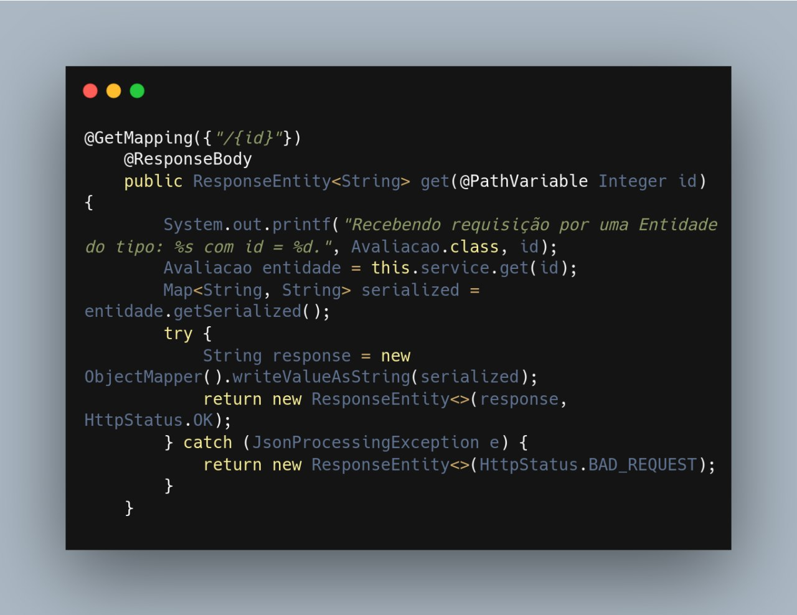
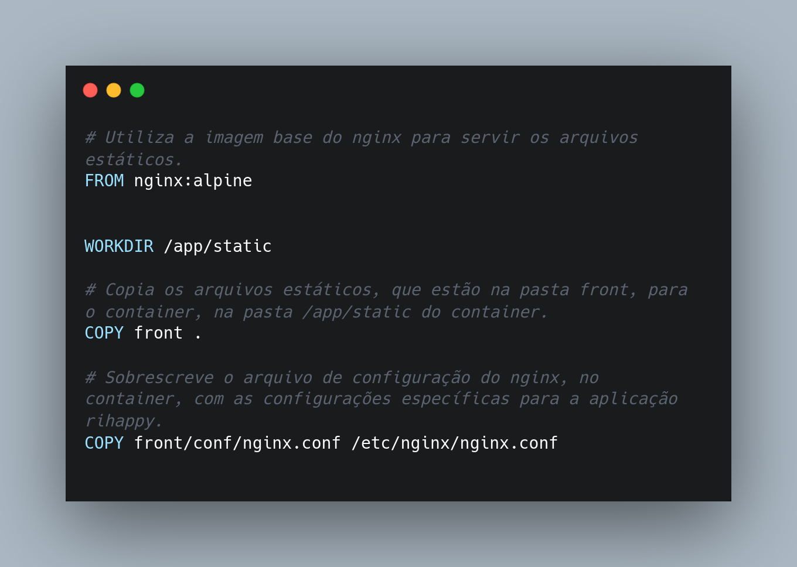
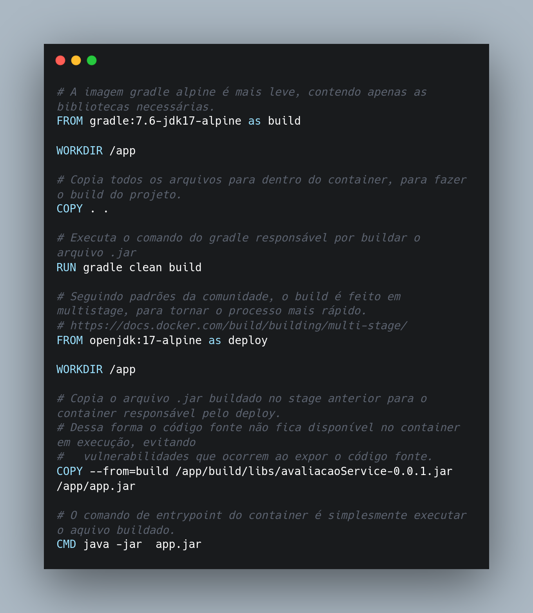
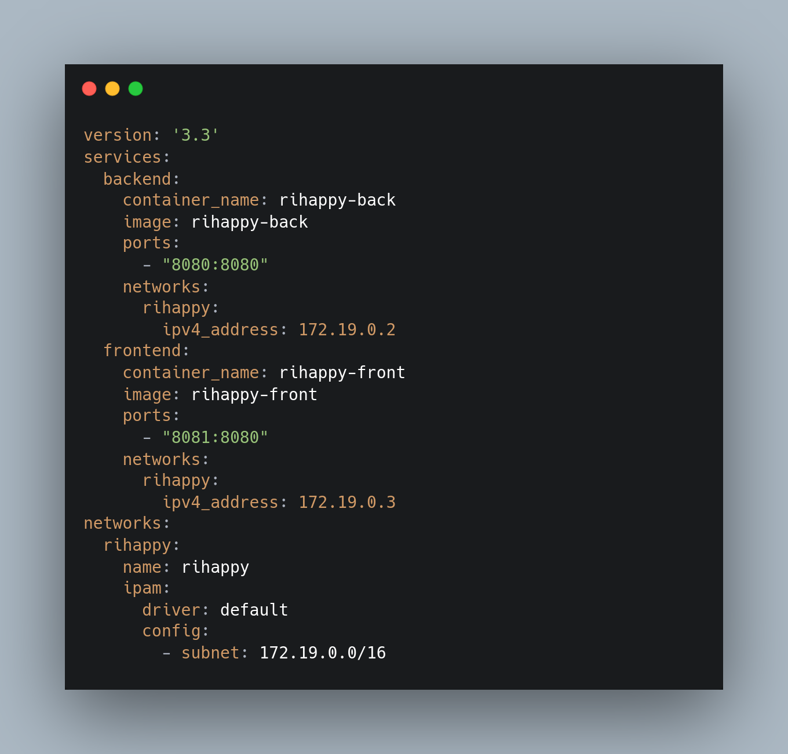

### Frameworks

Um Framework valida-se de funcionalidades em comum a várias aplicações, utilizando das interseções presentes entre esses
domínios para construção de ferramentas que atendam a esses conjuntos de aplicações [4]. Assim, um Framework, Orientado a
objetos, visa prover soluções para um conjunto de problemas semelhantes, usando as classes e interfaces presentes no
projeto para decompor os problemas e cumprir as responsabilidades, dessa forma as classes necessitam ser flexíveis e
extensíveis para que possam ser utilizadas em diversas aplicações diferentes [4].

Dentro desse contexto, as partes as quais compõem um Frameworks podem ser divididas em duas classificações **Hot-Spots** e **Frozen-Spots**, nos
quais os Hot-Spots são as partes mais genéricas e consequentemente flexíveis de um Framework permitindo mudanças de
acordo com as necessidades específicas da aplicação e representados por classes abstratas, já os Frozen-Spots são as
partes mais concretas e que permanecem fixas e são "core" do Framework, ou seja traduzindo para o português é a parte
essencial do Framework [4].

Além disso, um Framework também pode ser classificado como Caixa Branca, Caixa Preta ou Caixa Cinza. Um Framework Caixa
Branca utiliza principalmente de HotSpots, permitindo que esse seja extremamente flexível validando-se principalmente
dos conceitos de herança, interfaces e alguns padrões de projeto que contribuam com essa característica, já um Framework
Caixa Preta é o oposto e utiliza de FrozenSpots, no qual a reutilização acontece apenas através da composição,
permitindo apenas utilizar de forma diferente algo já concreto, diante disso, um Framework Caixa Cinza é um híbrido, o
qual é composto por elementos do Caixa Branca e do Caixa Preta, assim utilizando dos HotSpots e dos FrozenSpots com
pontos de flexibilidade e outros mais concretos [4].

Além dessa classificação os Frameworks também são divididos em uma macro classificação com relação à função exercida, são
essas de Infra-estrutura (simplificam o processo de desenvolvimento de infra-estrutura), Integração (simplificam o
processo de integração de aplicações e componentes) e Aplicação empresarial [4].

Diante disso, no contexto do projeto Rihappy, foram selecionados alguns Frameworks externos para facilitar o processo de
desenvolvimento do sistema, reutilizando código externo e construindo um projeto com a especificidade necessária no
contexto do fluxo de avaliações de mercadorias a partir desses. Os Frameworks utilizados são o JUnit, o Spring Boot e o
Hibernate. É importante observar que esses Frameworks possuem FrozenSpots com todas as estruturas prontas para ser
utilizadas e também possuem HotSpots permitindo ao desenvolvedor uma flexibilidade de acordo com a sua necessidade,
dessa forma esses podem ser considerados Frameworks Caixa Cinza.
Diante disso, no contexto do projeto Rihappy, foram selecionados alguns Frameworks externos para facilitar o processo de
desenvolvimento do sistema, reutilizando código externo e construindo um projeto com a especificidade necessária no
contexto do fluxo de avaliações de mercadorias a partir desses. Os Frameworks utilizados são o JUnit, o Spring Boot e o
Hibernate. É importante observar que esses Frameworks possuem FrozenSpots com todas as estruturas prontas para ser
utilizadas e também possuem HotSpots permitindo ao desenvolvedor uma flexibilidade de acordo com a sua necessidade,
dessa forma esses podem ser considerados Frameworks Caixa Cinza.

#### JUnit 5

O [JUnit 5](https://junit.org/junit5/) é um Framework de código livre para realização de testes de software. Assim, esse
Framework contribui facilitando o processo de teste dentro do projeto.

  JUnit (Fonte: JUnit). 

#### Spring Boot

O [Spring](https://spring.io/projects) é um projeto de software livre de abordagem simplificada e modular para criação
de aplicações com Java [5]. Porém, devido a necessidade de realizar um longo processo de configurações motivou a criação
do Spring Boot, o qual é uma extensão do Framework Spring que tem o objetivo de tornar mais rápido o processo de
desenvolvimento de aplicações Web e microsserviços em Java [5].

Dentro do contexto do projeto foi utilizado o [Spring Initializr](https://start.spring.io/) com o intuito de se utilizar
da facilitação para configuração fornecida por esse Framework. A seguir é possível observar na Figura 5 as seleções de
configurações selecionadas, tendo como opções o Gradle - Kotlin como gerenciador de pacotes, com a linguagem Java na
versão 17, o Spring Boot na versão 3.1.1 e como dependências o Spring Web e o PostgresSQL Driver.

  Spring Initializr (Fonte: Autoria Própria). 

#### Hibernate

O [Hibernate](https://hibernate.org/) é um Framework de conexão com o banco de dados, o qual lida com o mapeamento
objeto-relacional, também chamado de ORM, para Java. Porém, também é utilizado para . NET com o nome de NHibernate. Por
ter essa característica de ORM, ele transforma os dados da estrutura lógica de um banco de dados em objetos relacionais,
auxiliando na camada de persistência do projeto ao compatibilizar as duas camadas (Domínio e Persistência) [4]. No
contexto da aplicação
o [Hibernate é utilizado em conjunto com o Spring Boot](https://www.baeldung.com/spring-boot-hibernate).

  Hibernate (Fonte: Hibernate). 

### Bibliotecas

Semelhantes aos Frameworks as Bibliotecas contribuem com a reutilização de código dentro do sistema, porém possuem
diferenças relevantes. A Biblioteca não possui a preocupação de realizar chamadas do código, mas o Framework sim (Hollywood Principle), pois é empacotado e incorporado ao código. Além de que em uma Biblioteca não há uma interação
específica entre as classes presentes no código ali especificado, pois não há um comportamento padrão pré-definido,
diferente do que ocorre no Framework .

#### RXJS no contexto de Observador

Um observer ou observador é um receptor de valores entregues por um componente observável. São um conjunto de retornos
de chamada, um para cada tipo de componente.

Os observadores podem ser parciais, ou seja, se não fornecer retorno, a execução ainda acontecerá
normalmente.[Observer](https://rxjs.dev/guide/observer)

  RXJS (Fonte: RXJS). 

#### React JS

O React é uma biblioteca front-end JavaScript de código aberto com foco em criar interfaces de usuário em páginas
web.[ReactJS](https://react.dev/learn)

  React JS (Fonte: React JS). 

#### Jackson ObjectMapper

O Jackson tem a classe ObjectMapper que é muito utilizada para converter classes Java em JSON, e vice-versa, na
comunicação entre APIs RESTful e SPAs.[Jackson](https://www.devmedia.com.br/introducao-ao-jackson-objectmapper/43174)

   Jackson ObjectMapper (Fonte: Jackson ObjectMapper). 

#### Exemplo de Implantação do Jackson ObjectMapper

Para exemplificar a utilização do Jackson ObjectMapper é possível observar o trecho de código a seguir, o qual tem a função de selecionar uma entidade que posteriormente será transformada de uma classes POJO (Plain Old Java Objects) para um JSON (JavaScript Object Notation).

 Exemplo de utilização do `Jackson ObjectMapper`. (Fonte: Nicolas)

> O arquivo original elaborado encontra-se disponível no link: [Jackson ObjectMapper](https://github.com/UnBArqDsw2023-1/2023.1_G5_ProjetoRiHappy/blob/main/codigo/src/main/java/br/com/rihappy/avaliacaoService/controller/AvaliacaoController.java).

### Banco de Dados

#### PostgreSQL

Um outro exemplo de reutilização de software externo é o Sistema de Gerenciamento de Banco de Dados do tipo
Relacional [PostgreSQL](https://www.postgresql.org/) e ele pode ser reutilizado em diversos projetos para atender às
necessidades de armazenamento de dados de um projeto. Dentro do contexto do projeto é possível ver a conexão do mesmo ao
Banco de Dados no [Diagrama de Classes](../../2.modelagem/estatica/diagramadeclasses.md#versão-2), por meio da camada Controller, a qual facilita tal reutilização desse sistema externo adaptado ao contexto do projeto de forma simples, essa pode ser observada na Figura 4 citada anteriormente e no [Documento de Arquitetura de Software na seção de visão lógica](../padroes/padroesarquiteturais.md#visão-lógica).

   PostgreSQL (Fonte: PostgreSQL). 

### Ferramentas

#### GitHub

GitHub é uma plataforma feita para hospedagem de códigos de programação. Os objetivos principais são o controle e a
colaboração, permitindo que usuários desenvolvam projetos juntos, estando em qualquer lugar do
mundo.[GitHub](https://github.com)

   GitHub (Fonte: GitHub). 

#### ZenHub

O Zenhub permite que os desenvolvedores fiquem mais próximos ao desenvolvimento do projeto dentro do GitHub, minimizando
a troca de contextos. Os dados simultâneos do GitHub sempre mantendo os projetos atualizados e precisos em ambas as
ferramentas.
Usamos ele como forma de organização e de otimizar a rotina de desenvolvimento de cada membro em cada
tarefa. [Zenhub](https://www.zenhub.com/)

  ZenHub (Fonte: ZenHub). 

#### FlyWay

Flyway é uma ferramenta de migração de banco de dados de código aberto.
O Flyway é uma dentre as várias ferramentas que se propõem a trazer ordem e organização para os scripts SQL que são
executados no banco de dados, funciona como um controle de versão do mesmo. [Flyway](https://www.baeldung.com/database-migrations-with-flyway)

   FlyWay (Fonte: FlyWay). 

#### Docker

O Docker é uma forma de virtualizar aplicações no conceito de “containers”, trazendo da web ou de seu repositório
interno uma imagem completa, incluindo todas as dependências necessárias para executar sua aplicação.
Ademais também se contextualizam como containers de ambiente e deploy com Docker e Docker Compose e orquestração de
containers com Docker Swarm.[Docker](https://docs.docker.com/)

   Docker (Fonte: Docker). 

#### Exemplo de Implantação com Docker

Para exemplificar o deploy dos dois serviços da aplicação em uma máquina servidora foram elaborados dois arquivos `Dockerfile`, responsáveis por construir os artefatos de deploy e servi-los em um ambiente controlado, de acordo com a modelagem realizada na [visão de implantação](../padroes/padroesarquiteturais.md#visão-de-implantação).

Exemplo de `Dockerfile` para criar a imagem de execução do frontend. (Fonte: Nicolas)

Exemplo de `Dockerfile` para criar a imagem de execução do backend. (Fonte: Nicolas)

Exemplo de docker-compose.yaml para orquestrar os serviços. (Fonte: Nicolas)

> Os arquivos originais elaborado para execução local encontram-se disponível nos links: [docker-compose.yaml](https://github.com/UnBArqDsw2023-1/2023.1_G5_ProjetoRiHappy/blob/main/codigo/docker-compose.yaml), [Dockerfile.front](https://github.com/UnBArqDsw2023-1/2023.1_G5_ProjetoRiHappy/blob/main/codigo/deploy/Dockerfile.front) e [Dockerfile.back](https://github.com/UnBArqDsw2023-1/2023.1_G5_ProjetoRiHappy/blob/main/codigo/deploy/Dockerfile.back).
