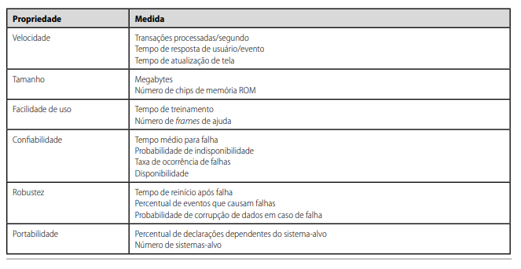
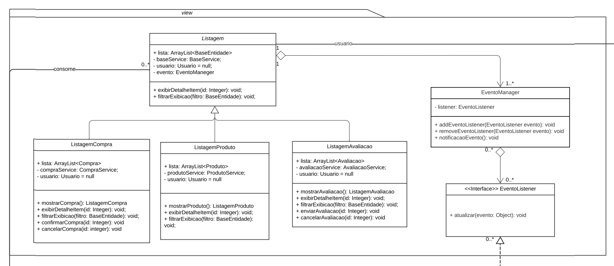
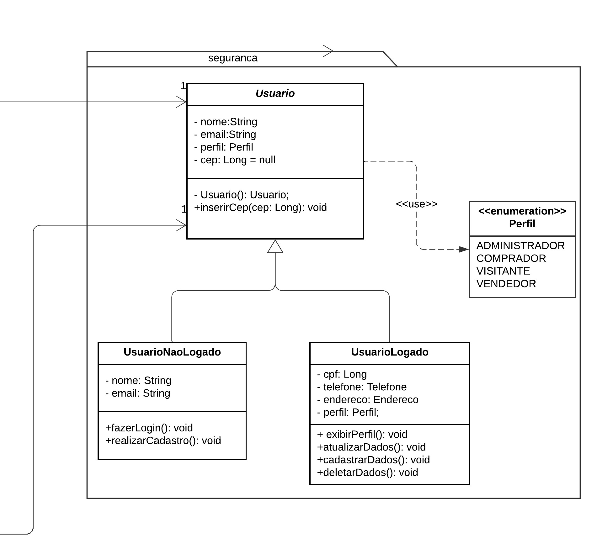
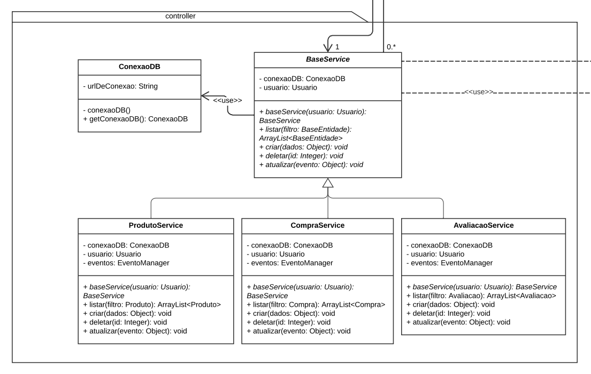

### Base

#### Requisitos

A elicitação de requisitos por parte do grupo se deu a partir da elaboração de um artefato [Rich Picture](../../1.base/nao-especificos/richpicture.md), através dele foi possivel trazer várias funcionalidades importante dentro do nosso escopo, mas não todas. Tendo em vista esse problema, podemos definir que existem requisitos não funcionais que qualquer software deve seguir, a figura 1 a baixo mostra alguns exemplos que não são excessão para o site da RiHappy.

Requisitos de um sistema (Fonte: Ian Sommerville, 2009.)

Alguns requisitos funcionais que são reutilizáveis para qualquer site de vendas seriam: "cliente não pode realizar avaliação sem estar logado", "são necessárias camadas de segurança diferentes para administrador, comprador, visitante e vendedor", "a avaliação deve ser enviada para analise antes de ser mostrada no site"

#### Plano de Custo, Risco e Tempo

Possuir um plano para custos, riscos e tempos do projeto é indispensável, eventos que causam incertezas e venham a impactar o alcance dos objetivos estratégicos, são inerentes a qualquer organização de projeto e estar preparado é essencial. No nosso projeto elaboramos um [plano de custo risco e tempo](../../1.base/nao-especificos/planocustoriscotempo.md) para que possamos gerir nossos recursos e não permitir que o planejamento desmorone, diante de problemas e desafios pudemos examinar nossos planos e gerar uma solução. Qualquer projeto encara desafios e passar por problemas no seu decorrer e ter um plano para como lidar com essas situações é crucial.

#### Metodologias e abordagens

A utilização de metodologias e abordagens são imprescindíveis quanto se trata de otimizar a organização de uma equipe e a realização de processos, no nosso contexto não foi diferente e elaboramos uma [metodologia](../../1.base/processos/metodologiasadotadas.md) própria através da utilização de frações de metodologias e abordagens já previamente estabelecidas e aceitas no mercado. Uma representação visual metodologia pode ser melhor explorada dentro da [modelagem BPMN 2.0](../../1.base/processos/modelagembpmn.md). Concluindo, podemos definir que foi realizado uma reutilização das abordagens e metodologias, com intuito de aumentar a organização e produtividade da equipe, gerando assim uma possibilidade de reutilização da nossa própria reutilização dessas abordagens e metodologias, por parte de algum outro grupo que tenham um contexto similar ao definido pelo nosso grupo.

### Modelagem

Dentro do nosso desenvolvimento para a entrega 2 criamos alguns tipos de modelagem e através dos diagramas produzidos conseguimos destacar nos diagramas estáticos exemplos passiveis de reutilização, no [diagrama de pacotes](../../2.modelagem/estatica/diagramadepacotes.md) conseguimos ver uma visão geral de projeto, definido em back end, front end e dados, que é uma visão padrão para projeto que pode ser reutilizada em diversos contextos. Os diagramas dinâmicos entram num nivel de implementação maior da aplicação, resultando assim num uso mais especifico ao nosso contexto, a reutilização deles se dariam apenas em um contexto extremamente similar ao nosso projeto. 

Revisitando nosso [diagrama de classes](docs/2.modelagem/estatica/diagramadeclasses.md) podemos separar pelo menos três exemplos de possíveis casos de reutilização do nosso projeto, sendo esses, Listagem, Usuario e BaseService.

Listagem - o exemplo de listagem entra como um tipo de reutilação em dois contextos, um deles é a utilização do padrão de projeto observer e através do polimorfismo, obtivo através da herança transmitida através da classe abstrata para as demais.

Camada view diagrama de classes HiRappy (Fonte: Abritta, Lucas Felipe e Josué.)

Usuario -  o usuario entra como a camada de segurança do sistema, na parte de reutilização ele entra como o laço entre perfis para a instanciação entre usuários do sistema no sentido de que sempre que for necessário um novo perfil existe um construtor e só é necessário implementar a lógica própria do novo perfil.

Camada segurança diagrama de classes HiRappy (Fonte: Abritta, Lucas Felipe e Josué.)

BaseService - o BaseService entra principalmente como uma conexão direta entre a camada controladora e as requisições do usuário, este exempre server como forma de reutilização no sentido de que qualquer sistema que necessite este tipo de conexão pode se adequar a maneira modelada pelo grupo, também temos novamente o polimorfismo que representa uma forma de desacoplamento e resultando em uma reutilização de código.

Camada controller diagrama de classes HiRappy (Fonte: Abritta, Lucas Felipe e Josué.)

### Padrões de projeto