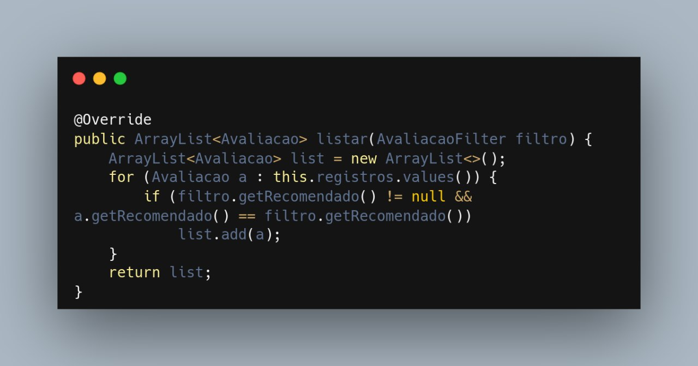
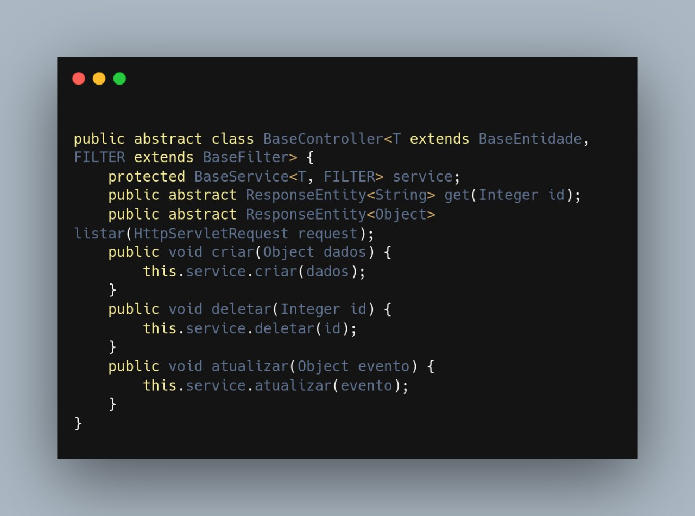
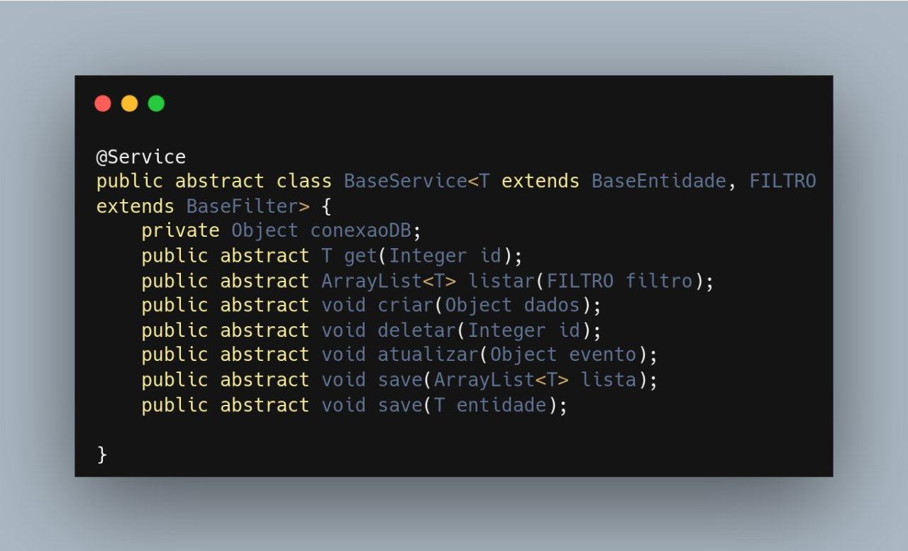

### Base

#### Requisitos

A elicitação de requisitos por parte do grupo se deu a partir da elaboração de um
artefato [Rich Picture](../../1.base/nao-especificos/richpicture.md), através dele foi possível trazer várias
funcionalidades importante dentro do nosso escopo, mas não todas. Tendo em vista esse problema, podemos definir que
existem requisitos não funcionais que qualquer software deve seguir, a figura abaixo mostra alguns exemplos que não são
exceção para o site da RiHappy.

Requisitos de um sistema (Fonte: Ian Sommerville, 2009.)

Alguns requisitos funcionais que são reutilizáveis para qualquer site de vendas seriam: "cliente não pode realizar
avaliação sem estar logado", "são necessárias camadas de segurança diferentes para administrador, comprador, visitante e
vendedor", "a avaliação deve ser enviada para analise antes de ser mostrada no site"

#### Plano de Custo, Risco e Tempo

Possuir um plano para custos, riscos e tempos do projeto é indispensável, eventos que causam incertezas e venham a
impactar o alcance dos objetivos estratégicos, são inerentes a qualquer organização de projeto e estar preparado é
essencial. No nosso projeto elaboramos
um [plano de custo risco e tempo](../../1.base/nao-especificos/planocustoriscotempo.md) para que possamos gerir nossos
recursos e não permitir que o planejamento desmorone, diante de problemas e desafios pudemos examinar nossos planos e
gerar uma solução. Qualquer projeto encara desafios e passar por problemas no seu decorrer e ter um plano para como
lidar com essas situações é crucial.

#### Metodologias e abordagens

A utilização de metodologias e abordagens são imprescindíveis quanto se trata de otimizar a organização de uma equipe e
a realização de processos, no nosso contexto não foi diferente e elaboramos
uma [metodologia](../../1.base/processos/metodologiasadotadas.md) própria através da utilização de frações de
metodologias e abordagens já previamente estabelecidas e aceitas no mercado. Uma representação visual metodologia pode
ser melhor explorada dentro da [modelagem BPMN 2.0](../../1.base/processos/modelagembpmn.md). Concluindo, podemos
definir que foi realizado uma reutilização das abordagens e metodologias, com intuito de aumentar a organização e
produtividade da equipe, gerando assim uma possibilidade de reutilização da nossa própria reutilização dessas abordagens
e metodologias, por parte de algum outro grupo que tenham um contexto similar ao definido pelo nosso grupo.

### Modelagem

Dentro do nosso desenvolvimento para a entrega 2 criamos alguns tipos de modelagem e através dos diagramas produzidos
conseguimos destacar nos diagramas estáticos exemplos passiveis de reutilização,
no [diagrama de pacotes](../../2.modelagem/estatica/diagramadepacotes.md) conseguimos ver uma visão geral de projeto,
definido em back end, front end e dados, que é uma visão padrão para projeto que pode ser reutilizada em diversos
contextos. Os diagramas dinâmicos entram num nível de implementação maior da aplicação, resultando assim num uso mais
especifico ao nosso contexto, a reutilização deles se dariam apenas em um contexto extremamente similar ao nosso
projeto.

Revisitando nosso [diagrama de classes](docs/2.modelagem/estatica/diagramadeclasses.md) podemos separar pelo menos três
exemplos de possíveis casos de reutilização do nosso projeto, sendo esses, Listagem, Usuário e BaseService.

Listagem - o exemplo de listagem entra como um tipo de reutilização em dois contextos, um deles é a utilização do padrão
de projeto observer e através do polimorfismo, objetivo através da herança transmitida através da classe abstrata para
as demais.

Camada view diagrama de classes RiHappy (Fonte: Abritta, Lucas Felipe e Josué.)

Usuário - o usuário entra como a camada de segurança do sistema, na parte de reutilização ele entra como o laço entre
perfis para a instanciação entre usuários do sistema no sentido de que sempre que for necessário um novo perfil existe
um construtor e só é necessário implementar a lógica própria do novo perfil.

Camada segurança diagrama de classes RiHappy (Fonte: Abritta, Lucas Felipe e Josué.)

BaseService - o BaseService entra principalmente como uma conexão direta entre a camada controladora e as requisições do
usuário, este exemplo serve como forma de reutilização no sentido de que qualquer sistema que necessite este tipo de
conexão pode se adequar a maneira modelada pelo grupo, também temos novamente o polimorfismo que representa uma forma de
desacoplamento e resultando em uma reutilização de código.

Camada controller diagrama de classes RiHappy (Fonte: Abritta, Lucas Felipe e Josué.)

### Padrões de projeto

A correlação entre padrões de projeto e reutilização de software é bastante significativa. Os padrões de projeto são
soluções comprovadas para problemas comuns no desenvolvimento de software, enquanto a reutilização de software é a
prática de utilizar componentes ou módulos existentes em novos projetos, em vez de desenvolvê-los do zero. A seguir são
demonstrados alguns exemplos de padrões de projeto que utilizamos e que podem vir a encaixados dentro da reutilização de
software.

#### GRASP

- Polimorfismo: O padrão de projeto GRASP Polimorfismo foi utilizado para encapsular variações de comportamento com base
  no tipo, usando de métodos abstratos em níveis generalistas para que uma instância se comporte de acordo com suas
  especificidade, eliminando a necessidade da lógica condicional (if, else e switch) para especificação do
  comportamento. O polimorfismo permite a reutilização de software por meio da substituição de objetos, interfaces
  comuns, extensibilidade e composição de objetos. Ele promove a flexibilidade, modularidade e extensibilidade do
  código, permitindo que você escreva código que interaja com objetos de diferentes classes sem depender de detalhes
  específicos da implementação. Isso resulta em um código mais reutilizável, modular e fácil de manter.

- Alta coesão: O padrão de projeto GRASP Alta Coesão foi utilizado para garantir que as classes da modelagem do software
  atendessem apenas a questões relacionadas ao seu escopo, facilitando a reutilização de código, a manutenção e a
  evolução do software como um todo.

- Controlador: O padrão de projeto GRASP Controlador foi utilizado para realização da comunicação do domínio com o banco
  de dados. Para isso foi criada uma camada de comunicação abstrata chamada Controller focada apenas na persistência dos
  dados do Back-end no Banco de Dados. Ao seguir o padrão Controlador, você cria uma camada de controle modular e
  independente da interface do usuário e do modelo de dados. Essa separação facilita a reutilização do código do
  controlador em diferentes interfaces ou aplicações, desde que a lógica de negócios seja a mesma. Assim, você pode usar
  o mesmo controlador em diferentes contextos sem a necessidade de reescrever a lógica central

#### GOF

- Proxy: A principal aplicação do padrão dentro do fluxo do projeto, vai se dar no processo de criação de uma avaliação
  para um determinado produto. O Proxy permite encapsular a lógica adicional em torno de um objeto real sem modificar
  seu código subjacente. O padrão Proxy pode ser aplicado para reutilizar e adicionar funcionalidades adicionais a
  objetos existentes, compartilhar recursos, otimizar desempenho e fornecer controle de acesso. Ele promove a
  reutilização de software, permitindo que você crie Proxies para objetos existentes e adicione comportamentos
  específicos necessários para diferentes contextos ou requisitos.

- Observer: Nas figuras 2 e 4, a classe Listagem atua como um objeto emissor de eventos, representado pelo EventManager,
  enquanto a classe BaseService atua como um objeto ouvinte de eventos, representado pelo EventListener.
  Através das interfaces EventManager e EventListener, é estabelecida uma relação de dependência flexível e desacoplada
  entre essas classes, permitindo que o BaseService seja notificado e possa responder aos eventos emitidos pela Listagem
  de maneira adaptável e flexível. O padrão Observer (ou Observador) é um padrão de projeto comportamental que define
  uma relação de dependência de um-para-muitos entre objetos, de modo que, quando um objeto (chamado de "sujeito" ou "
  observável") muda de estado, todos os seus observadores são notificados e atualizados automaticamente. O padrão
  Observer facilita a reutilização de componentes, interfaces e subsistemas, permitindo a comunicação assíncrona e
  desacoplada entre eles. Ele promove a flexibilidade e a modularidade do código, tornando mais fácil reutilizar e
  integrar diferentes partes de um sistema em diferentes contextos.

### Exemplos de reutilizações internas de código no projeto

Para exemplificar a reutilização interna de código no projeto é possível observar o trecho de código a seguir, no qual 
há a ocorrência de uma Sobrescrita do método listar da classe AvaliacaoService.

`Trecho de código referente à Sobrescrita do método listar da classe AvaliacaoService`. (Fonte: Nicolas)

> O arquivo original elaborado encontra-se disponível no link: [Sobrescrita](https://github.com/UnBArqDsw2023-1/2023.1_G5_ProjetoRiHappy/blob/main/codigo/src/main/java/br/com/rihappy/avaliacaoService/controller/AvaliacaoController.java).

Ademais, foi criada uma BaseService que tem o papel de um serviço de Base para unificar a comunicação do projeto com o Banco de Dados, a qual está em consonância com a modelagem realizada no Documento de Arquitetura de Software na seção de [Visão Lógica](../padroes/padroesarquiteturais.md#visão-lógica) e com o intuito que essa possa ser reutilizada em qualquer projeto com uma API REST foi criada uma BaseController para responder as requisições HTTP.

`Trecho de código referente à BaseController`. (Fonte: Nicolas)

`Trecho de código referente à BaseService`. (Fonte: Nicolas)

> Os arquivos originais elaborado referentes a BaseController e BaseService encontram-se disponível nos links: [BaseController](hhttps://github.com/UnBArqDsw2023-1/2023.1_G5_ProjetoRiHappy/blob/main/codigo/src/main/java/br/com/rihappy/avaliacaoService/controller/BaseController.java) e [BaseService](https://github.com/UnBArqDsw2023-1/2023.1_G5_ProjetoRiHappy/blob/main/codigo/src/main/java/br/com/rihappy/avaliacaoService/service/BaseService.java).