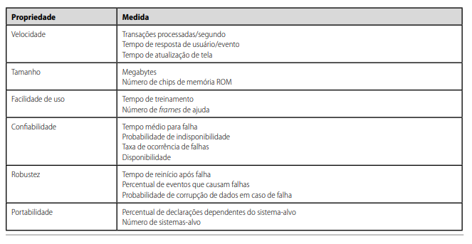

# Reutilização de Software

## Histórico de Versão

| Versão | Data       | Descrição                                  | Autor(es)             | Revisor(es) |
| ------ | ---------- | ------------------------------------------ | --------------------- | ----------- |
| `1.0`  | 13/06/2023 | Criação do documento com estrutura padrão. | Lucas Felipe          | Nicolas     |
| `1.1`  | 24/06/2023 | Adição da Padronização, introdução, metodologia e reutilização interna. | Davi Lima e Guilherme | João Pedro e Lucas Felipe     |

## Introdução

O presente artefato visa documentar a reutilização de software dentro do projeto. essa que é uma abordagem essencial na engenharia de software moderna, visando a maximização da eficiência, produtividade e qualidade no desenvolvimento de sistemas.

## Metodologia

O artefato está sendo elaborado seguindo os pontos de vista coletados e discutidos pelo grupo e aprovado pela professora. Para elaboração do mesmo. As principais discussões foram trazidas para dentro da issue do repósitorio no [Github]("https://github.com/UnBArqDsw2023-1/2023.1_G5_ProjetoRiHappy/issues/16"). 
## Reutulização Interna

### Base

#### Requisitos

A elicitação de requisitos por parte do grupo se deu a partir da elaboração de um artefato [Rich Picture](../../1.base/nao-especificos/richpicture.md), através dele foi possivel trazer várias funcionalidades importante dentro do nosso escopo, mas não todas. Tendo em vista esse problema, podemos definir que existem requisitos não funcionais que qualquer software deve seguir, a figura 1 a baixo mostra alguns exemplos que não são excessão para o site da RiHappy.

Alguns requisitos funcionais que são reutilizáveis para qualquer site de vendas seriam: "cliente não pode realizar avaliação sem estar logado", "são necessárias camadas de segurança diferentes para administrador, comprador, visitante e vendedor", "a avaliação deve ser enviada para analise antes de ser mostrada no site"

#### Plano de Custo, Risco e Tempo

Possuir um plano para custos, riscos e tempos do projeto é indispensável, eventos que causam incertezas e venham a impactar o alcance dos objetivos estratégicos, são inerentes a qualquer organização de projeto e estar preparado é essencial. No nosso projeto elaboramos um [plano de custo risco e tempo](../../1.base/nao-especificos/planocustoriscotempo.md) para que possamos gerir nossos recursos e não permitir que o planejamento desmorone, diante de problemas e desafios pudemos examinar nossos planos e gerar uma solução. Qualquer projeto encara desafios e passar por problemas no seu decorrer e ter um plano para como lidar com essas situações é crucial.

#### Metodologias e abordagens

A utilização de metodologias e abordagens são imprescindíveis quanto se trata de otimizar a organização de uma equipe e a realização de processos, no nosso contexto não foi diferente e elaboramos uma [metodologia](../../1.base/processos/metodologiasadotadas.md) própria através da utilização de frações de metodologias e abordagens já previamente estabelecidas e aceitas no mercado. Partindo desse ponto, podemos definir que foi realizado uma reutilização das abordagens e metodologias, com intuito de aumentar a organização e produtividade da equipe, gerando assim uma possibilidade de reutilização da nossa própria reutilização dessas abordagens e metodologias, por parte de algum outro grupo que tenham um contexto similar ao definido pelo nosso grupo.

### Modelagem

Dentro do nosso desenvolvimento para a entrega 2 criamos alguns tipos de modelagem e através dos diagramas produzidos conseguimos identificar nos diagramas estáticos exemplos passiveis de reutilização, no [diagrama de pacotes](../../2.modelagem/estatica/diagramadepacotes.md) conseguimos ver uma visão geral de projeto, definido em back end, front end e dados, que é uma visão padrão para projeto que pode ser reutilizada em diversos contextos. 

Revisitando nosso [diagrama de classes](docs/2.modelagem/estatica/diagramadeclasses.md) podemos separar pelo menos três exemplos de possíveis casos de reutilização do nosso projeto, sendo esses, Listagem, Usuario e BaseService.

Listagem - o exemplo de listagem entra como um tipo de reutilação em dois contextos, um deles é a utilização do padrão de projeto observer e através do polimorfismo, obtivo através da herança transmitida através da classe abstrata para as demais. 

Usuario -  o usuario entra como a camada de segurança do sistema, na parte de reutilização ele entra como o laço entre perfis para a instanciação entre usuários do sistema no sentido de que sempre que for necessário um novo perfil existe um construtor e só é necessário implementar a lógica própria do novo perfil.

BaseService - o BaseService entra principalmente como uma conexão direta entre a camada controladora e as requisições do usuário, este exempre server como forma de reutilização no sentido de que qualquer sistema que necessite este tipo de conexão pode se adequar a maneira modelada pelo grupo, também temos novamente o polimorfismo que representa uma forma de desacoplamento e resultando em uma reutilização de código.

## Reutilização Externa

### Bibliotecas

#### RXJS no contexto de Observador

Um observer ou observador é um receptor de valores entregues por um componente observável. São um conjunto de retornos de chamada, um para cada tipo de componente. 

Os observadores podem ser parciais, ou seja, se nao fornecer retorno, a execução ainda acontecerá normalmente.[Observer](https://rxjs.dev/guide/observer) 
 
#### React JS

O React é uma biblioteca front-end JavaScript de código aberto com foco em criar interfaces de usuário em páginas web.[ReactJS](https://react.dev/learn)

#### Jackson ObjectMapper
O Jackson tem a classe ObjectMapper que é muito utilizada para converter classes Java em JSON, e vice-versa, na comunicação entre APIs RESTful e SPAs.[Jackson](https://www.devmedia.com.br/introducao-ao-jackson-objectmapper/43174) 

### Frameworks

#### Hibernate com Spring Boot

O Hibernate é uma biblioteca de conexão com o banco de dados. 

O Hibernate é um framework de mapeamento objeto-relacional, também chamado de ORM, para Java. Porém, também é utilizado para . NET com o nome de NHibernate. Por ter essa característica de ORM, ele transforma os dados da estrutura lógica de um banco de dados em objetos relacionais. [Hibernate](https://www.baeldung.com/spring-boot-hibernate)

### Banco de Dados

### Ferramentas

#### GitHub

GitHub é uma plataforma feita para hospedagem de códigos de programação. Os objetivos principais são o controle e a colaboração, permitindo que usuários desenvolvam projetos juntos, estando em qualquer lugar do mundo.[GitHub](https://github.com)

 

#### ZenHub
O Zenhub permite que os desenvolvedores fiquem mais próximos ao desenvolvimento do projeto dentro do GitHub, minimizando a troca de contextos. Os dados simultâneos do GitHub sempre mantendo os projetos atualizados e precisos em ambas as ferramentas.
Usamos ele como forma de organização e de otimizar a rotina de desenvolvimento de cada membro em cada tarefa. [Zenhub](https://www.zenhub.com/)

#### FlyWay 

Flyway é uma ferramenta de migração de banco de dados de código aberto. 
O Flyway é uma dentre as várias ferramentas que se propõem a trazer ordem e organização para os scripts SQL que são executados no banco de dados, funciona como um controle de versão do mesmo. [Flyway](https://www.baeldung.com/database-migrations-with-flyway)

#### Docker

O Docker é uma forma de virtualizar aplicações no conceito de “containers”, trazendo da web ou de seu repositório interno uma imagem completa, incluindo todas as dependências necessárias para executar sua aplicação.
Ademais também se contextualizam como containers de ambiente e deploy com Docker e Docker Compose e orquestração de containers com Docker Swarm.[Docker](https://docs.docker.com/)

## Arquitetura

## Referências

[1] Arquitetura e Desenho de software - Aula ARQUITETURA & DAS  - Prof. Milene  
[2] Engenharia de software - Ian Sommerville - 9 edição  
[3] O que é o GitHub   

